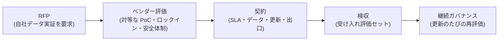

# AI 調達・ベンダー選定の実務

## この記事の目的

AI 製品・ソリューションを「買う側」として、RFP・ベンダー評価・契約・検収・継続ガバナンスを、**非決定的なシステムの性質に合わせて**設計できるようになります。従来の SI 調達がなぜそのまま通用しないのかを起点に、「自社データでの実証を要求する RFP」「デモに騙されない評価」「更新され続ける前提の契約・検収」までを、エンジニアが調達部門・法務と協働するための地図として整理します。

## 対象読者

- AI 製品・SaaS・受託開発を発注する側で、RFP 作成・ベンダー評価に関わるエンジニア・テックリード
- 調達・情報システム部門と協働して AI ソリューションの選定基準を設計する立場のマネージャー

## 前提知識

- [Agent 評価の基礎](../04-evaluation/agent-evaluation-basics.md) — 「自社の評価セットで測る」という本記事の中核(評価の調達への応用)
- [PoC から本番への進め方](poc-to-production.md) — ベンダー PoC の条件設計・パイロットの考え方
- [ROI とビジネスケース](roi-and-business-case.md) — 買う投資の費用対効果の見積もり

## 本文

### 概要: AI 調達は従来調達と 3 点で違う

AI ソリューションの調達に、従来の SI・SaaS 調達の型をそのまま当てると失敗します。違いは 3 点です。

1. **仕様を完全に書けない**: 「こう入力したらこう出力する」を網羅的に規定できません。出力は確率的で、同じ入力でも揺れます。仕様書ベースの受け入れ検査が成立しにくいのです
2. **性能が確率的**: 「95% 正しい」システムを、残り 5% を織り込んで調達する必要があります。決定的システムの「バグかどうか」の二分法が効きません
3. **デモが当てにならない**: ベンダーのデモは、うまくいく入力で最適化されています。**自社の実データ・エッジケースで動くかは、デモからは一切わかりません**([ケーススタディ: 撤退した PoC](../07-case-studies/case-study-failed-poc.md)の「デモの罠」)

この 3 点への対処が、AI 調達の設計そのものです。全体の流れは次の通りです。

売る側(受注・提供する側)の視点は[顧客・プロジェクトへの導入合意形成](../08-coding-agents/se-client-adoption.md)が扱います。本記事はその対になる「買う側」です。

### RFP の書き方: 評価基準を先に定義する

AI 調達の RFP は、機能一覧よりも**「どう合否を判定するか」の事前定義**が中心になります。これは[Agent 評価の基礎](../04-evaluation/agent-evaluation-basics.md)を調達に応用したものです。

- **自社データでの実証を要求する**: ベンダーのベンチマーク値やデモではなく、**自社の代表データ(可能なら実データのサンプル)で評価する条件**を RFP に含めます。「当社が用意する評価セットでの結果を提出すること」と書きます
- **評価基準を先に決める**: 何を・どの水準で満たせば合格かを、提案を受ける前に定義します。基準を後から作ると、ベンダーの提案に引きずられます([Agent 評価の基礎](../04-evaluation/agent-evaluation-basics.md)の「評価セットを先に作る」)
- **失敗の許容度を明示する**: 「100% 正確」ではなく「どの種類の誤りをどこまで許容するか」を書きます。誤りの種類(見逃し / 誤検知)で重大性が違うことを、要件に落とします
- **確率的性能を要件化する**: 単一の精度値でなく、「代表データセットでの成功率 X% 以上、かつ重大な誤りが Y 件以下」のように、分布と重大度で書きます

### ベンダー評価: 対等な条件で試す

提案を比較する段階では、**ベンダーごとに条件が違う評価は無意味**です。同じ土俵で試すことが要です。

- **PoC の条件を対等化する**: 同じ評価セット・同じ入力分布・同じ成功基準で各ベンダーを試します。ベンダーが自前のデータで出した数値は、比較には使えません([PoC から本番への進め方](poc-to-production.md))
- **ロックインを評価する**: そのベンダーから乗り換えるコストを、選定時に見積もります。データのエクスポート可否・独自形式への依存・API の互換性・プロンプトや設定資産の移植性。**乗り換え不能なほど、更新後の価格改定・品質劣化を受け入れるしかなくなります**([LLM ゲートウェイ](../05-operations/llm-gateway.md)の抽象化で緩和できる部分も評価します)
- **安全体制・ガバナンスを確認する**: モデル提供元の安全体制(誤用対策・脆弱性対応・重大リスクへの備え)は、調達先の継続性・信頼性の一部です。何を・どの一次情報で確認するかは[フロンティアセーフティの概観](../06-security/frontier-safety-overview.md)を参照します(内容の評価はせず、開示の所在を確認する姿勢で)
- **データの取り扱いを確認する**: 入力データが学習に使われるか・保持されるか・どのリージョンで処理されるかは、評価の必須項目です([会話データの管理基盤](../05-operations/conversation-data-management.md))

### 契約の観点

契約は法務・調達部門の領分です。エンジニアの役割は、**AI 固有の論点を挙げて法務につなぐ**ことです(契約文言の作成は本記事の範囲外 — [業界別規制の入口マップ](industry-regulations-map.md)と同じ入口方式で観点列挙まで)。

- **SLA(サービス品質保証)**: 可用性だけでなく、品質(精度)の保証をどう扱うか。確率的性能に「精度 100%」の SLA は書けないため、測定方法・許容範囲・下回った場合の扱いを論点にします
- **データ利用条項**: 入力・出力・ログがベンダー側でどう使われるか(学習利用の可否・保持期間・第三者提供・削除)。規制産業では[業界別規制の入口マップ](industry-regulations-map.md)の確認先と突き合わせます
- **モデル更新の扱い**: ベンダーがモデルを更新したとき、挙動が変わり得ます。「更新の事前通知」「旧版の継続利用可否」「更新後の再評価の権利」を論点にします(後述の継続ガバナンスと直結)
- **出口条項**: 契約終了時のデータ返還・削除、移行支援、ロックイン緩和の取り決め。入る前に出方を決めておきます
- **責任分界**: AI の出力に起因する損害の責任をどう分けるか。関連する論点整理は[エージェントの責任と説明責任](agent-liability-and-accountability.md)を参照します

### 検収の設計

「仕様書通り動くか」ではなく、**「受け入れ評価セットで合格水準を満たすか」**で検収します。

- **受け入れ評価セットで判定する**: RFP で定義した評価基準を、検収の合否判定にそのまま使います。ベンダーの主張ではなく、自社の評価セットでの実測が根拠です
- **本番前パイロットを挟む**: 検収を「一発の受け入れ試験」で終わらせず、限定範囲の本番前パイロットで実運用の挙動を確認します。デモや評価セットで見えない、実データ分布・運用負荷・レビューコストがここで出ます([ROI とビジネスケース](roi-and-business-case.md))
- **エッジケース・失敗時の挙動を確認する**: ハッピーパスだけでなく、想定外入力・失敗時の振る舞い(安全に止まるか・誤った結果を自信ありげに返さないか)を検収項目に含めます

### 継続ガバナンス: 買って終わりではない

AI ソリューションは、ベンダー側のモデル更新で**買った後に挙動が変わり得ます**。ここが従来調達との最大の運用上の違いです。

- **更新のたびに再評価する**: モデル更新の通知を受けたら、受け入れ評価セットで再評価します([バージョニング・デプロイ・モデル更新追従](../05-operations/versioning-and-model-updates.md)の考え方を、他社製品に対しても適用します)
- **品質を継続監視する**: 自社側でも出力品質を継続測定し、静かな劣化(ドリフト)を検知します([フィードバックループの運用](../05-operations/feedback-loops.md))
- **定期的にロックインと代替を見直す**: 年単位で、代替ベンダー・自社構築([「自社モデルを持つか」の判断](own-model-strategy.md))との比較を更新します。市場が速く動くため、選定時の前提はすぐ古くなります

## 実務での注意点

### アンチパターン

- **ベンダーのデモ・ベンチマーク値で選定する** → 自社の実データ・エッジケースで動かず、本番で破綻する → 自社の評価セットでの実証を RFP で要求し、対等な条件で比較する
- **評価基準を提案を見てから作る** → ベンダーの強みに合わせた基準になり、比較が歪む → 評価基準を提案受領前に確定する
- **ロックインを評価せずに契約する** → 更新後の価格改定・品質劣化を受け入れるしかなくなる → 乗り換えコスト(データ移植・API 互換・資産移植)を選定時に見積もる
- **「精度 100%」の SLA を求める** → 確率的システムに書けない条件で交渉が空転する、または実質無意味な保証になる → 測定方法・許容範囲・下回った場合の扱いで書く
- **検収を一発の受け入れ試験で終える** → 実運用の分布・負荷・失敗時挙動が見えず、本番で問題が出る → 受け入れ評価セット + 本番前パイロットで検収する
- **買って終わりにする** → ベンダーのモデル更新で挙動が変わり、気付かず品質が劣化する → 更新のたびの再評価と継続監視を運用に組み込む

### チェックリスト

- [ ] RFP に「自社の評価セットでの実証」を要求条件として含めた
- [ ] 評価基準(合格水準・許容する誤りの種類と量)を提案受領前に確定した
- [ ] 各ベンダーを同じ評価セット・同じ条件(対等な PoC)で比較した
- [ ] ロックイン(データ移植・API 互換・資産移植のコスト)を評価した
- [ ] データ取り扱い(学習利用・保持・リージョン)とベンダーの安全体制の確認先を押さえた
- [ ] 契約の AI 固有論点(品質 SLA・データ利用・モデル更新・出口・責任分界)を法務につないだ
- [ ] 検収を受け入れ評価セット + 本番前パイロットで設計した
- [ ] モデル更新のたびの再評価と、継続的な品質監視を運用に組み込んだ
- [ ] 「作る([「自社モデルを持つか」の判断](own-model-strategy.md))」との比較を検討した

## 関連トピック

- [顧客・プロジェクトへの導入合意形成](../08-coding-agents/se-client-adoption.md) — 売る側(受注・提供側)の対になる記事
- [Agent 評価の基礎](../04-evaluation/agent-evaluation-basics.md) — 調達の中核である「自社の評価で測る」の正本
- [PoC から本番への進め方](poc-to-production.md) — ベンダー PoC の条件設計・パイロット
- [ROI とビジネスケース](roi-and-business-case.md) — 買う投資の費用対効果と継続判断
- [「自社モデルを持つか」の判断](own-model-strategy.md) — 「作る vs 買う」の作る側
- [業界別規制の入口マップ](industry-regulations-map.md) — 規制産業での契約・データ確認先(入口方式)
- [フロンティアセーフティの概観](../06-security/frontier-safety-overview.md) — モデル提供元の安全体制の確認先
- [LLM ゲートウェイの設計](../05-operations/llm-gateway.md) — ロックイン緩和のモデル抽象化
- [バージョニング・デプロイ・モデル更新追従](../05-operations/versioning-and-model-updates.md) — 更新のたびの再評価の運用

## 参考資料

- なし(AI 調達は各社の調達規程・契約実務・法務の領分であり、本記事は特定の一次資料の解説ではなく、本ライブラリの評価・PoC・運用の知見を「買う側」の実務として整理したものです。契約文言・調達基準は各社の調達・法務部門の判断に従ってください)

## TODO・未確認事項

なし
