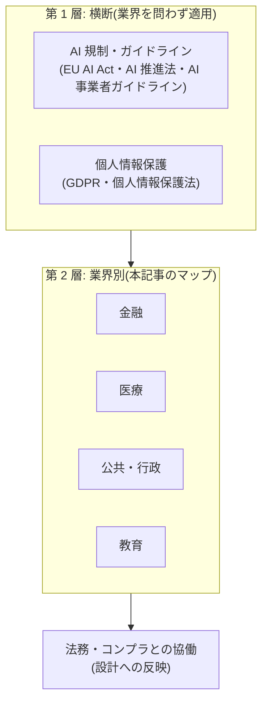

# 業界別規制の入口マップ

> **免責:** 本記事は法的助言ではありません。規制・ガイドラインの**内容の解説はせず**、「自分の業界で Agent を作るとき、何を・どの一次情報で確認しに行くか」の所在(入口)だけを示します。個別案件の適法性判断は、必ず法務・コンプライアンス部門や専門家に確認してください。

## この記事の目的

規制の厳しい業界(金融・医療・公共・教育など)で AI Agent を企画・設計するとき、**着手前に確認すべき規制・ガイドラインの「在り処」**を短時間で特定できるようになります。あわせて、法務・コンプライアンス部門と協働するためにエンジニア側が準備すべきものを整理します。

**本記事は鮮度リスクの高いページです。** 挙げる文書の版数・構成は年単位で改版されるため、参照の際は必ず本文冒頭の最終確認日と各発行主体の公式ページで現行版を確認してください。

## 対象読者

- 規制産業(またはその顧客向け)で Agent 導入を企画・設計するエンジニア・テックリード
- 法務・コンプライアンス部門に「何を確認したいか」を持ち込む立場の人

## 前提知識

- [コンプライアンスとガバナンス](../06-security/compliance-and-governance.md) — 業界を問わない横断規制(AI 規制・個人情報保護)の正本。本記事はその 1 段下の業界層を扱います
- [ユースケース発見と要件定義](usecase-discovery.md) — 規制確認の入力になる「何をやるか」の記述

## 本文

> **最終確認日:** 2026-09-10 — 金融基準・FDA ガイダンス・個人情報保護法改正を再確認しました。他の入口は各参考資料のアクセス日と調査メモの確認日を参照してください。各文書の URL・確認の詳細は、リポジトリ内 `research/supplementary/regulations.md` の調査メモを参照してください(主要な一次情報は本記事末尾の参考資料にも掲載)。

### 概要: 規制は 2 層で確認する

Agent 案件で確認すべき規制・ガイドラインは、2 つの層に分かれます。

```mermaid
flowchart TD
    subgraph L1["第 1 層: 横断(業界を問わず適用)"]
        A["AI 規制・ガイドライン<br/>(EU AI Act・AI 推進法・AI 事業者ガイドライン)"]
        B["個人情報保護<br/>(GDPR・個人情報保護法)"]
    end
    subgraph L2["第 2 層: 業界別(本記事のマップ)"]
        F["金融"]
        M["医療"]
        G["公共・行政"]
        E["教育"]
    end
    L1 --> L2
    L2 --> C["法務・コンプラとの協働<br/>(設計への反映)"]
```

第 1 層(横断)は[コンプライアンスとガバナンス](../06-security/compliance-and-governance.md)が正本です。本記事は第 2 層 — 業界の主務官庁・公的機関・業界団体が出す規制・ガイドライン — の入口を業界別に示します。

内容の解説をしない理由は 3 つあります。(1) 業界規制は改版が速く、解説はすぐ陳腐化します(2026-07 時点で、後述の主要文書の多くが 2025〜2026 年に改版されたばかりです)。(2) 規制の解釈は文脈依存で、法的助言の領分です。(3) 一次情報(公式の本文)が常に正であり、必要なのは「どこを見るか」だけだからです。

使い方は次の 3 ステップです。

1. 第 1 層を[コンプライアンスとガバナンス](../06-security/compliance-and-governance.md)で確認する
2. 自分の業界の表から該当文書を特定し、**発行主体の公式ページで現行版を確認**する(Web 上の二次解説は旧版ベースのものが多く残っています。版数と公表年月を必ず突き合わせます)
3. 確認結果を持って法務・コンプライアンス部門と協働する(後述の「準備」を参照)

### 金融

金融は「監督当局(金融庁)・公的な安全対策基準(FISC)・業界自主ガイドライン」の 3 段で見ます。

| 文書(確認時点の版。個別の確認日は調査メモ参照) | 発行主体 | いつ見るか |
| --- | --- | --- |
| モデル・リスク管理に関する原則(2021-11 公表版) | 金融庁 | AI モデルを与信・査定などの判断業務に使う際のガバナンス体制の設計時 |
| AI ディスカッションペーパー 第 1.1 版(2026-03) | 金融庁 | 金融分野での AI 利活用の論点整理。当局の問題意識を知る入口(規制文書ではありません) |
| 金融機関等コンピュータシステムの安全対策基準・解説書 第 14 版(2026-03-25 発刊) | FISC(金融情報システムセンター) | システム安全対策の参照基準。公表概要では AI・生成 AI、サイバーセキュリティ、耐量子計算機暗号(PQC)対応を拡充。一般向け本文は有償で、条項差分は別途確認 |
| 金融機関による AI の業務への利活用に関する安全対策の観点からの考察(2024-09) | FISC | 生成 AI 特有の課題整理。安全対策基準を補完する読み物 |
| 金融生成 AI ガイドライン 第 1.2 版(2026-08-05 公表) | FDUA(金融データ活用推進協会) | 業界自主の実務ガイド。Agent の接続先・権限・行動に伴うリスク、AI レジリエンスとガバナンスの確認入口 |

注意点: 全国銀行協会名義の包括的な「生成 AI 利活用指針」は 2026-07 時点で確認できません(同協会の直近の AI 関連文書はサイバーセキュリティ観点のものです)。発行主体を取り違えないでください。海外参照としては、米国のモデル・リスク管理監督文書が **SR 11-7(2011)から SR 26-2(2026-04)に置換**されています。「金融 AI ガバナンスの古典 = SR 11-7」という定番の記述は 2026 年時点では現行版の確認が必要です。

### 医療

医療は 3 つの象限に分けると迷いません。

| 象限 | 文書(確認時点の版。個別の確認日は調査メモ参照) | 発行主体 | いつ見るか |
| --- | --- | --- | --- |
| (1) 医療情報の安全管理 | 医療情報システムの安全管理に関するガイドライン **第 7.0 版(2026-06)** | 厚生労働省 | 医療機関の情報を扱うシステム全般。いわゆる「3 省 2 ガイドライン」の医療機関側 |
| 同上 | 医療情報を取り扱う情報システム・サービスの提供事業者における安全管理ガイドライン **第 2.0 版(2025-03)** | 総務省・経済産業省 | 医療機関へシステム・サービスを提供する事業者側(Agent を提供する側はこちら) |
| (2) 医療機器該当性 | プログラムの医療機器該当性に関するガイドライン(2023-03 一部改正版) | 厚生労働省 | 診断・治療の判断に関与する機能を作る前に必ず。該当すれば薬機法の世界(PMDA の一元的相談窓口へ) |
| (3) 生成 AI の利用指針 | 医療デジタルデータの AI 研究開発等への利活用に係るガイドライン(2024-09) | 厚生労働省 | 医療データを AI 開発に使う際の法的根拠の整理 |
| 同上 | 医療・ヘルスケア分野における生成 AI 利用ガイドライン 第 2 版(2025-07)/ ヘルスケア事業者のための生成 AI 活用ガイド 第 2.0 版(2025-02) | HAIP / JaDHA(業界団体) | 医療機関・ヘルスケア事業者の実務ガイド(業界自主) |

注意点: 3 省 2 ガイドラインは両方とも 2025〜2026 年に改版されており、旧版(第 6.0 版・第 1.1 版)の解説と区別します。海外参照では、FDA の AI 医療機器ライフサイクル管理ガイダンス(TPLC)は 2025-01-07 版が **Draft**、事前に変更管理計画を審査する PCCP ガイダンスは 2025-08-18 版が **Final** です。臨床意思決定支援ソフトウェア(Clinical Decision Support Software、CDS)は 2026-01-29 版が Final であり、文書名と Draft / Final を別々に確認します(2026-09-10 の FDA 公式索引)。

### 公共・行政

| 文書(確認時点の版。個別の確認日は調査メモ参照) | 発行主体 | いつ見るか |
| --- | --- | --- |
| デジタル社会推進標準ガイドライン DS-920「行政の進化と革新のための生成 AI の調達・利活用に係るガイドライン」**第 2.0 版(2026-06)** | デジタル庁 | 政府機関向け案件の必読文書(調達要件・AI 統括責任者体制)。地方自治体に直接の義務はないが事実上の参照基準 |

第 2.0 版は 2026-06-12 決定と新しく、二次解説の多くは第 1.0 版(2025-05)ベースです。

### 教育

| 文書(確認時点の版。個別の確認日は調査メモ参照) | 発行主体 | いつ見るか |
| --- | --- | --- |
| 初等中等教育段階における生成 AI の利活用に関するガイドライン Ver. 2.0(2024-12) | 文部科学省 | 学校・教育委員会向け案件、児童生徒が利用するサービスの設計時 |

個人情報保護法改正は 2026-07-10 成立・2026-07-17 公布(令和 8 年法律第 56 号)です。主な施行日は公布から 2 年以内の政令指定日で、2026-09-10 時点では未確定です。一部罰則は 2027-01-17 に施行されます。業界を横断する準備事項は[コンプライアンスとガバナンス](../06-security/compliance-and-governance.md)で確認します。

### 法務と協働するための準備

規制対応は「法務に丸投げ」でも「エンジニアが独自解釈」でも失敗します。**該当性の判断は法務・専門家の領分、判断材料を揃えるのはエンジニアの領分**です。持ち込むべき材料は 4 点です。

1. **データフロー図**: どのデータ(個人情報・医療情報・取引情報)が、どこから来て、どこ(モデル API・ログ・外部サービス)へ行くか。所在地(リージョン)も含めます([会話データの管理基盤](../05-operations/conversation-data-management.md))
2. **自律度と人の関与点**: Agent が何を自動で行い、どこに人の確認が入るか([Human-in-the-Loop 設計](../02-architecture/human-in-the-loop.md))。「人間による監視」は多くの規制・ガイドラインの中心的な関心事です
3. **記録の設計**: 何をログし、どれだけ保持し、誰が見られるか。監査・説明責任への回答になります
4. **該当しうる文書の候補リスト**: 本記事のマップから当たりを付けた文書名と版数。「ゼロから調べてください」ではなく「この 3 つに該当しそうか確認したい」と持ち込むと、協働が速く回ります

このプロセスは PoC → 本番の関門([PoC から本番への進め方](poc-to-production.md))に組み込み、本番化の直前ではなく PoC の設計段階で始めます。

### 更新の追い方

- **発行主体の公式ページを起点にする**: 主務官庁のプレスリリース・審議会ページが一次情報です。まとめ記事は「存在を知る」までに使い、根拠には使いません
- **版数と確認日を記録する**: 設計文書・社内 wiki に「何版を・いつ確認したか」を残します。AI インベントリ([コンプライアンスとガバナンス](../06-security/compliance-and-governance.md))に確認済み規制の欄を持たせると一元管理できます
- **四半期ごとに見直す**: 本記事の表にある文書だけでも、2025〜2026 年に多くが改版されています。四半期の定点観測に業界規制の版数確認を含めます

## 実務での注意点

### アンチパターン

- **二次解説(まとめ記事)を根拠に設計する** → 旧版ベースの解説が多く、改版で要件が変わっていることに気付けない → 発行主体の公式ページで版数・公表年月を確認する
- **「明示的な規制がないから自由」と考える** → 規制法がなくても、業界自主ガイドライン・監督当局の問題意識・契約要件が実質的な制約になる → 業界団体・当局の文書まで含めて当たりを付ける
- **横断層だけ(または業界層だけ)を確認する** → AI 事業者ガイドラインを読んでも FISC 基準は満たせず、逆も同じ → 2 層を両方確認する
- **規制確認を本番リリース直前に回す** → 該当性次第で設計(データ所在・記録・人の関与)が根本から変わり、手戻りが最大化する → PoC 設計段階で候補文書を特定し、関門に組み込む
- **一度確認して終わりにする** → 主要文書は年単位で改版される → 版数・確認日を記録し、四半期で見直す

### チェックリスト

- [ ] 横断層(AI 規制・個人情報保護)を[コンプライアンスとガバナンス](../06-security/compliance-and-governance.md)の観点で確認した
- [ ] 自分の業界の主務官庁・業界団体と、該当しうる文書の現行版を特定した
- [ ] 有償・非公開の基準(FISC など)の入手経路を確認した
- [ ] 法務に持ち込む 4 点(データフロー・自律度と関与点・記録の設計・候補文書リスト)を用意した
- [ ] 規制確認が PoC → 本番の関門に組み込まれている
- [ ] 参照した文書の版数と確認日を記録し、四半期見直しの運用に載せた

## 関連トピック

- [コンプライアンスとガバナンス](../06-security/compliance-and-governance.md) — 横断層(第 1 層)の正本
- [PoC から本番への進め方](poc-to-production.md) — 規制確認を組み込む関門
- [ユースケース発見と要件定義](usecase-discovery.md) — 規制確認の入力(何をやるか・どのデータを使うか)
- [会話データの管理基盤](../05-operations/conversation-data-management.md) — データフロー・保持・削除の実装側
- [Human-in-the-Loop 設計](../02-architecture/human-in-the-loop.md) — 「人間による監視」の設計
- [企業システム環境の制約と対応](../08-coding-agents/se-enterprise-constraints.md) — 規制産業でコーディングエージェントを使う際の提供形態・データ経路の判断
- [AI と著作権・知的財産の入口マップ](ai-copyright-and-ip-map.md) — 同じ入口マップ方式の知財版(業界規制とは別の確認軸)
- [教育・学習支援エージェントの設計](../13-domain-agents/education-agents.md) — 教育分野の規制・子どものデータ保護の確認先(本マップの教育の項へ接続)
- [AI と地政学・輸出規制の入口マップ](ai-geopolitics-map.md) — 同じ入口マップ方式の地政学・輸出規制版(業界規制とは別の確認軸)

## 参考資料

- [金融庁 AI ディスカッションペーパー(第 1.1 版)](https://www.fsa.go.jp/news/r7/sonota/20260303/aidp.html) — 金融分野の AI 利活用の論点整理(アクセス日: 2026-07-07)
- [FISC 安全対策基準 第 14 版](https://www.fisc.or.jp/publication/book/007219.php) — AI・生成 AI、サイバーセキュリティ、PQC を含む公表概要(アクセス日: 2026-09-10)
- [FISC 2026 年トピックス](https://www.fisc.or.jp/topics/2026.php) — 第 14 版の発刊日(アクセス日: 2026-09-10)
- [FDUA 金融生成 AI ガイドライン 第 1.2 版](https://www.fdua.org/news/202608051) — Agent 関連のリスク対応を拡充した版の公表(アクセス日: 2026-09-10)
- [FDA: Guidances with Digital Health Content](https://www.fda.gov/medical-devices/digital-health-center-excellence/guidances-digital-health-content) — 文書ごとの発行日と Draft / Final の索引(アクセス日: 2026-09-10)
- [医療情報システムの安全管理に関するガイドライン(厚生労働省)](https://www.mhlw.go.jp/stf/shingi/0000516275_00006.html) — 第 7.0 版の掲載ページ(アクセス日: 2026-07-07)
- [医療情報を取り扱う情報システム・サービスの提供事業者における安全管理ガイドライン 第 2.0 版(総務省プレス)](https://www.soumu.go.jp/menu_news/s-news/01ryutsu06_02000427.html) — 3 省 2 ガイドラインの事業者側(アクセス日: 2026-07-07)
- [PMDA プログラム医療機器 一元的相談窓口](https://www.pmda.go.jp/review-services/f2f-pre/strategies/0011.html) — 医療機器該当性・薬事・保険の相談先(アクセス日: 2026-07-07)
- [デジタル庁 DS-920 第 2.0 版の決定(ニュース)](https://www.digital.go.jp/en/news/decb64eb-f26e-41cb-8d37-f3dd173108b8) — 行政の生成 AI 調達・利活用ガイドライン(アクセス日: 2026-07-07)
- [FRB SR 26-2: Revised Guidance on Model Risk Management](https://www.federalreserve.gov/supervisionreg/srletters/SR2602.htm) — SR 11-7 を置換した米国のモデル・リスク管理監督文書(アクセス日: 2026-07-07)
- [NIST AI Risk Management Framework](https://www.nist.gov/itl/ai-risk-management-framework) — 米国の AI リスク管理フレームワーク(アクセス日: 2026-07-07)

上記以外の文書(FDUA・HAIP・JaDHA の業界自主ガイドライン、文部科学省ガイドライン、FDA ガイダンス等)の URL と確認状況は `research/supplementary/regulations.md` に整理しています。

## TODO・未確認事項

> **TODO(要確認):** 厚生労働省「医療情報システムの安全管理に関するガイドライン」第 7.0 版(2026-06)に AI・生成 AI 関連の記載があるかを、同省の概要資料で確認する(最終確認: 2026-07)

### 変わりやすい項目(定点観測)

> **TODO(要確認):** 本記事の全表(文書名・版数・発行主体)を四半期ごとに各発行主体の公式ページで再確認する(`research/supplementary/regulations.md` を更新起点にする)。直近の注目: FISC 第 14 版の有償本文の条項差分、FDUA 第 1.2 版の適用事例、厚労省第 7.0 版の AI 関連記載、FDA TPLC の最終化、PPC 9/9 工程表に沿う施行政令・規則・ガイドラインの整備(最終確認: 2026-09)
