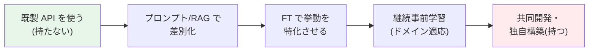
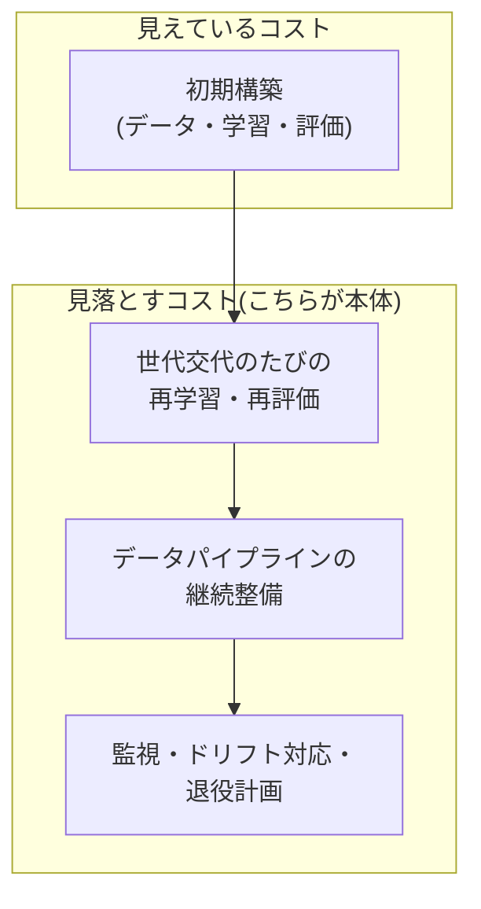

# 「自社モデルを持つか」の判断

## この記事の目的

プロンプト → RAG → ファインチューニング(FT)の先にある「専用モデルへの投資」— 大規模 FT・継続事前学習(continued pre-training)・共同開発や独自構築 — を、**能力・コスト・組織**の観点で判断できるようになります。「持つ」ことがどの段階を指すのかを分解し、判断軸と最大の見落とし(世代交代への追従コスト)、そして「持たない」戦略の強さと撤退基準までを、経営・調達レベルの意思決定として整理します。

## 対象読者

- 「自社専用モデルを作るべきか」を経営・技術の両面から問われている CTO・技術責任者・アーキテクト
- FT やモデル内製の投資稟議を評価・起案する立場のエンジニアリングマネージャー

## 前提知識

- [ファインチューニングと蒸留](../03-implementation/fine-tuning-and-distillation.md) — 「持つ」の一手段である FT の**手法**の正本(本記事は手法ではなく投資判断)
- [モデル選定ガイド](../03-implementation/model-selection.md) — 「持たない(既製を使い分ける)」という選択肢の技術的正本
- [ROI とビジネスケース](roi-and-business-case.md) — 撤退基準・段階投資という本記事の判断原則
- [セルフホスト推論の実務](../05-operations/self-hosted-inference.md) — 独自モデルを動かす実行基盤(本記事はその手前の投資判断)

## 本文

### 概要: 「持つ」は 0/1 ではなく段階

「自社モデルを持つべきか」という問いは、しばしば「巨大な独自モデルをゼロから学習するか否か」という極端な二択で語られます。実際には、**モデルへの関与は連続した段階**であり、判断はそのどの段階に踏み込むかの選択です。多くの組織にとって最適解は両端ではなく中間、あるいは「持たない」ことの意識的な選択です。

右へ行くほど、差別化の可能性と引き換えに、初期投資・追従コスト・必要な組織能力が跳ね上がります。**右に進む判断は「戻れなくはないが、戻るのに大きなコストがかかる」不可逆性**を帯びます。だからこそ、投資判断として扱います。

### 「持つ」の段階と前提条件

各段階は、その手前の段階を尽くしていることが前提です。上の段を飛ばして下の段(重い段)に投資するのは、ほぼ常に失敗します。

| 段階 | 何をするか | 踏み込む前提条件 | 追従コストの重さ |
| --- | --- | --- | --- |
| 既製 API を使い分ける | ベンダーのモデルをそのまま。ティア混在で最適化 | ほぼ常にここから。多くの案件はここで足りる | 軽(乗り換え自由) |
| プロンプト / RAG | 指示・文脈・知識注入で品質を作る | 評価で品質課題を特定済み | 軽 |
| ファインチューニング | 既存モデルの重みを自社データで追加調整 | プロンプト/RAG が頭打ちと**評価で実証**済み。良質なラベルデータがある | 中(ベース世代に固定) |
| 継続事前学習 | 大量のドメインコーパスでベースを追加事前学習 | ドメイン固有の言語・知識で既製が明確に不足。大規模コーパスと ML 基盤・人材がある | 重 |
| 共同開発・独自構築 | ベンダーとの共同開発、またはオープンウェイトからの本格構築 | モデルそのものが事業の中核差別化。継続投資できる資本と組織 | 最重 |

継続事前学習より右は、専任の ML 研究・基盤チーム、学習用計算資源(自社または[セルフホスト推論](../05-operations/self-hosted-inference.md)の延長にある学習インフラ)、そして継続的なデータ整備の体制を前提とします。ここは「プロジェクト」ではなく「事業」です。

### 判断軸

段階を上げるかどうかは、次の 4 軸で問います。1 つでも「否」があれば、その投資は疑うべきです。

1. **差別化の源泉になるか**: そのモデルの挙動が、競合が容易に真似られない事業価値を生むか。「少し賢くなる」程度なら、次のベース世代が無料でくれます。**汎用能力の向上をベンダーに任せ、自社は差別化に集中する**のが基本方針です
2. **データ優位があるか**: 自社にしかない、質・量ともに十分な独自データがあるか。モデルを特化させる燃料はデータであり、データ優位のない特化は「他社も既製 API で追いつける」ことを意味します
3. **維持できる組織か**: 単発で作れても、評価・再学習・監視・世代追従を回し続ける人材と体制があるか。**モデルは資産ではなく、生き物のように世話が要る負債にもなり得ます**([常駐エージェントのライフサイクル管理](../05-operations/long-running-agents.md)と同じ「維持の思想」)
4. **退役リスクを引き受けられるか**: FT・継続学習はベースモデルの世代に紐づき、ベースが退役すれば作り直しです。次節の追従コストを、事業として引き受けられるか

### 最大の見落とし: 追従コスト

自社モデル投資で最も過小評価されるのは、初期の構築費ではなく**世代交代への追従コスト**です。

既製モデルは年単位(ときに数か月)で世代交代し、汎用能力が跳ね上がります。ある時点で「既製 API より優秀」だった自社特化モデルは、**次のベース世代が出た瞬間に、追加学習なしの既製モデルに能力で追い越されることがあります**。追いつくには、新しいベースの上で FT・継続学習を**やり直す**必要があり、これはデータ整備・学習・評価・再デプロイの全工程の繰り返しです([ファインチューニングと蒸留](../03-implementation/fine-tuning-and-distillation.md)の「ベース退役は期限付きの計画タスク」)。

投資判断では、初期費用ではなく**「今後 N 年、世代交代のたびに払い続けるコスト」の総額**で見積もります。この追従コストが、既製 API を使い続けるコストを継続的に上回る根拠がなければ、投資は正当化できません。

### 「持たない」ことの強さ

「持たない」— 既製モデルを中立的に使い分ける — は、消極的な選択ではなく**積極的な戦略**です。これは[モデル選定ガイド](../03-implementation/model-selection.md)の「モデル中立・乗り換え自由」の経営版です。

- **能力向上をただ乗りできる**: ベンダーが投じる巨額の研究開発の成果を、世代交代のたびに(ほぼ)自動で受け取れます。自社は差別化レイヤー(データ・プロンプト・ワークフロー・UX)に集中できます
- **乗り換え自由という保険**: 特定モデルに固定しない設計([LLM ゲートウェイ](../05-operations/llm-gateway.md)でモデルを抽象化)は、価格改定・提供停止・性能逆転に対する保険です。自社モデルはこの自由を手放す代わりに差別化を得る取引であり、割に合うかを常に問います
- **差別化はモデルの外に多い**: 多くの事業で、競争優位は「モデルが少し賢い」ことよりも、独自データ・業務への統合・信頼・UX にあります。これらは既製モデルの上でも作れます

原則として、**「持たない」を既定とし、「持つ」は 4 つの判断軸すべてに明確に答えられる場合の例外**として扱うのが、多くの組織にとって健全です。

### 段階的な検証と撤退基準

「持つ」に踏み込むと決めても、一足飛びに最重量の段階へ投資しません。[ROI とビジネスケース](roi-and-business-case.md)と[PoC から本番への進め方](poc-to-production.md)の段階投資・関門の原則がそのまま適用されます。

- **小さい段階で実証してから拡大する**: いきなり継続事前学習ではなく、まず限定タスクの FT で「特化が実際に事業価値を生むか」を評価で実証します。実証できてから、より重い段階への投資を検討します
- **撤退基準を着手前に決める**: 「次のベース世代で既製 API に能力で並ばれたら FT をやめる」「追従コストが既製利用の N 倍を超えたら撤退する」といった基準を、投資を始める前に定義します。[ROI とビジネスケース](roi-and-business-case.md)の「サンクコストに引きずられない」がここでも要です — 投じた学習費は戻りません。継続判断は将来の見合いだけで行います

### 「持つ側」の実行基盤との関係

「持つ」と決めた後の**実行**は、本記事の範囲外です。学習・推論の基盤は[セルフホスト推論の実務](../05-operations/self-hosted-inference.md)・[GPU・AI ハードウェアの基礎](../05-operations/gpu-and-hardware-basics.md)・[MLOps と LLMOps の統合](../05-operations/mlops-and-llmops.md)が扱います。オープンウェイトモデルを起点にする場合の選択肢は[主要 LLM の全体像](../03-implementation/llm-landscape.md)を参照してください。本記事はその手前の「そもそも投資すべきか」を扱います。

## 実務での注意点

### アンチパターン

- **「自社モデルがあると箔が付く」で内製を始める** → 差別化に寄与しないモデルの世話に人材を取られ、本業の差別化が止まる → 4 つの判断軸(差別化・データ優位・維持組織・退役リスク)で問い、否があれば持たない
- **初期構築費だけで投資判断する** → 世代交代のたびの再学習という本体コストを見落とし、数年で採算割れする → 「今後 N 年の追従コスト総額」で見積もる
- **プロンプト/RAG を尽くさずに FT・継続学習へ飛ぶ** → 軽い手段で得られた改善に、重い投資が能力で負ける → 手前の段階を評価で尽くしてから次の段へ
- **世代交代を計画に入れずに特化モデルを塩漬けにする** → 次のベース世代が出た瞬間、既製 API に追い越され、追従の準備がなく品質が停滞する → ベース退役の追跡と再学習運用をセットで持つ
- **撤退基準なしで投資を始める** → サンクコストで止められず、見合わない内製を続ける → 「既製に並ばれたら」「追従コストが N 倍を超えたら」を着手前に定義する

### チェックリスト

- [ ] 「持つ」のどの段階(FT / 継続事前学習 / 共同開発・独自構築)を検討しているか明確にした
- [ ] 手前の段階(プロンプト・RAG・既製の使い分け)を評価で尽くしたことを実証した
- [ ] 4 つの判断軸(差別化の源泉・データ優位・維持できる組織・退役リスク)すべてに答えた
- [ ] 投資見積もりを初期費用でなく「今後 N 年の世代交代追従コスト総額」で作った
- [ ] 「持たない(既製の使い分け + 乗り換え自由)」を対抗案として明示的に比較した
- [ ] 小さい段階での実証 → 拡大という段階投資を設計した
- [ ] 撤退基準(能力逆転・コスト超過)を着手前に定義した
- [ ] 「持つ」場合の実行基盤(学習・推論・MLOps)の体制を確認した

## 関連トピック

- [ファインチューニングと蒸留](../03-implementation/fine-tuning-and-distillation.md) — 「持つ」の一手段である FT・蒸留の手法(本記事の実装側)
- [モデル選定ガイド](../03-implementation/model-selection.md) — 「持たない」= 既製を使い分ける技術的正本
- [ROI とビジネスケース](roi-and-business-case.md) — 段階投資・撤退基準・サンクコストの原則
- [AI 調達・ベンダー選定の実務](ai-procurement.md) — 「作らずに買う」ときの評価・契約(本記事の対になる調達側)
- [セルフホスト推論の実務](../05-operations/self-hosted-inference.md) — 「持つ」と決めた後にモデルを動かす実行基盤
- [小型言語モデル(SLM)の活用戦略](../03-implementation/slm-strategy.md) — 特化を小型モデルで得る中間解
- [主要 LLM の全体像](../03-implementation/llm-landscape.md) — オープンウェイトという独自構築の起点
- [LLM ゲートウェイの設計](../05-operations/llm-gateway.md) — 乗り換え自由を保つモデル抽象化

## 参考資料

- なし(自社モデル投資の判断は、本ライブラリのモデル選定・FT・ROI・運用の知見を経営判断として統合した整理であり、単独の外部一次資料の解説ではありません。FT の提供状況など変化の速い事実は各記事の一次情報を参照してください)

## TODO・未確認事項

なし
