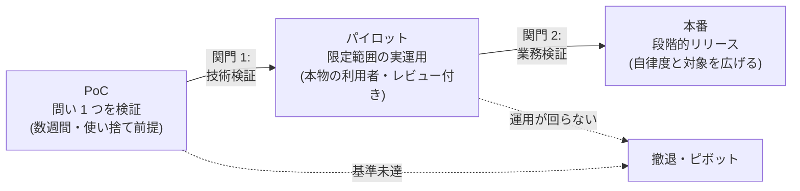

# PoC から本番への進め方

## この記事の目的

「デモは動くが本番に行けない」を防ぎ、PoC(概念実証)→ パイロット → 本番という段階と、各段階の関門・撤退基準・体制を設計できるようになります。Agent 案件が最も多く止まるのは PoC と本番の間であり、本記事はその谷の渡り方を扱います。

## 対象読者

- PoC の実施を任されたエンジニア・テックリード
- PoC の結果から本番化の可否を判断するエンジニアリングマネージャー・プロダクト責任者

## 前提知識

- [ユースケース発見と要件定義](usecase-discovery.md) — 成功基準とベースラインが合意済みであることが本記事の前提です
- [Agent 評価の基礎](../04-evaluation/agent-evaluation-basics.md) — 関門判断の根拠になる評価の設計

## 本文

### 概要

PoC から本番までを 1 回のジャンプにせず、関門付きの 3 段階で進めます。各段階には目的・期間・通過条件があり、どの段階からも「撤退・ピボット」に分岐できることが健全な設計です。

- **PoC**: 「この業務で・このデータで・必要な精度が出るか」という技術的な問いを検証する
- **パイロット**: 限られた利用者・範囲で実運用し、「業務として回るか」(レビュー体制・例外処理・利用者の受容)を検証する
- **本番**: 対象範囲と自律度を段階的に広げる

### PoC の設計

PoC の品質は、作り込みではなく **問いの絞り込み** で決まります。

- **問いを 1 つに絞る**: 「経費明細の規程照合で、人のチェックと同等の検出率が出るか」のように 1 文で書けること。複数の問いがあるなら PoC を分けます
- **期間と予算を区切る**: 数週間単位で締め切りを置き、延長するなら「何が分かれば延長の価値があるか」を明示します
- **使い捨て前提で作る**: PoC コードは本番の土台ではなく、問いに答えるための実験装置です。エラー処理・監視・権限管理を省いた実装は本番に持ち込めません
- **ただし評価データセットは資産として作る**: PoC で作った評価ケースと採点方法は、本番後の回帰テストまで使い続ける数少ない持ち越し資産です([回帰テストと CI 組み込み](../04-evaluation/regression-testing.md))
- **本物のデータで測る**: 整形済みのきれいなサンプルだけで測った精度は、本番の入力分布では再現しません

最大の敵は **「デモの罠」** です。うまくいく 5 件を見せるデモは説得力がありますが、何も証明していません。PoC の成果物はデモではなく、(1) 分布を代表する評価セットでの測定結果、(2) 失敗ケースの分析、(3) 本番化に必要な残課題リスト、の 3 点セットです。

### 本番化の関門チェック

「デモが動く」と「本番に置ける」の間には、機能以外の関門が並んでいます。関門 2(パイロット → 本番)では最低限、次の観点を確認します。

| 観点 | 関門の問い | 参照 |
| --- | --- | --- |
| 評価 | 定量評価が成功基準を超え、変更のたびに再評価できる仕組みがあるか | [Agent 評価の基礎](../04-evaluation/agent-evaluation-basics.md) |
| セキュリティ | 脅威モデルを作り、インジェクション・権限・データ持ち出しのレビューを通過したか | [Agent の脅威モデル概観](../06-security/threat-model-overview.md) |
| 運用体制 | 監視・アラート・キルスイッチがあり、「誰が止めるか」が決まっているか | [インシデント対応](../05-operations/incident-response.md) |
| コスト | 本番トラフィックでのコスト見積もりがあり、上限とアラートを設定したか | [コスト管理](../05-operations/cost-management.md) |
| 人の関与 | レビュー・承認の運用が現実的な負荷で回ることをパイロットで確認したか | [Human-in-the-Loop 設計](../02-architecture/human-in-the-loop.md) |
| データ | 会話ログ・顧客データの保持と共有の方針を関係部門と合意したか | [データ漏えい対策](../06-security/data-exfiltration.md) |

この表は本番化判定会議のアジェンダとしてそのまま使えます。重要なのは、関門を **PoC 開始前に公開しておく** ことです。後出しの関門は「動いているのになぜ出せないのか」という不毛な対立を生みます。

### 段階的リリース

本番リリースは「全ユーザー・全自動」への一斉切り替えではなく、2 つの軸を段階的に広げます。

1. **自律度の軸**: 提案のみ(人が実行)→ 承認付き実行 → 限定範囲の自動実行 → 自動実行 + 抜き取り監査。引き上げの判断は稼働データ(修正率・エラー率)で行います
2. **対象範囲の軸**: 社内利用者 → 一部の顧客・カテゴリ → 全体。トラフィックを絞ったカナリアリリースと、問題時に旧フローへ戻すロールバック手段を先に用意します([バージョニング・デプロイ・モデル更新追従](../05-operations/versioning-and-model-updates.md))

有効な中間手段として **シャドーラン**(本番の入力を Agent に流すが、結果は業務に使わず人の結果と突き合わせる)があります。利用者への影響ゼロで本番分布での品質を測れるため、関門 1 と関門 2 の間に挟む価値があります。

### 撤退・ピボットの判断

撤退基準は **着手前に** 決めます。作った後に決めようとすると、サンクコスト(投じた工数への愛着)で判断が歪むからです。

- 撤退基準の例: 「評価セットでの精度が 2 回の改善イテレーションを経ても基準未達」「人の修正コストが削減時間を上回る」「前提としていたデータが継続的に得られない」
- 全面撤退の前に検討するピボットの型:
  - **自律度を下げる**: 自動実行 → 下書き生成に切り替える(価値は減るが人の修正で品質を担保できる)
  - **範囲を狭める**: 全カテゴリ → 精度の高い 1〜2 カテゴリに限定する
  - **Workflow 化**: 判断部分を捨て、手順が固定の部分だけを従来型の自動化にする([Workflow 型 vs Agent 型](../02-architecture/workflow-vs-agent.md))
- 撤退しても、評価データセット・失敗分析・「この業務は現状の技術では合わない」という知見は残ります。撤退を「失敗」ではなく計測結果として報告する文化が、次の案件の速度を上げます

### 体制と引き継ぎ

Agent は作って終わりではなく、モデル更新・入力分布の変化・プロンプト改善が続きます。「作る人」と「運用する人」が分断していると本番後に品質が漂流するため、パイロット段階から運用側を巻き込みます。

本番移行時の引き継ぎ物は最低限、次の 5 点です。

1. 評価ハーネスと評価データセット(更新の手順を含む)
2. プロンプト・設定・ツール定義の管理場所と変更フロー
3. 既知の失敗モードと対処の記録(失敗ケース分析の続き)
4. 運用手順書(Runbook。監視項目・アラート対応・キルスイッチの場所 → [インシデント対応](../05-operations/incident-response.md))
5. コストダッシュボードと予算アラート

オーナーシップは「業務側オーナー(品質と業務影響の最終責任)」と「技術側オーナー(システムの維持改善)」を 1 人ずつ明示します。どちらかが空席のまま本番化した Agent は、最初のインシデントで止まったまま再開されない、という結末になりがちです。

## 実務での注意点

### アンチパターン

- **PoC のコードをそのまま本番に昇格させる** → エラー処理・監視・権限管理がなく、最初の異常入力やインシデントで破綻する → 本番実装は関門を通す前提で作り直し、持ち越すのは評価データセットとプロンプトの知見にする
- **デモの成功で本番 GO を判断する** → ハッピーパス偏重のまま本番に出て、例外入力で事故が起きる → 分布を代表する評価セットでの測定結果と失敗分析で判断する
- **撤退基準を決めずに延命し続ける** → サンクコストで「あと少し」を繰り返し、数か月と信頼を失う → 着手前に撤退条件を文書で合意する
- **セキュリティレビューを本番化直前に初めて実施する** → 権限設計やデータフローの手戻りが大きく、リリースが数週間止まる → PoC 段階で[脅威モデル](../06-security/threat-model-overview.md)に目を通し、パイロット前にレビューを受ける
- **全ユーザーへ一斉リリースする** → 問題発生時の影響とロールバックのコストが最大化する → 自律度と対象範囲の 2 軸で段階的に広げ、ロールバック手段を先に用意する

### チェックリスト

本番化判定(関門 2)でそのまま使える形にしています。

- [ ] PoC の問いが 1 文で書かれており、本物のデータ分布での測定結果がある
- [ ] 評価データセットと回帰テストが、本番後も回る形で引き継がれる
- [ ] セキュリティレビュー(脅威モデル・権限・インジェクション・データフロー)を通過した
- [ ] 監視・アラート・キルスイッチがあり、「誰が止めるか」が決まっている
- [ ] 本番トラフィックでのコスト見積もりと予算アラートを設定した
- [ ] レビュー・承認の運用負荷がパイロットで実測され、現実的である
- [ ] 撤退・ロールバックの条件と手段が文書化されている
- [ ] 業務側オーナーと技術側オーナーが 1 人ずつ決まり、引き継ぎ物 5 点が揃っている

## 関連トピック

- [ユースケース発見と要件定義](usecase-discovery.md) — 本記事の前段。成功基準の合意なしに PoC を始めない
- [Agent 評価の基礎](../04-evaluation/agent-evaluation-basics.md) — 関門 1(技術検証)の中身
- [Human-in-the-Loop 設計](../02-architecture/human-in-the-loop.md) — 自律度の段階設計と承認運用
- [バージョニング・デプロイ・モデル更新追従](../05-operations/versioning-and-model-updates.md) — カナリアリリースとロールバックの実務
- [インシデント対応](../05-operations/incident-response.md) — 本番化の関門になる運用体制の設計
- [経費精算アシスタントの段階的 Agent 化](../07-case-studies/case-study-expense-agent.md) — 段階的リリース(自律度の引き上げ)の通し実例
- [ケーススタディ: 撤退したプロジェクト](../07-case-studies/case-study-failed-poc.md) — 本番化に至らず撤退した失敗事例(デモの罠・撤退の実務)

## 参考資料

- [Building Effective Agents(Anthropic)](https://www.anthropic.com/research/building-effective-agents) — 最小構成から始めて計測しながら複雑化するという、PoC 設計と同じ思想の設計原則(アクセス日: 2026-07-06)

## TODO・未確認事項

なし
