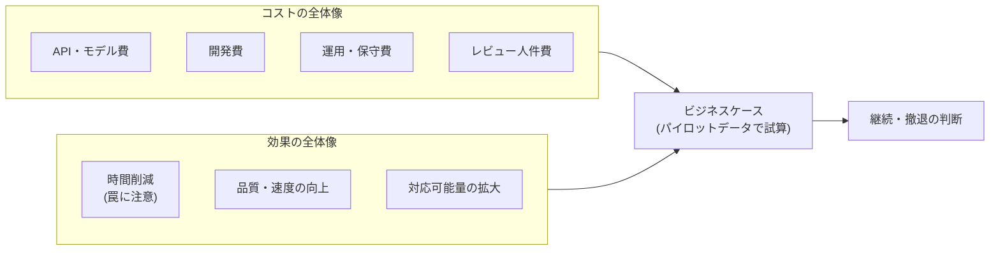

# ROI とビジネスケース

## この記事の目的

AI Agent 案件の投資対効果(ROI)を、コスト側と効果側の両方を漏れなく見積もり、稟議・継続判断に使えるビジネスケースとして組み立てられるようになります。「時間削減効果」を過大に語る罠を避け、失敗した投資を適切に止める判断まで扱います。

## 対象読者

- Agent 導入の予算取り・稟議を通す立場のエンジニア・テックリード
- パイロットの結果から本番投資の可否を判断するプロダクト責任者・マネージャー

## 前提知識

- [ユースケース発見と要件定義](usecase-discovery.md) — 成功基準とベースラインの合意(ROI 試算の入力)
- [PoC から本番への進め方](poc-to-production.md) — パイロットデータで語るという本記事の前提
- [コスト管理](../05-operations/cost-management.md) — API コストの構造(コスト側の一部)

## 本文

### 概要: ROI は「効果 − コスト」だが両方を見落としやすい

ROI 自体は「効果 − コスト」という単純な引き算ですが、AI Agent では**コストを過小に、効果を過大に**見積もる方向に両方が偏りがちです。結果、稟議時は魅力的に見えて本番で採算が合わない、という失敗が起きます。本記事はこの両側のバイアスを潰すための地図です。

### コストの全体像

API 費用は氷山の一角です。見落としやすいコストまで含めて積み上げます。

| コスト | 内容 | 見落としの罠 |
| --- | --- | --- |
| API・モデル費 | 推論トークン費。ループ回数 × 履歴再送で膨らむ | PoC の少量データで単価を推定すると、本番トラフィックで数倍になる([コスト管理](../05-operations/cost-management.md)) |
| 開発費 | 設計・実装・評価ハーネス構築・プロンプト調整 | 「動くデモ」から「本番品質」までの作り込みが最も過小評価される |
| 運用・保守費 | 監視・インシデント対応・モデル更新追従・プロンプト改善 | Agent は作って終わりでなく、継続的な保守コストが乗り続ける([バージョニング・デプロイ・モデル更新追従](../05-operations/versioning-and-model-updates.md)) |
| レビュー人件費 | 人間の承認・出力レビュー・エスカレーション対応 | **自律度が低いほど大きい**。「下書きを人が全件レビュー」は削減した時間の相当部分を食う |

特にレビュー人件費は、ROI 試算で最も忘れられるコストです。「AI が下書きを作り、人が確認して送る」構成では、確認の手間が残ります。効果を「作成時間ゼロ」で計算すると過大評価になります。自律度を上げれば下がりますが、それは品質・リスクとのトレードオフです([Human-in-the-Loop 設計](../02-architecture/human-in-the-loop.md))。

### 効果測定の設計

効果は「時間削減」だけではありませんが、その時間削減こそ最も罠が多い指標です。

- **時間削減の罠**: 「1 件 30 分 → 5 分、25 分削減」という計算は、(1) レビュー時間を無視している、(2) 削減された時間が実際に価値ある業務に振り替わるとは限らない(端数の時間は消えるだけのこともある)、(3) ハッピーパスの所要時間で計算し、Agent が失敗して人が引き取るケースを無視している、という 3 点で過大評価に傾きます。**「純削減時間 = 従来の所要 −(Agent 実行 + レビュー + 失敗時の引き取り)」**で計算します
- **品質・速度の効果も測る**: 時間だけでなく、品質(誤り率の低下・一貫性)、速度(応答が速くなる = 顧客満足)、対応可能量の拡大(24 時間対応・繁忙期の吸収)も効果です。これらは金額換算しにくいですが、案件によっては時間削減より本質的です
- **ベースラインと比較する**: 効果は必ず現状(ベースライン)との差で測ります([ユースケース発見と要件定義](usecase-discovery.md)で測ったベースラインが、ここで効いてきます)。ベースラインなしの「N 時間削減」は検証も反証もできません
- **パイロットの実測で語る**: 見積もりの精度は、机上計算よりパイロットの実測が桁違いに高いです。純削減時間・レビュー率・失敗率・1 件あたりコストをパイロットで実測し、それを本番規模に外挿します([PoC から本番への進め方](poc-to-production.md))

### ビジネスケースの組み立て

稟議・意思決定に使うビジネスケースは、次を含めます。

1. **前提の明示**: どの業務の・どの範囲を・どの自律度で、という前提(前提が変われば数字が変わることを示す)
2. **パイロット実測に基づく試算**: 純削減時間・品質効果・コスト内訳を、パイロットデータから。机上の理想値ではなく実測レンジで
3. **感度分析**: 「トラフィックが 2 倍なら」「レビュー率が想定より高ければ」で ROI がどう動くかを示す。単一の楽観値でなく幅で語ると、意思決定者の信頼が上がります
4. **段階投資の提案**: 全額を一度に投じるのではなく、パイロット → 限定本番 → 拡大の各段階での投資と撤退ポイントを示す([PoC から本番への進め方](poc-to-production.md)の関門と対応)
5. **非金銭的効果とリスク**: 金額換算しにくい効果(顧客満足・従業員体験)と、リスク(誤り・レピュテーション・コンプライアンス)を併記する

数字の精度を装いすぎないことも重要です。過度に精緻な ROI 試算は、不確実性を隠して意思決定を誤らせます。レンジと前提を明示する方が誠実で、結果的に信頼されます。

### 継続判断

ビジネスケースは一度作って終わりではなく、稼働後の実績で更新し続けます。

- **実績で試算を更新する**: 本番の純削減時間・コスト・品質を継続測定し、当初試算とのズレを見ます。フィードバックループの運用([フィードバックループの運用](../05-operations/feedback-loops.md))で得るデータがそのまま ROI の実績値になります
- **撤退・縮小の判断**: 「レビューコストが削減効果を上回っている」「保守コストが見合わない」なら、自律度の引き上げ・範囲の縮小・撤退を検討します。撤退基準は着手前に決めておくのが原則です([PoC から本番への進め方](poc-to-production.md))
- **サンクコストに引きずられない**: 投じた開発費は戻りません。継続判断は「これまで幾ら使ったか」ではなく「これから見合うか」で行います。止める判断も投資判断の一部です

## 実務での注意点

### アンチパターン

- **API 費用だけでコストを見積もる** → 開発・運用・レビュー人件費が抜け、本番で採算割れする → 4 種のコスト(API・開発・運用・レビュー)を積み上げる
- **時間削減を「作成時間ゼロ」で計算する** → レビュー・失敗引き取りを無視し、効果を過大評価する → 純削減時間(実行 + レビュー + 引き取りを引いた値)で計算する
- **PoC の少量データで単価を推定する** → 本番トラフィックでコストが数倍になり ROI が崩れる → パイロットの実測を本番規模に外挿し、感度分析で幅を持たせる
- **単一の楽観値で稟議を通す** → 前提が少しずれただけで採算が崩れ、信頼を失う → レンジ + 前提 + 感度分析で示す
- **サンクコストで撤退できない** → 見合わない投資を「ここまで使ったから」と続けてしまう → 継続判断は将来の見合いだけで行い、撤退基準を事前に決める

### チェックリスト

- [ ] コストを 4 種(API・開発・運用・レビュー人件費)で積み上げた
- [ ] レビュー人件費を自律度に応じて見積もった
- [ ] 効果を純削減時間(実行・レビュー・失敗引き取りを差し引き)で計算した
- [ ] 時間以外の効果(品質・速度・対応量)も評価した
- [ ] ベースラインとの差で効果を測っている
- [ ] 試算がパイロットの実測に基づき、感度分析で幅を示している
- [ ] 段階投資と各段階の撤退ポイントを提示した
- [ ] 稼働後に実績で試算を更新し、継続・撤退を将来の見合いで判断する運用がある

## 関連トピック

- [ユースケース発見と要件定義](usecase-discovery.md) — ベースライン測定と成功基準(ROI の入力)
- [PoC から本番への進め方](poc-to-production.md) — パイロット実測・段階投資・撤退基準
- [コスト管理](../05-operations/cost-management.md) — API コストの構造(コスト側の技術的詳細)
- [フィードバックループの運用](../05-operations/feedback-loops.md) — 稼働後の実績データの収集
- [Human-in-the-Loop 設計](../02-architecture/human-in-the-loop.md) — レビューコストと自律度のトレードオフ
- [顧客・プロジェクトへの導入合意形成](../08-coding-agents/se-client-adoption.md) — 受託開発で AI 活用の効果を顧客に示し合意を取る SE 実践側
- [ケーススタディ: 撤退したプロジェクト](../07-case-studies/case-study-failed-poc.md) — 費用対効果が反転し撤退した失敗事例(撤退基準・サンクコストの物語)

## 参考資料

- なし(ROI の算定は一般的な投資評価の実践に、本ライブラリのコスト構造・評価・運用の知見を統合した整理のため、単独の外部一次資料はありません)

## TODO・未確認事項

なし
