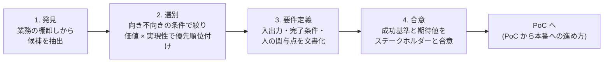

# ユースケース発見と要件定義

## この記事の目的

「Agent で何をやるか」を業務の棚卸しから発見・選別し、着手前に成功基準と期待値をステークホルダーと合意できるようになります。Agent 案件の成否は技術力より題材選びと合意形成で決まることが多く、本記事はその最初の分岐を扱います。

## 対象読者

- AI Agent の導入を企画・推進するエンジニア・テックリード
- 事業部門から「AI で何かできないか」と相談され、候補を選別する立場の人

## 前提知識

- [AI Agent とは何か](../01-concepts/what-is-an-ai-agent.md) — 自律性のスペクトラムという判断軸
- [Workflow 型 vs Agent 型の使い分け](../02-architecture/workflow-vs-agent.md) — 候補を「Agent で作るべきか」を判断する技術側の基準

## 本文

### 概要

ユースケース発見から着手までは、次の 4 段階で進めます。いきなり「作りたいもの」から始めるのではなく、業務の棚卸しから候補を出し、条件で絞り、要件と成功基準を文書化してから着手します。

この段階を飛ばした案件は、「デモはできたが誰の何を解決するのか分からない」「完成したのに評価基準がなく本番化を判断できない」という形で後から止まります。

### Agent に向く仕事・向かない仕事

候補を選別する最初のフィルタです。技術的な作り方の判断([Workflow 型 vs Agent 型](../02-architecture/workflow-vs-agent.md))の前に、そもそも LLM ベースの自動化に向く業務かを判定します。

| 向く条件 | なぜ効くか | 確認の仕方 |
| --- | --- | --- |
| 結果を検証できる | 誤りを検知・修正できないと品質を保証できない | 正解データ・チェック手順・レビュー担当のいずれかが存在するか |
| 手順が毎回変わる(判断を含む) | 手順が完全に固定なら、定型操作の自動化ツール(RPA)やスクリプトの方が確実で安い | 担当者に「例外はどのくらいあるか」を聞く |
| 失敗の損害が限定的、または人のレビューで回収できる | Agent の誤りはゼロにできない | 最悪の誤りが起きたときの影響を 1 文で書けるか |
| 必要な情報・ツールにプログラムからアクセスできる | データが紙・画面キャプチャ・属人記憶にしかないと精度以前の問題になる | API・DB・ファイルでの取得経路を列挙できるか |
| 人が現に時間を使っている | 使う人がいない自動化は価値を測れない | 頻度と 1 件あたりの所要時間を概算できるか |

逆に、次のような業務は(少なくとも最初の案件としては)向きません。

- **検証不能な高リスク判断**: 与信の最終判断、医療上の診断など、誤りの検知が難しく損害が大きいもの
- **100% の正確性が前提の処理**: 会計仕訳の転記そのものなど。決定的なコードで書くべき処理です
- **厳しい応答時間が求められる処理**: LLM の呼び出しを重ねる Agent はレイテンシが読みにくい([レイテンシ最適化](../05-operations/latency-optimization.md))
- **データがデジタル化されていない業務**: 先にデータ整備が必要で、Agent 案件としては時期尚早

### 候補の発見と優先順位付け

**発見**は「AI で何ができるか」ではなく「人がどこに時間を使っているか」から始めます。宝庫になりやすいのは次の場所です。

- 問い合わせ対応のログ・チケット管理システム(同型の質問が繰り返されている領域)
- 定型レポート・議事録・下書き作成(成果物の型が決まっている作業)
- 転記・照合・コピペ(複数システムをまたぐ手作業)
- 引き継ぎ資料・手順書(手順が文書化されている = 要件定義の素材が既にある)

候補は「**誰の・どの業務の・どの部分を・どこまで任せるか**」の 1 文で記述します。「営業事務の見積もり作成業務のうち、過去見積もりの検索と下書き作成までを任せる(送付判断は人)」のように、範囲と自律性を含めるのがポイントです。

**優先順位付け**は価値と実現性の 2 軸で行います。

- **価値** = 頻度 × 1 件あたりの時間 × 担当人数(+ 品質・速度の改善効果)
- **実現性** = 検証可能性・データアクセス・失敗許容度(上の表の条件をどれだけ満たすか)

最初の 1 件は「価値が中程度でも実現性が高い」候補を選びます。最初の案件の役割は投資回収ではなく、組織としての実績づくりと評価・運用の型づくりだからです。価値最大の本丸は、型ができた 2 件目以降に回します。

### 要件定義の型

Agent 案件の要件定義は、従来のシステム要件に加えて「人の関与」と「失敗の扱い」を最初から含める必要があります。最低限、次の 8 項目を埋めます。

| 項目 | 書くこと | 例(問い合わせ一次対応 Agent) |
| --- | --- | --- |
| トリガー | いつ・何をきっかけに動くか | 問い合わせフォームの受信時 |
| 入力 | 何を受け取るか(形式・ソース) | 問い合わせ本文 + 顧客情報 + FAQ データベース |
| 出力 | 何をどこへ出すか | 回答の下書きをサポートツールに保存 |
| 完了条件 | 何をもって 1 件完了とするか | 下書き保存 or 「回答不能」の判定 |
| 自律性の範囲 | どこまで任せ、どこから人か | 下書きまで。送信は人が承認 |
| 人の関与点 | 承認・レビュー・エスカレーションの設計 | 全件レビュー(将来は抜き取りに移行) |
| データ要件 | アクセス権・機微度・ログの扱い | 顧客情報は参照のみ。会話ログの保持方針は情報セキュリティ部門と合意 |
| 失敗時の扱い | 誰がどう気づき、どう処理するか | 判定不能時は人のキューへ。誤回答は修正内容を記録して改善に使う |

「自律性の範囲」は要件の中核です。[Human-in-the-Loop 設計](../02-architecture/human-in-the-loop.md)の関与パターン(事前承認・事後レビュー・エスカレーション)から選び、**将来引き上げる計画**(例: 全件レビュー → 抜き取り監査)も含めて書いておくと、本番化後の拡張がスムーズになります。

### 成功基準と期待値の合意

**成功基準は着手前に数値で決めます**。あとから決めると「動いたから成功」に流れ、本番化・継続の判断ができなくなります。

1. ベースラインを測る(現状の処理時間・件数・品質。測っていなければ 1〜2 週間のサンプル計測から)
2. 目標を数値で置く(例: 一次回答の 60% を下書き自動化、人の修正率 30% 以下、1 件あたりコスト X 円以下)
3. 測定方法を決める(何のログで、誰が、いつ測るか → [Agent 評価の基礎](../04-evaluation/agent-evaluation-basics.md))

**期待値の合意**は「魔法ではない」の共有です。少なくとも次の 3 点を、着手前にステークホルダーへ明示します。

- 誤りは必ず起きる前提で、人のレビュー体制と改善ループをセットで運用する
- 自律度は段階的に上げる(最初から全自動にしない)
- PoC(概念実証)は本番ではない(位置づけと次の関門は [PoC から本番への進め方](poc-to-production.md) を参照)

ステークホルダーごとに関心が異なる点にも注意します。現場担当者は「仕事を奪われるのか・使いにくくないか」、管理職は「投資対効果」、情報システム・セキュリティ部門は「データがどこへ行くか」を見ています。それぞれの関心に対応する説明(役割の変化、成功基準、データフロー図)を用意しておくと合意が速くなります。

## 実務での注意点

### アンチパターン

- **「AI で何かやれ」からデモ映えする題材を選ぶ** → 誰の時間も減らさず、PoC 止まりで終わる → 業務の棚卸しと価値 × 実現性の評価から選ぶ
- **一番困っている(= 最高難度・高リスク)業務を最初の案件にする** → 失敗して「AI は使えない」という組織記憶が残る → 最初は実現性の高い題材で実績と型を作り、本丸は 2 件目以降に回す
- **成功基準を決めずに作り始める** → 完成しても良し悪しを判定できず、本番化も撤退も決められない → ベースライン計測と数値基準を着手前に合意する
- **「全自動化できます」と約束する** → 最初の誤りで信頼が崩壊し、案件ごと止まる → 誤り前提の運用設計と段階的な自律度引き上げを最初に説明する

### チェックリスト

- [ ] 候補を「誰の・どの業務の・どの部分を・どこまで任せるか」の 1 文で記述した
- [ ] 向き不向きの 5 条件(検証可能・手順変動・失敗許容・データアクセス・利用実態)を確認した
- [ ] 価値と実現性で優先順位を付け、最初の 1 件は実現性を優先した
- [ ] 要件定義の 8 項目(特に自律性の範囲・人の関与点・失敗時の扱い)を埋めた
- [ ] 機微データの範囲とアクセス権を情報セキュリティ担当と確認した
- [ ] 成功基準を数値で定義し、ベースラインを測定した(または測定計画がある)
- [ ] 「誤りは必ず起きる」前提と段階的な自律度引き上げをステークホルダーと合意した

## 関連トピック

- [Workflow 型 vs Agent 型の使い分け](../02-architecture/workflow-vs-agent.md) — 選んだ候補を「どう作るか」の技術判断。Agent 以外が正解のことも多い
- [PoC から本番への進め方](poc-to-production.md) — 合意した要件を検証し、本番に運ぶ次の段階
- [Human-in-the-Loop 設計](../02-architecture/human-in-the-loop.md) — 要件の中核になる「人の関与点」の設計パターン
- [Agent 評価の基礎](../04-evaluation/agent-evaluation-basics.md) — 成功基準を評価・測定に落とし込む方法
- [経費精算アシスタントの段階的 Agent 化](../07-case-studies/case-study-expense-agent.md) — 題材選定から段階導入までの通し実例

## 参考資料

- [Building Effective Agents(Anthropic)](https://www.anthropic.com/research/building-effective-agents) — 「いつ Agent を使うべきか(使わないべきか)」の判断と、シンプルさを優先する原則(アクセス日: 2026-07-06)

## TODO・未確認事項

なし
