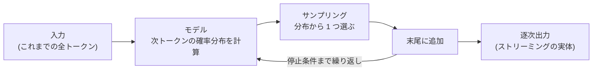

# LLM はどうやってテキストを生成するか

## この記事の目的

LLM の出力が「次の 1 トークンの予測を繰り返した積み上げ」であることを理解し、温度(temperature)などの推論パラメータを設計判断として扱えるようになります。あわせて、実務で毎日直面する性質 — 出力が毎回揺れる・ストリーミングできる・出力が長いほど遅く高い — がすべてこの 1 つの仕組みから導けることを掴みます。

## 対象読者

- LLM API は使えるが、パラメータを「おまじない」のまま使っているエンジニア
- 非決定性・出力切断など LLM 特有の挙動を、仕組みから説明できるようになりたい人

## 前提知識

- LLM API(チャット補完 API)を呼び出した経験(このライブラリ共通の前提)
- ライブラリ内の前提ドキュメントはありません — 本記事が 10 章(LLM 基礎)の最初の 1 本です

## 本文

### 概要: たった 1 つのループ

LLM の生成の実体は次の 1 文に要約できます — **「これまでの全トークンを入力として、次の 1 トークンの確率分布を計算し、そこから 1 つ選んで末尾に足す」を、停止条件まで繰り返す**。これを自己回帰生成(autoregressive generation)と呼びます。トークン(token)はモデルが扱うテキストの最小単位です(詳細は[トークナイザとトークン経済](tokenization.md))。

長い推論も、コードも、丁寧な謝罪文も、モデルにとってはすべて「次の 1 トークン」の連続です。この単純さを知っていることが、以降のすべての実務判断の土台になります。

### 次トークン予測という実体

モデル本体は、状態を持たない関数です — 「ここまでのトークン列」を受け取り、「語彙中の各トークンが次に来る確率」を返します。知識も推論らしき振る舞いも、この形式の中に押し込まれています。ここから 2 つの実務的な帰結が出ます。

- **自分の出力が、以降の生成の入力になる**: 生成の途中経過は文脈として確定し、モデルはそれを「取り消せません」。序盤で方向を誤ると後半も引きずられます。逆に、結論の前に考察を書かせると精度が変わるのは、書いた考察が次トークンの予測条件に加わるからです([プランニングと推論](../01-concepts/planning-and-reasoning.md))
- **「途中でやめて考え直す」は起きない**: 見かけ上の自己修正(「すみません、訂正します」)も、確定済みの文脈の上に続きを生成しているだけです。やり直しをさせたければ、呼び出し側が文脈を作り直す必要があります

### サンプリングと温度

確率分布から次の 1 トークンを「選ぶ」方法がサンプリングで、ここに主要な推論パラメータが集まっています。

| 方法・パラメータ | 意味 | 実務での使いどころ |
| --- | --- | --- |
| 貪欲法(最大確率を常に選ぶ) | 揺らぎ最小。反復・単調に陥ることがある | 温度 0 指定が近い挙動 |
| 温度(temperature) | 分布の尖り具合。低いほど高確率トークンに集中、高いほど平坦化 | 分類・抽出・構造化出力は低め、発想・文章の多様性は中〜高 |
| top-p(累積確率での足切り) | 確率上位の候補集合だけからサンプリング | 温度と併用される既定の安全弁 |

指針はシンプルです — **後続をコードで処理する出力(分類・抽出・判定)は低温度、多様さ自体に価値がある出力は高めの温度**。なお、推論に特化したモデルでは温度などの指定が制限・無視される場合があるため、モデルごとの仕様を確認してください。

### 「同じ入力で違う出力」になる理由

LLM の非決定性には 2 つの層があります。

1. **サンプリングの確率性**: 温度が 0 より大きければ、同じ分布からでも選ばれるトークンは毎回変わりえます。これは意図された挙動です
2. **実装レベルの揺らぎ**: 温度を 0 にしても、並列計算の丸め誤差やサービス側の実装要因により、完全に同一の出力は一般に保証されません。確率が拮抗した 2 つのトークンは、ごくわずかな計算差で入れ替わり、その 1 トークンの違いが以降の生成を分岐させます

実務上の帰結は明確です — **「1 回通ったテスト」は品質の保証にならない**、が LLM アプリの大前提になります。評価を複数ケース・複数回で設計する理由([Agent 評価の基礎](../04-evaluation/agent-evaluation-basics.md))、回帰テストで完全一致比較を使わない理由([回帰テストと CI 組み込み](../04-evaluation/regression-testing.md))は、どちらもここから来ています。

### 停止とストリーミング

生成ループの止まり方は 3 つあります。

- **自然停止**: モデルが「応答の終わり」を意味するトークンを選ぶ
- **停止シーケンス**: 開発者が指定した文字列が現れたら打ち切る
- **上限打ち切り**: 最大出力トークン数(max_tokens)に達して強制終了する

とくに上限打ち切りは事故の温床です。**打ち切られた JSON は壊れた JSON** であり、応答の停止理由(finish reason)を確認せずに後続処理へ流すと、静かな失敗になります([構造化出力](../03-implementation/structured-output.md))。

また、1 トークンずつ順に確定していく仕組みだからこそ、生成と同時に配信するストリーミングが自然に成立します([ストリーミングと Agent の UX 実装パターン](../03-implementation/streaming-and-agent-ux.md))。生成時間とコストは出力トークン数にほぼ比例するため、「出力を短く設計する」ことがレイテンシとコストの双方に効く最適化になります([レイテンシ最適化](../05-operations/latency-optimization.md)、[コスト管理](../05-operations/cost-management.md))。

### この理解が効く場面

- **構造化出力**: スキーマ強制は「その位置で選べるトークンを制約する」仕組みで実現されるのが主流です。だから**形式は保証できても、内容の正しさは保証されません**([構造化出力](../03-implementation/structured-output.md))
- **評価設計**: 非決定性が仕様だと分かっていれば、単発の成否ではなく分布(合格率・ばらつき)で品質を測る設計になります([Agent 評価の基礎](../04-evaluation/agent-evaluation-basics.md))
- **レイテンシ・コスト**: 出力長比例の構造を知っていれば、「不要な説明を書かせない」「要約を返させる」といった出力側の設計が最初の最適化になります
- **パラメータの設計**: 温度・top-p を「試して良かった値」ではなく「タスクの性質から選んだ値」として文書化できます

## 実務での注意点

### アンチパターン

- **温度 0 なら決定的になると信じて完全一致の回帰テストを作る** → 実装要因の揺らぎでテストが不安定化する → 意味レベルの比較・複数回実行・合格率での判定にする
- **1 回のデモ成功で品質を判断する** → サンプリングの揺らぎで次の実行は失敗しうる → 複数ケース・複数回の評価で分布を見る
- **停止理由を確認せず出力を後続処理に流す** → 上限打ち切りの壊れた JSON・尻切れ応答が静かに下流を壊す → finish reason のチェックをコードに入れる
- **分類・抽出タスクを高めの温度のまま運用する** → 同じ入力への判定が揺れて信頼を失う → 後続がコードの出力は低温度を既定にする

### チェックリスト

- [ ] 応答の停止理由(自然停止/打ち切り)をコードで確認している
- [ ] タスク種別ごとに温度・サンプリング設定を意図して選び、記録している
- [ ] 非決定性を前提にした評価(複数ケース・複数回・合格率)がある
- [ ] 出力トークン数がレイテンシ・コスト要件に収まるよう出力側を設計した

## 関連トピック

- [トークナイザとトークン経済](tokenization.md) — 生成の単位「トークン」の実体(次に読む 1 本)
- [構造化出力](../03-implementation/structured-output.md) — デコード制約の実務(形式保証と内容保証の違い)
- [Agent 評価の基礎](../04-evaluation/agent-evaluation-basics.md) — 非決定性を前提にした評価設計
- [ストリーミングと Agent の UX 実装パターン](../03-implementation/streaming-and-agent-ux.md) — 逐次生成を UX に活かす側
- [レイテンシ最適化](../05-operations/latency-optimization.md) — 出力長比例の構造への対処
- [プランニングと推論](../01-concepts/planning-and-reasoning.md) — 「考察を書かせると精度が変わる」の実務側
- [マルチモーダルモデルの仕組み(数式なしの直感)](multimodal-models.md) — 画像・音声入力も次トークン予測の枠組みに載る応用
- [推論の内部機構(サンプリング・KV キャッシュ・量子化)](../11-llm-internals/inference-internals.md) — サンプリングの数理・推論高速化の学術的な詳解(本記事のさらに深く)

## 参考資料

- なし(次トークン予測・温度付きサンプリングは LLM の確立した基本動作であり、本記事は特定の一次資料ではなく、広く共有された理解を本ライブラリの実務記事へ接続した整理のため)

## TODO・未確認事項

なし
