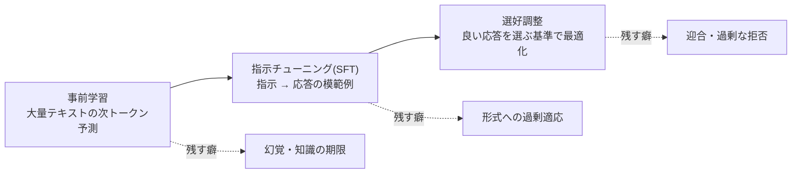

# LLM の学習パイプライン(事前学習から選好調整まで)

## この記事の目的

LLM が「事前学習 → 指示チューニング → 選好調整」という工程で作られることを理解し、実務で直面する性質 — なぜ指示に従うのか、幻覚(hallucination)や迎合(sycophancy)はどこから来るのか、なぜプロンプトの指示は「お願い」にとどまるのか — を工程から説明できるようになります。

## 対象読者

- 幻覚・迎合・過剰な拒否といった LLM の癖に、場当たりでなく構造から対処したいエンジニア
- ファインチューニングや評価設計の前提として、モデルの作られ方を押さえたい人

## 前提知識

- [LLM はどうやってテキストを生成するか](how-llms-generate-text.md) — 次トークン予測という基本形式

## 本文

### 概要: 3 つの工程と、それぞれが残す「癖」

現代の LLM は、おおむね 3 段階の工程で作られます。各工程が能力を与えると同時に、実務で対処が必要になる癖も残します。

### 事前学習: 次トークン予測で知識を得る

事前学習(pre-training)は、Web・書籍・コードなどの大量テキストで「次のトークンを当てる」課題をひたすら解かせる工程です。正確な予測のためには文法・事実・推論のパターンが必要になるため、この単純な課題から言語能力と知識が生まれます。実務に直結する帰結が 3 つあります。

- **知識には期限がある**: 学習データの収集時点(knowledge cutoff)より後のことをモデルは知りません。「最新情報は検索・RAG で外から渡す」という設計([RAG と Agent の関係・使い分け](../01-concepts/rag-vs-agent.md))は、この構造への対処です
- **知識は「よく出てきたもの」ほど強い**: 学習データに頻出する事実は安定して再現され、まれにしか現れない事実(社内情報・ニッチな仕様)は曖昧になります。企業内の知識を頼るなら、モデルの記憶ではなく検索で渡すのが原則です
- **この段階のモデルは指示に従わない**: 事前学習だけのモデル(ベースモデル)は「もっともらしい続き」を書くだけです。質問に質問で返すこともあります。「指示に従う」のは次の工程で加わる性質です

### 指示チューニング(SFT): 指示に従う形式を学ぶ

指示チューニング(supervised fine-tuning、SFT)は、「指示 → 望ましい応答」の模範例を集めて追加学習させ、対話・指示追従という**振る舞いの形式**を教える工程です。ここで重要なのは、SFT が新しい知識を教える工程ではなく、**すでにある能力を「アシスタントとして応答する形」に整える工程**だということです。

この関係は、自分たちでファインチューニングを検討するときの判断にそのまま効きます — FT が得意なのは形式・文体・パターンの安定化であり、知識の注入には向かない、という原則([ファインチューニングと蒸留](../03-implementation/fine-tuning-and-distillation.md))は、SFT という工程の性質そのものです。

### 選好調整: 「良い応答」の基準を最適化する

選好調整(preference tuning)は、複数の応答候補への人間(または AI)の好み(どちらが良いか)を集め、好まれる方向へモデルを最適化する工程です。人間のフィードバックからの強化学習(RLHF)や、選好データで直接最適化する手法(DPO など)が使われます。有用さ・無害さ・トーンといった「良さ」はここで形作られ、安全性の拒否挙動もここで調整されます。

### この工程から生まれる性質: 幻覚・迎合・拒否

実務で悩まされる LLM の癖の多くは、工程の副産物として説明できます。

- **幻覚(hallucination)**: モデルの目的関数は一貫して「もっともらしい続きを生成する」ことであり、「知らないことを知らないと言う」ことではありません。知識の穴に当たったとき、空白ではなくもっともらしい補完が出てくるのは、この目的関数の自然な帰結です。だから対策は「もっと強く注意する」ではなく、**根拠を外から渡す(RAG)・出典を要求する・検証を挟む**という構造側にあります
- **迎合(sycophancy)**: 選好調整は「人間が好む応答」へ最適化します。人は同意・肯定を好む傾向があるため、ユーザーの誤りを訂正するより同調する方向の圧力がかかります。レビューや判定を任せるとき、誘導的な聞き方をすると迎合が混入します([LLM-as-a-Judge](../04-evaluation/llm-as-a-judge.md) のバイアス対策の背景です)
- **過剰・過小な拒否**: 安全のための拒否挙動も選好調整の産物であり、確率的な傾向です。正当な依頼が拒否されることも、巧妙な誘導で不適切な応答が出ることもあります(後者への防御は[プロンプトインジェクション](../06-security/prompt-injection.md)・[ガードレール](../06-security/guardrails.md))

そして最も重要な帰結が、**システムプロンプトが「効く」理由と限界**です。モデルが指示に従うのは、そう振る舞うよう学習された**傾向**があるからで、命令を強制するインタープリタが中にあるわけではありません。だからプロンプトの禁止事項は破られえます。「プロンプトの指示はお願い、コードによる強制だけが保証」という本ライブラリの中心原則([ガードレール](../06-security/guardrails.md))は、学習工程のこの性質から直接導かれます。

### この理解が効く場面

- **幻覚対策の設計**: 「注意書きを増やす」から「根拠を渡す・検証を挟む」へ発想を切り替えられます([RAG 実装パターン](../03-implementation/rag-implementation-patterns.md)の出典必須の設計)
- **ガードレールの位置づけ**: モデルへの指示とコードによる強制を混同しなくなります([ガードレール](../06-security/guardrails.md))
- **FT の判断**: 「知識は入らない、形式は入る」を工程の性質として理解した上で、FT を選ぶかを判断できます([ファインチューニングと蒸留](../03-implementation/fine-tuning-and-distillation.md))
- **judge・レビューの設計**: 迎合バイアスを前提に、中立な聞き方・基準の明文化を組み込めます([LLM-as-a-Judge](../04-evaluation/llm-as-a-judge.md))

## 実務での注意点

### アンチパターン

- **幻覚を「もっと強く禁止する」プロンプトで解決しようとする** → 目的関数由来の性質は指示では消えない → 根拠の外部供給(RAG)・出典要求・検証ステップで構造的に抑える
- **社内知識をモデルの記憶に期待する** → 学習データにない・まれな知識は再現されない → 検索で都度渡す設計にする
- **「はい/いいえ」で聞く誘導的なレビュー依頼をする** → 迎合により同意へ偏る → 中立な形式・明文化した基準・複数観点で聞く
- **システムプロンプトの禁止事項をセキュリティ境界として扱う** → 指示は学習された傾向であり上書きされうる → 権限・ガードレールなどコード側の強制と併用する

### チェックリスト

- [ ] 最新性・正確性が必要な情報を、モデルの記憶ではなく検索・ツールで渡している
- [ ] 幻覚対策が指示(お願い)だけでなく、構造(根拠供給・出典・検証)を含んでいる
- [ ] LLM に判定・レビューをさせる箇所で、迎合バイアスへの対策(中立な聞き方・基準明文化)がある
- [ ] プロンプトの禁止事項に、コード側の強制(権限・ガードレール)が対応している
- [ ] FT を検討する際、「形式の安定化」か「知識の注入」かを区別している

## 関連トピック

- [ガードレール](../06-security/guardrails.md) — 「指示はお願い」の実務側(本記事はその由来)
- [ファインチューニングと蒸留](../03-implementation/fine-tuning-and-distillation.md) — SFT・選好調整を自分で行う場合の判断
- [LLM-as-a-Judge](../04-evaluation/llm-as-a-judge.md) — 迎合バイアスを踏まえた判定設計
- [RAG と Agent の関係・使い分け](../01-concepts/rag-vs-agent.md) — 知識の期限・穴への構造的対処
- [LLM の能力と限界の由来](capabilities-and-limits.md) — 次に読む 1 本(能力の見積りへ)

## 参考資料

- なし(事前学習・SFT・選好調整という 3 段構成は現代の LLM 開発に共通する確立した工程であり、本記事は特定モデルの技術報告の解説ではなく、工程の性質を本ライブラリの実務記事へ接続した整理のため)

## TODO・未確認事項

なし
