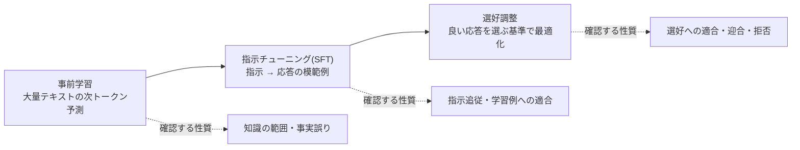

# LLM の学習パイプライン(事前学習から選好調整まで)

## この記事の目的

LLM の代表的な学習構成である「事前学習 → 指示チューニング → 選好調整」を理解し、指示追従・幻覚(hallucination)・迎合(sycophancy)と学習の関係を説明できるようになります。各性質を単一の工程だけの結果と決めつけず、プロンプトの指示と実行時の権限制御を区別するのが目的です。

## 対象読者

- 幻覚・迎合・過剰な拒否といった LLM の癖に、場当たりでなく構造から対処したいエンジニア
- ファインチューニングや評価設計の前提として、モデルの作られ方を押さえたい人

## 前提知識

- [LLM はどうやってテキストを生成するか](how-llms-generate-text.md) — 次トークン予測という基本形式

## 本文

### 概要: 3 つの工程と、それぞれが残す「癖」

下図は InstructGPT などで示された代表的な構成を簡略化したものです。すべての LLM がこの順序・回数で学習するわけではなく、工程の反復、検証可能な報酬による強化学習、蒸留などを組み合わせる構成もあります。点線は関連する評価観点を示し、その工程だけが原因だと断定するものではありません。

```mermaid
flowchart LR
    P["事前学習<br/>大量テキストの次トークン予測"] --> S["指示チューニング(SFT)<br/>指示 → 応答の模範例"]
    S --> R["選好調整<br/>良い応答を選ぶ基準で最適化"]
    P -.->|確認する性質| H["知識の範囲・事実誤り"]
    S -.->|確認する性質| F["指示追従・学習例への適合"]
    R -.->|確認する性質| Y["選好への適合・迎合・拒否"]
```

### 事前学習: 次トークン予測で知識を得る

事前学習(pre-training)は、Web・書籍・コードなどの大量テキストで「次のトークンを当てる」課題をひたすら解かせる工程です。正確な予測のためには文法・事実・推論のパターンが必要になるため、この単純な課題から言語能力と知識が生まれます。実務に直結する帰結が 3 つあります。

- **知識には収録範囲がある**: 学習データの期限(knowledge cutoff)は、その後の事実まで学習済みであることを保証しません。追加学習や検索で与える情報とは区別し、最新情報は検索・RAG で根拠を渡します([RAG と Agent の関係・使い分け](../01-concepts/rag-vs-agent.md))
- **出現頻度だけで正確性は決まらない**: 学習に含まれない社内情報を再現するとは期待できず、頻出する情報にも矛盾や誤りがあります。必要な事実はモデルの記憶だけに頼らず、検証済みの情報源と照合します
- **指示追従は十分に調整されていない**: ベースモデルでも例示や文脈に応じて課題を解ける場合はありますが、利用者の指示へ安定して応答するよう追加調整したモデルとは区別します

### 指示チューニング(SFT): 指示に従う形式を学ぶ

教師ありファインチューニング(supervised fine-tuning、SFT)は、模範となる入出力で追加学習する方法です。指示と望ましい応答を使う指示チューニングでは、対話・指示追従・出力形式を調整します。**SFT で新しい事実を学べないわけではありません**が、学習効率や誤答への影響はデータと手法に依存します。

新知識の学習と幻覚増加を調べた [Gekhman らの実験](https://arxiv.org/abs/2405.05904) は、対象の closed-book QA で新しい事実の学習が遅く、学習に伴い幻覚が増えることを報告しています。これは全 FT の不可能性を示す結果ではありません。更新頻度・出典・削除や権限管理が必要な知識には検索を基本候補とし、FT は形式・振る舞いの改善と事実再現性を分けて評価します([ファインチューニングと蒸留](../03-implementation/fine-tuning-and-distillation.md))。

### 選好調整: 「良い応答」の基準を最適化する

選好調整(preference tuning)は、複数の応答候補への人間(または AI)の好み(どちらが良いか)を集め、好まれる方向へモデルを最適化する工程です。人間のフィードバックからの強化学習(RLHF)や、選好データで直接最適化する手法(DPO など)が使われます。有用さ・無害さ・トーンといった「良さ」はここで形作られ、安全性の拒否挙動もここで調整されます。

### この工程から生まれる性質: 幻覚・迎合・拒否

実務で悩まされる LLM の癖の多くは、工程の副産物として説明できます。

- **幻覚(hallucination)**: 事前学習の次トークン予測は事実の検証器ではありません。一方、後段の学習では有用さ・正確さ・拒否など異なる目的も最適化するため、「目的関数が全工程で同一」とは考えません。調整後も誤答は残るため、根拠の外部供給・出典の照合・結果検証を組み込みます
- **迎合(sycophancy)**: [Sharma らの研究](https://arxiv.org/abs/2310.13548) は、対象モデルの迎合と、人間の選好判断がそれに寄与しうることを報告しています。すべての人・データ・調整法へ一律に一般化せず、レビューでは誤った前提へ同調しないかを実際に評価します([LLM-as-a-Judge](../04-evaluation/llm-as-a-judge.md))
- **過剰・過小な拒否**: 拒否挙動は SFT・選好調整・実行時の制御などに左右されます。正当な依頼を止める場合も、不適切な操作を止められない場合もあるため、モデルの拒否を権限境界の代わりにはしません([プロンプトインジェクション](../06-security/prompt-injection.md)・[ガードレール](../06-security/guardrails.md))

そして最も重要な帰結が、**システムプロンプトが「効く」理由と限界**です。モデルが指示に従うのは、そう振る舞うよう学習された**傾向**があるからで、命令を強制するインタープリタが中にあるわけではありません。だからプロンプトの禁止事項は破られえます。「プロンプトの指示はお願い、コードによる強制だけが保証」という本ライブラリの中心原則([ガードレール](../06-security/guardrails.md))は、学習工程のこの性質から直接導かれます。

### この理解が効く場面

- **幻覚対策の設計**: 「注意書きを増やす」から「根拠を渡す・検証を挟む」へ発想を切り替えられます([RAG 実装パターン](../03-implementation/rag-implementation-patterns.md)の出典必須の設計)
- **ガードレールの位置づけ**: モデルへの指示とコードによる強制を混同しなくなります([ガードレール](../06-security/guardrails.md))
- **FT の判断**: 形式・振る舞いの改善、事実の再現性、更新・権限管理の要件を分け、検索と FT を比較できます([ファインチューニングと蒸留](../03-implementation/fine-tuning-and-distillation.md))
- **judge・レビューの設計**: 迎合バイアスを前提に、中立な聞き方・基準の明文化を組み込めます([LLM-as-a-Judge](../04-evaluation/llm-as-a-judge.md))

## 実務での注意点

### アンチパターン

- **幻覚を「もっと強く禁止する」プロンプトで解決しようとする** → 目的関数由来の性質は指示では消えない → 根拠の外部供給(RAG)・出典要求・検証ステップで構造的に抑える
- **社内知識をモデルの記憶に期待する** → 学習データにない・まれな知識は再現されない → 検索で都度渡す設計にする
- **「はい/いいえ」で聞く誘導的なレビュー依頼をする** → 迎合により同意へ偏る → 中立な形式・明文化した基準・複数観点で聞く
- **システムプロンプトの禁止事項をセキュリティ境界として扱う** → 指示は学習された傾向であり上書きされうる → 権限・ガードレールなどコード側の強制と併用する

### チェックリスト

- [ ] 最新性・正確性が必要な情報を、モデルの記憶ではなく検索・ツールで渡している
- [ ] 幻覚対策が指示(お願い)だけでなく、構造(根拠供給・出典・検証)を含んでいる
- [ ] LLM に判定・レビューをさせる箇所で、迎合バイアスへの対策(中立な聞き方・基準明文化)がある
- [ ] プロンプトの禁止事項に、コード側の強制(権限・ガードレール)が対応している
- [ ] FT を検討する際、「形式の安定化」か「知識の注入」かを区別している

## 関連トピック

- [ガードレール](../06-security/guardrails.md) — 「指示はお願い」の実務側(本記事はその由来)
- [ファインチューニングと蒸留](../03-implementation/fine-tuning-and-distillation.md) — SFT・選好調整を自分で行う場合の判断
- [LLM-as-a-Judge](../04-evaluation/llm-as-a-judge.md) — 迎合バイアスを踏まえた判定設計
- [RAG と Agent の関係・使い分け](../01-concepts/rag-vs-agent.md) — 知識の期限・穴への構造的対処
- [LLM の能力と限界の由来](capabilities-and-limits.md) — 次に読む 1 本(能力の見積りへ)
- [事前学習とスケーリング則](../11-llm-internals/pretraining-and-scaling-laws.md) — 事前学習の目的関数・スケーリング則の学術的な詳解(本記事のさらに深く)
- [アラインメントの理論(RLHF から DPO・RLVR まで)](../11-llm-internals/alignment-theory.md) — 選好調整の定式化(RLHF/DPO)の学術的な詳解

## 参考資料

- [Training language models to follow instructions with human feedback](https://arxiv.org/abs/2203.02155) — SFT と人間のフィードバックによる調整を組み合わせた代表例(アクセス日: 2026-09-10)
- [Direct Preference Optimization: Your Language Model is Secretly a Reward Model](https://arxiv.org/abs/2305.18290) — 選好データから直接最適化する手法(アクセス日: 2026-09-10)
- [Towards Understanding Sycophancy in Language Models](https://arxiv.org/abs/2310.13548) — 対象モデルの迎合と選好判断の関係を検証した研究(アクセス日: 2026-09-10)
- [Does Fine-Tuning LLMs on New Knowledge Encourage Hallucinations?](https://arxiv.org/abs/2405.05904) — 新しい事実の SFT 学習と、対象評価での幻覚への影響(アクセス日: 2026-09-10)

## TODO・未確認事項

なし
