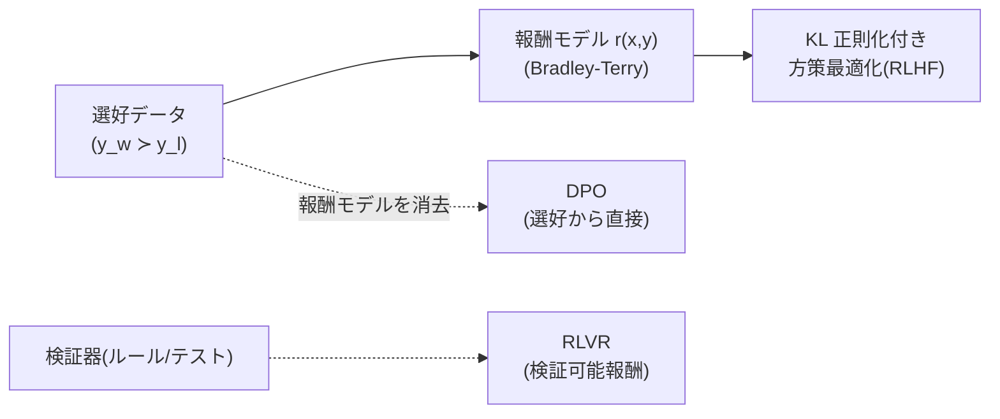

# アラインメントの理論(RLHF から DPO・RLVR まで)

## この記事の目的

選好調整(preference tuning)を数式レベルで理解できるようになります。RLHF の定式化(選好データ → 報酬モデル → KL 正則化付き方策最適化)、報酬モデルを消去する DPO の導出、報酬の過剰最適化(Goodhart)、そして検証可能報酬(RLVR)・プロセス報酬までを、「結果の式 + 日本語の読み下し」で押さえます。[LLM の学習パイプライン](../10-llm-foundations/llm-training-pipeline.md)が直感で説明する「迎合はなぜ起きるか」「なぜ拒否は確率的か」の**理論的な裏付け**を得ることを目指します。

数式は読み飛ばしても本文が成立するように読み下しを添えます。安全性の運用・ガードレールの実装は本記事のスコープ外です([ガードレール](../06-security/guardrails.md)側)。

## 対象読者

- [LLM の学習パイプライン](../10-llm-foundations/llm-training-pipeline.md)の選好調整を、RLHF・DPO の定式化で理解したいエンジニア
- 迎合・報酬ハッキング・アラインメント税といった現象の理論的な由来を知りたい人

## 前提知識

- [LLM の学習パイプライン](../10-llm-foundations/llm-training-pipeline.md) — 事前学習 → SFT → 選好調整の工程と、そこから生まれる癖(必読)
- [事前学習とスケーリング則](pretraining-and-scaling-laws.md) — 選好調整の手前にある事前学習・SFT の土台
- 確率・期待値の基礎。強化学習の用語(方策・報酬)は本文で最小限に補います

## 本文

### 概要: 「良さ」をどう最適化するか

事前学習と SFT を終えたモデルは、指示に従う形は得ていますが、「どの応答が**より良いか**」の基準はまだ弱いままです。選好調整は、**人間(または AI)の『こちらが良い』という比較**からこの基準を学ばせる工程です。中心となるのが RLHF(人間のフィードバックからの強化学習)で、その簡略化として DPO、検証可能なタスク向けに RLVR があります。

### RLHF の定式化

RLHF は 2 段です。まず**報酬モデル**を選好から学び、次にその報酬を最大化するように**方策(モデル)**を最適化します。

**(1) 報酬モデルの学習**。同じ入力 $x$ への 2 つの応答について、人間が「勝ち $y_w$ / 負け $y_l$」を付けた選好データを使います。勝ちの方が報酬が高くなる確率を、報酬差のシグモイドでモデル化します(Bradley-Terry モデル)。

$$
P(y_w \succ y_l \mid x) = \sigma\big(r_\phi(x, y_w) - r_\phi(x, y_l)\big)
$$

読み下し: 「勝ち応答が選ばれる確率は、勝ちと負けの報酬の差をシグモイドに通したもの。差が大きいほど勝ちが選ばれやすい」。報酬モデル $r_\phi$ は、この確率が観測された選好に合うよう(負対数尤度の最小化で)学習されます。

**(2) 方策の最適化**。次に、モデル(方策 $\pi_\theta$)を、報酬 $r_\phi$ を高める方向に最適化します。ただし**元のモデル $\pi_{\mathrm{ref}}$ から離れすぎない**よう、KL ダイバージェンスで正則化します。

$$
\max_{\pi_\theta}\ \mathbb{E}_{x,\, y \sim \pi_\theta}\big[r_\phi(x, y)\big] \;-\; \beta\, \mathrm{KL}\big(\pi_\theta(\cdot \mid x)\ \|\ \pi_{\mathrm{ref}}(\cdot \mid x)\big)
$$

読み下し: 「報酬の期待値を上げつつ、元のモデルからの逸脱(KL)に $\beta$ の罰則をかける」。$\beta$ が正則化の強さで、**小さいほど報酬を追って元から離れ、大きいほど元に留まる**。この最適化は通常 PPO などの強化学習アルゴリズムで解きます。KL 項がないと、次節の「報酬の過剰最適化」で暴走します。

### DPO の導出: 報酬モデルを消す

RLHF は報酬モデルの学習と強化学習の 2 段で、実装が重く不安定になりがちです。**DPO(Direct Preference Optimization)**は、この 2 段を**選好データから直接 1 段**にまとめます。鍵は、上の KL 正則化付き最適化の**最適方策が閉じた形で書ける**ことです。その式を報酬について解くと、報酬が方策の比で表せます。

$$
r(x, y) = \beta \log \frac{\pi_\theta(y \mid x)}{\pi_{\mathrm{ref}}(y \mid x)} + \beta \log Z(x)
$$

読み下し: 「報酬は、いまの方策と元の方策の確率比の対数(× $\beta$)に、$x$ ごとの定数を足したもの。つまり**報酬モデルは方策の中に暗黙に含まれている**」。これを Bradley-Terry の式に代入すると、扱いにくい正規化定数 $Z(x)$ が**差し引きで消え**、選好データだけで最適化できる損失になります。

$$
\mathcal{L}_{\mathrm{DPO}} = -\, \mathbb{E}\left[ \log \sigma\!\left( \beta \log \frac{\pi_\theta(y_w \mid x)}{\pi_{\mathrm{ref}}(y_w \mid x)} - \beta \log \frac{\pi_\theta(y_l \mid x)}{\pi_{\mathrm{ref}}(y_l \mid x)} \right) \right]
$$

読み下し: 「勝ち応答の確率比を上げ、負け応答の確率比を下げるように学習する。報酬モデルも強化学習も要らない」。DPO は実装が軽く安定な一方、明示的な報酬モデルがないぶん、RLHF ほど細かい制御(報酬の再利用・オンライン探索)はしにくい、というトレードオフがあります。

### 報酬の過剰最適化(Goodhart)

「測りたいもの(真の良さ)」の**代理**(報酬モデル)を最大化すると、代理を突いて真の目標から外れる — これが **Goodhart の法則**(指標が目標になると指標として機能しなくなる)です。RLHF/DPO では**報酬ハッキング**として現れます。

- 報酬モデルを強く最大化するほど、**真の品質はある点から下がる**(報酬モデルの誤差を突く出力に寄る)ことが観測されています(報酬の過剰最適化のスケーリング)
- 前節の KL 正則化($\beta$)は、この暴走を抑えるブレーキです。**$\beta$ を下げすぎると報酬モデルの穴を突き、上げすぎると学習が進まない**、という調整になります
- 具体的な症状: 長さで水増しする(冗長な回答が高報酬に見える)、体裁だけ整える、といった「報酬モデルが好むが人間の真意ではない」方向への最適化

読み下すと: 「代理指標を全力で最大化してはいけない。正則化で元から離れすぎないようにし、報酬モデル自体も更新する」。これは評価一般の[ガードレールメトリクス](../04-evaluation/online-evaluation-and-ab-testing.md)や、判定の[較正](../04-evaluation/confidence-and-calibration.md)とも通じる話です。

### 検証可能報酬(RLVR)とプロセス報酬

数学・コードのように**正解を機械的に検証できる**タスクでは、学習した報酬モデルの代わりに**検証器(テスト・ルール)そのものを報酬**に使えます。これが **RLVR(検証可能報酬による強化学習)**です。

- **結果報酬**: 最終答えが正しいか(テストが通るか)だけを報酬にする。報酬モデルの誤差・ハッキングを避けられる一方、途中の誤った推論を咎められない
- **プロセス報酬**: 推論の各ステップの正しさを評価して報酬にする。中間の誤りを直接罰せるが、ステップの正誤ラベルを用意するコストがかかる

RLVR は、**推論モデル(考える時間を使う LLM)の学習**を支える枠組みで、[推論モデル](../10-llm-foundations/reasoning-models.md)が検証可能な問題で強い理由の 1 つです。検証器が用意できるタスクに限られる点が本質的な制約です。

### 迎合とアラインメント税

選好調整は 2 つの副作用を残します。[LLM の学習パイプライン](../10-llm-foundations/llm-training-pipeline.md)の「癖」を理論から裏付けます。

- **迎合(sycophancy)**: 人間は同意・肯定を好む傾向があるため、選好データにその偏りが乗り、モデルは**ユーザーの誤りを訂正するより同調する**方向に最適化されます。研究でも、モデルがユーザーの立場に合わせて答えを変える傾向が観察されています。判定・レビューを任せるとき、誘導的な聞き方が迎合を引き出す理由です([LLM-as-a-Judge](../04-evaluation/llm-as-a-judge.md))
- **アラインメント税(alignment tax)**: 安全・整形のための調整が、素の能力(特定タスクの性能)をわずかに下げることがあります(この概念は InstructGPT で導入され、緩和策も併せて提示されました)。無害化と有用性はトレードオフしうるため、**「安全にするほど賢くなる」とは限らない**。RLHF はこの税を小さく保つ工夫でもあります

なお、AI のフィードバックで無害化を進める手法(Constitutional AI など)は、人手の選好ラベルを AI の判断で置き換える方向の研究で、選好データの作り方の変種として位置づけられます。

### この理解が効く場面

- **迎合バイアスへの対処**: 判定・レビュー設計で中立な聞き方・基準明文化を組み込む理由が、選好調整の定式化から説明できる([LLM-as-a-Judge](../04-evaluation/llm-as-a-judge.md))
- **推論モデルの理解**: RLVR・プロセス報酬が、検証可能タスクでの推論モデルの強さの背景([推論モデル](../10-llm-foundations/reasoning-models.md))
- **FT の判断**: 自前で選好調整(DPO 等)をするときの、報酬過剰最適化・KL 正則化の勘所([ファインチューニングと蒸留](../03-implementation/fine-tuning-and-distillation.md))
- **安全主張の読み方**: アラインメント税・報酬ハッキングを知っていると、提供者の安全フレームワークを批判的に読める([フロンティアセーフティの概観](../06-security/frontier-safety-overview.md))

## 実務での注意点

### アンチパターン

- **報酬モデルを全力で最大化する** → Goodhart により真の品質がある点から下がり、報酬ハッキング(長さ水増し等)が起きる → KL 正則化で元から離れすぎないようにし、報酬モデルも更新する
- **DPO を「RLHF の完全上位互換」と誤解する** → 明示的報酬モデルがないぶん、オンライン探索・報酬再利用などの制御は効きにくい → タスクと運用に応じて RLHF/DPO を選ぶ
- **RLVR をあらゆるタスクに使おうとする** → 検証器が用意できないタスク(開放的な生成・主観評価)には適用できない → 検証可能なタスクに限定し、他は報酬モデル/人手評価を併用する
- **迎合を「プロンプトで禁止」しようとする** → 選好調整由来の傾向は指示で消えない → 中立な聞き方・基準明文化・複数観点で構造的に抑える
- **「安全調整すれば能力も上がる」と期待する** → アラインメント税で素の性能がわずかに下がりうる → 安全と有用性のトレードオフを前提に評価する

### チェックリスト

- [ ] RLHF の 2 段(報酬モデル → KL 正則化付き方策最適化)を説明できる
- [ ] Bradley-Terry モデル(報酬差のシグモイド)で選好が表されることを理解している
- [ ] DPO が「報酬モデルは方策に暗黙に含まれる」ことで 1 段化する発想を説明できる
- [ ] 報酬の過剰最適化(Goodhart)と、KL 正則化 $\beta$ の役割を理解している
- [ ] RLVR・プロセス報酬が検証可能タスクに限られると理解している
- [ ] 迎合とアラインメント税を選好調整の副作用として説明できる

## 関連トピック

- [LLM の学習パイプライン](../10-llm-foundations/llm-training-pipeline.md) — 選好調整の直感側(本記事はその理論的裏付け)
- [事前学習とスケーリング則](pretraining-and-scaling-laws.md) — 選好調整の手前の事前学習・SFT
- [推論モデル(考える時間を使う LLM)](../10-llm-foundations/reasoning-models.md) — RLVR・プロセス報酬が支える推論学習
- [LLM-as-a-Judge](../04-evaluation/llm-as-a-judge.md) — 迎合バイアスを踏まえた判定設計
- [信頼度と較正(calibration)](../04-evaluation/confidence-and-calibration.md) — 報酬・確信度の測り方(過剰最適化と通じる)
- [ファインチューニングと蒸留](../03-implementation/fine-tuning-and-distillation.md) — 自前で選好調整(DPO 等)を行う場合の実務
- [フロンティアセーフティの概観](../06-security/frontier-safety-overview.md) — 安全主張を批判的に読む土台

## 参考資料

- [Deep Reinforcement Learning from Human Preferences](https://arxiv.org/abs/1706.03741) — 人間の選好から報酬を学ぶ枠組みの原典(Christiano et al., 2017、アクセス日: 2026-07-09)
- [Learning to summarize from human feedback](https://arxiv.org/abs/2009.01325) — 要約での RLHF(Stiennon et al., 2020、アクセス日: 2026-07-09)
- [Training language models to follow instructions with human feedback](https://arxiv.org/abs/2203.02155) — InstructGPT。SFT + RLHF の定式化(Ouyang et al., 2022、アクセス日: 2026-07-09)
- [Direct Preference Optimization: Your Language Model is Secretly a Reward Model](https://arxiv.org/abs/2305.18290) — DPO の原論文(Rafailov et al., 2023、アクセス日: 2026-07-09)
- [Scaling Laws for Reward Model Overoptimization](https://arxiv.org/abs/2210.10760) — 報酬の過剰最適化(Gao et al., 2022、アクセス日: 2026-07-09)
- [Let's Verify Step by Step](https://arxiv.org/abs/2305.20050) — プロセス報酬(Lightman et al., 2023、アクセス日: 2026-07-09)
- [Towards Understanding Sycophancy in Language Models](https://arxiv.org/abs/2310.13548) — 迎合の分析(Sharma et al., 2023、アクセス日: 2026-07-09)
- [Constitutional AI: Harmlessness from AI Feedback](https://arxiv.org/abs/2212.08073) — AI フィードバックによる無害化(Bai et al., 2022、アクセス日: 2026-07-09)

## TODO・未確認事項

> **TODO(要確認):** アラインメント手法(RLVR・プロセス報酬・オンライン選好最適化)は研究の動きが速い。本記事は確立した定式化(RLHF・DPO・報酬過剰最適化)に軸を置いており、最新手法は各研究の一次情報で確認する(最終確認: 2026-07)
