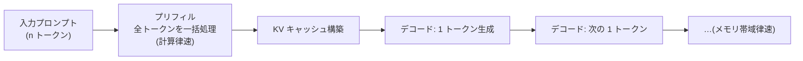

# 推論の内部機構(サンプリング・KV キャッシュ・量子化)

## この記事の目的

学習済みモデルが**推論時に何をしているか**を、数式と計算量の観点で理解できるようになります。ロジット → 確率 → 選択のサンプリングの数理、プリフィルとデコードという 2 相の計算量・メモリ特性、連続バッチング・投機的デコーディング・量子化といった高速化技術の原理までを押さえ、「なぜ入力は安く出力は高いのか」「なぜ最初のトークンは遅く以降は速いのか」といった **API の価格・レイテンシ特性の『なぜ』**に接続できる状態を目指します。

数式は読み下しを添え、読み飛ばしても本文が成立するようにします。推論エンジンの実装・運用は[セルフホスト推論の実務](../05-operations/self-hosted-inference.md)側で、本記事は原理を扱います。

## 対象読者

- [LLM はどのようにテキストを生成するか](../10-llm-foundations/how-llms-generate-text.md)を読み、サンプリング・推論コストの「なぜ」を数式で理解したいエンジニア
- API の価格構造・レイテンシ特性や、セルフホストの高速化技術の原理を押さえたい人

## 前提知識

- [Transformer アーキテクチャ詳解](transformer-architecture.md) — 自己注意・出力ヘッド(ロジットの出どころ)
- [注意機構の変種と長コンテキスト技術](attention-variants-and-long-context.md) — KV キャッシュのサイズ式(本記事で再掲・活用)
- [LLM はどのようにテキストを生成するか](../10-llm-foundations/how-llms-generate-text.md) — サンプリングの直感側

## 本文

### 概要: プリフィルとデコードの 2 相

自己回帰生成の推論は、性質の違う 2 つの相からなります。

- **プリフィル(prefill)**: 入力プロンプト全体を 1 回で処理し、各層の KV キャッシュを作る。並列に大量の行列積を回すため**計算律速(compute-bound)**。最初のトークンまでの時間(TTFT)を支配します
- **デコード(decode)**: 1 トークンずつ生成する。各ステップは 1 トークン分の小さな計算だが、モデルの全重みと KV キャッシュをメモリから読む必要があり**メモリ帯域律速(memory-bound)**。以降のトークン間の時間を支配します

この非対称が、後述の「入力は安く出力は高い」「バッチングが効く」といった性質の根です。

### ロジット → 確率 → 選択の数理

各ステップで、モデルは語彙上のスコア(ロジット $\mathbf{z}$)を出します([Transformer アーキテクチャ詳解](transformer-architecture.md)の出力ヘッド)。これを確率に変え、1 つ選ぶまでを制御するのがサンプリングです。

**温度(temperature)** $T$ は、softmax の鋭さを調整します。

$$
p_i = \frac{\exp(z_i / T)}{\sum_j \exp(z_j / T)}
$$

読み下し: 「ロジットを温度 $T$ で割ってから softmax する。$T$ が小さいほど分布が尖って決定的に、大きいほど平らでランダムになる。$T \to 0$ は最大確率のトークンを選ぶ貪欲法」。

選択肢の絞り込みは 2 系統です。

- **top-k**: 確率上位 $k$ 個だけを残し、その中で正規化してサンプリングする
- **top-p(核サンプリング / nucleus sampling)**: 確率の高い順に足していき、**累積確率が $p$ を超える最小の集合**だけを残す。候補数を文脈に応じて動的に変える(自信のある場面では少なく、曖昧な場面では多く)

読み下すと: 「top-k は個数で、top-p は確率質量で裾を切る」。さらに**繰り返しペナルティ**(既出トークンのロジットを下げる)などで退化(同じ語の反復)を抑えます。これらは品質と多様性のつまみで、決定論が要る用途($T=0$)と創造性が要る用途で使い分けます([LLM はどのようにテキストを生成するか](../10-llm-foundations/how-llms-generate-text.md))。

### プリフィルとデコードの計算量・メモリ

**KV キャッシュ**は、過去の全トークンの K・V を保持して各デコードステップで再利用する仕組みです。そのサイズは([注意機構の変種と長コンテキスト技術](attention-variants-and-long-context.md)で導いた式):

$$
\text{KV bytes} \approx 2 \cdot n \cdot L \cdot h_{kv} \cdot d_h \cdot b
$$

読み下し: 「K と V の 2 つ分 × トークン数 $n$ × 層数 $L$ × KV ヘッド数 $h_{kv}$ × ヘッド次元 $d_h$ × バイト数 $b$」。デコードでは毎ステップこの KV キャッシュ全体とモデル重みをメモリから読むため、**1 トークンの生成に必要なメモリ転送量が速度を決めます**(メモリ帯域律速)。

ここから重要な非対称が出ます。プリフィルは $n$ トークンを並列処理し計算を使い切れる一方、デコードは 1 トークンずつで**演算に対してメモリ読み出しが重い**。だから:

- **入力(プリフィル)は 1 トークンあたり安く、出力(デコード)は高い** — API 料金で出力単価が入力単価より高い構造的な理由
- **デコードは GPU の演算能力を持て余す** — その余りを埋めるのが次のバッチングです

### バッチングと連続バッチング

デコードがメモリ帯域律速だということは、**複数リクエストの重み読み出しを共有できれば、演算の余りで同時に処理できる**ことを意味します。これがバッチングです。

- **素朴なバッチング**: 複数リクエストをまとめて処理する。だが各リクエストの長さ・完了タイミングが揃わず、遅いものに引きずられて GPU が遊ぶ
- **連続バッチング(continuous batching)**: リクエストの開始・終了が揃わなくても、**空いたスロットに次のリクエストを随時詰める**。完了したものを抜き、待っているものを入れることで GPU を遊ばせない([セルフホスト推論の実務](../05-operations/self-hosted-inference.md)の中核機能)

読み下すと: 「デコードの余った演算力を、他リクエストの処理で埋めてスループットを上げる」。ただしバッチング=スループット最適化であり、**個々のリクエストのレイテンシとはトレードオフ**になります([レイテンシ最適化](../05-operations/latency-optimization.md))。KV キャッシュのメモリ管理(断片化を避ける工夫)も、同時に載せられるリクエスト数=スループットを左右します。

### 投機的デコーディング

デコードがメモリ帯域律速なら、**1 回のメモリ読み出しで複数トークンを検証できれば速くなる**。これが投機的デコーディング(speculative decoding)です。

- **下書き**: 小さく速い「下書きモデル」で次の $k$ トークンをまとめて予測する
- **検証**: 本命モデルで、その $k$ トークンを**1 回のフォワードで並列に検証**する。先頭から合っている分を採用し、最初に食い違ったところで打ち切る

読み下すと: 「安いモデルで数手先読みし、高いモデルで一括採点する。当たれば 1 回の計算で複数トークン進む」。**出力の分布は本命モデルと同一に保たれる**(近似ではない)のが要点で、品質を落とさずデコードを加速します。下書きが当たりやすいタスク(定型的な文章)ほど効きます。

### 量子化

**量子化(quantization)**は、重み・活性・KV キャッシュを低い数値精度(FP16 → INT8 / INT4 など)で表し、メモリと帯域を減らす技術です([GPU・AI ハードウェアの基礎](../05-operations/gpu-and-hardware-basics.md))。

- **何を量子化するか**: 重み(最も一般的・メモリ削減が大きい)、活性(実装が難しい・外れ値の扱いが鍵)、KV キャッシュ(長文で効く)
- **学習後量子化(PTQ)**: 学習済みモデルを事後に量子化する(GPTQ・AWQ など)。手軽だが精度低下のリスク
- **原理的なトレードオフ**: 精度を下げるほどメモリ・速度は得だが、品質が落ちうる。**外れ値(outlier)の大きな値**をどう保つかが品質維持の鍵で、重要な部分を高精度に残す混合精度が使われます

読み下すと: 「数値の桁を削ってメモリ・帯域を稼ぐ。どこまで削れるかは品質との引き換え」。**量子化後の品質は自社タスクで必ず検証**します(ベンチマーク上は同等でも、特定タスクで劣化することがあります)。

### この理解が効く場面

- **API 価格・レイテンシの読み解き**: 入力/出力の単価差、TTFT と以降の速度差が、プリフィル/デコードの非対称から説明できる([コスト管理](../05-operations/cost-management.md)・[レイテンシ最適化](../05-operations/latency-optimization.md))
- **セルフホストの設計**: 連続バッチング・量子化・投機的デコーディングが、スループットとメモリをどう動かすか([セルフホスト推論の実務](../05-operations/self-hosted-inference.md)・[GPU・AI ハードウェアの基礎](../05-operations/gpu-and-hardware-basics.md))
- **長文コストの見積り**: KV キャッシュ式が、長文デコードのメモリ・同時実行数の上限を決める([注意機構の変種と長コンテキスト技術](attention-variants-and-long-context.md))
- **サンプリング設定の判断**: 温度・top-p を用途(決定論 vs 創造性)で使い分ける根拠([LLM はどのようにテキストを生成するか](../10-llm-foundations/how-llms-generate-text.md))

## 実務での注意点

### アンチパターン

- **入力と出力のコストを同じに見積もる** → デコード(出力)はメモリ帯域律速で高く、プリフィル(入力)は安い → 出力単価が高い構造を前提にコストを試算する([コスト管理](../05-operations/cost-management.md))
- **バッチングでレイテンシも良くなると期待する** → 連続バッチングはスループット最適化で、個々のレイテンシとはトレードオフ → スループット目標かレイテンシ目標かを決めて調整する
- **投機的デコーディングを品質を落とす近似と誤解する** → 出力分布は本命モデルと同一に保たれる(厳密)→ 品質を落とさない加速として理解する
- **量子化を「無料の高速化」と考える** → 精度低下で特定タスクの品質が静かに落ちうる → 量子化後の品質を自社タスクで検証してから使う
- **決定論が要る用途で温度を上げたままにする** → サンプリングのランダム性で再現性が失われる → 決定論が要るなら $T=0$(貪欲法)にする

### チェックリスト

- [ ] プリフィル(計算律速)とデコード(メモリ帯域律速)の違いを説明できる
- [ ] 温度・top-k・top-p の定義と、用途による使い分けを説明できる
- [ ] KV キャッシュのサイズ式と、それがデコードのメモリ・速度を決める理由を理解している
- [ ] 連続バッチングがスループットを上げる原理(遊休演算の充填)を説明できる
- [ ] 投機的デコーディングが品質を保ったまま加速することを理解している
- [ ] 量子化のトレードオフ(メモリ/速度 vs 品質)と、検証の必要性を理解している
- [ ] 入力/出力の単価差・TTFT を、プリフィル/デコードの非対称から説明できる

## 関連トピック

- [Transformer アーキテクチャ詳解](transformer-architecture.md) — ロジットの出どころ・自己注意(本記事の前提構造)
- [注意機構の変種と長コンテキスト技術](attention-variants-and-long-context.md) — KV キャッシュ式・注意の効率化(本記事のメモリ話の土台)
- [LLM はどのようにテキストを生成するか](../10-llm-foundations/how-llms-generate-text.md) — サンプリングの直感側
- [セルフホスト推論の実務](../05-operations/self-hosted-inference.md) — 連続バッチング・量子化の運用側(本記事の原理の実装)
- [GPU・AI ハードウェアの基礎](../05-operations/gpu-and-hardware-basics.md) — メモリ帯域律速・量子化の受け皿
- [レイテンシ最適化](../05-operations/latency-optimization.md) — TTFT・スループットとレイテンシのトレードオフ
- [コスト管理](../05-operations/cost-management.md) — 入力/出力単価差の運用側
- [推論モデル(考える時間を使う LLM)](../10-llm-foundations/reasoning-models.md) — 推論トークンを増やす別軸のコスト

## 参考資料

- [The Curious Case of Neural Text Degeneration](https://arxiv.org/abs/1904.09751) — 核サンプリング(top-p)の原論文(Holtzman et al., 2019、アクセス日: 2026-07-09)
- [Fast Inference from Transformers via Speculative Decoding](https://arxiv.org/abs/2211.17192) — 投機的デコーディング(Leviathan et al., 2022、アクセス日: 2026-07-09)
- [Efficient Memory Management for Large Language Model Serving with PagedAttention](https://arxiv.org/abs/2309.06180) — KV キャッシュのメモリ管理(vLLM)(Kwon et al., 2023、アクセス日: 2026-07-09)
- [LLM.int8(): 8-bit Matrix Multiplication for Transformers at Scale](https://arxiv.org/abs/2208.07339) — 外れ値を考慮した 8-bit 量子化(Dettmers et al., 2022、アクセス日: 2026-07-09)
- [GPTQ: Accurate Post-Training Quantization for Generative Pre-trained Transformers](https://arxiv.org/abs/2210.17323) — 学習後量子化(Frantar et al., 2022、アクセス日: 2026-07-09)

## TODO・未確認事項

なし
