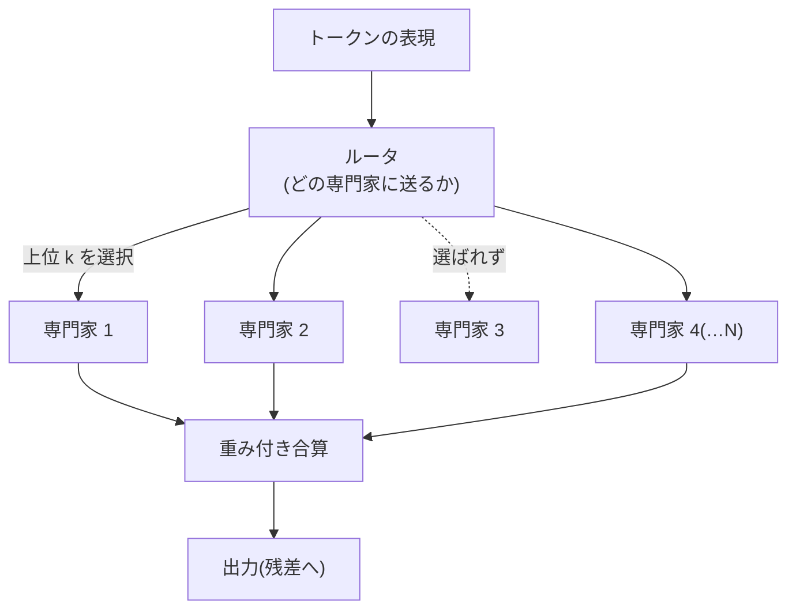

# MoE の内部構造

## この記事の目的

Mixture of Experts(MoE)が「**総パラメータ数を増やしながら、1 トークンあたりの計算量を抑える**」仕組みを、ルーティング・負荷分散・専門化・パラメータの数理のレベルで理解できるようになります。モデルカードの「総パラメータ vs アクティブパラメータ」が何を意味し、なぜ MoE が「メモリは大きいのに速い」という一見矛盾した性質を持つのか、提供・運用にどう効くのかを判断できる状態を目指します。

数式は読み下しを添え、読み飛ばしても本文が成立するようにします。MoE の「選定上の意味」は[主要 LLM の全体像](../03-implementation/llm-landscape.md)が正本で、本記事はその内部構造の裏付けです。

## 対象読者

- モデルカードの「総 vs アクティブパラメータ」を読み解き、メモリ・速度・コストの見積りにつなげたいエンジニア
- [Transformer アーキテクチャ詳解](transformer-architecture.md)の FFN が、MoE でどう疎化されるかを内部から理解したい人

## 前提知識

- [Transformer アーキテクチャ詳解](transformer-architecture.md) — FFN が MoE 化の対象。残差ストリームとパラメータの数え方(必読)
- [主要 LLM の全体像](../03-implementation/llm-landscape.md) — MoE の選定上の意味(総 vs アクティブ)の正本

## 本文

### 概要: 総パラメータと計算量を切り離す

標準の Transformer では、[FFN がパラメータの過半](transformer-architecture.md)を占め、**すべてのトークンがすべての FFN パラメータを通ります**(稠密 = dense)。MoE の発想は、FFN を多数の「専門家(expert)」に分割し、**各トークンはそのうち少数だけを通す(疎 = sparse)**というものです。

これにより、**総パラメータ数(全専門家の合計 = モデルの容量)**と、**1 トークンあたりの計算量(通る専門家だけ = 速度)**を分離できます。「容量は大きく、計算は軽く」を狙う構造です。

### 疎な活性化とルーティング

MoE 層は、$N$ 個の専門家 $E_1, \dots, E_N$(各々が FFN)と、どれに送るかを決める**ルータ(ゲーティング)**からなります。入力 $\mathbf{x}$ に対し、ルータはスコアを出します。

$$
\mathbf{g} = \mathrm{softmax}(\mathbf{x} W_r), \qquad W_r \in \mathbb{R}^{d \times N}
$$

読み下し: 「各専門家への適合度スコアを出し、softmax で重みにする」。このうち**上位 $k$ 個(典型的には $k=1$ or $2$)だけを実際に通し**、その重みで合算します。

$$
\mathbf{y} = \sum_{i \in \mathrm{TopK}(\mathbf{g})} g_i \, E_i(\mathbf{x})
$$

読み下し: 「スコア上位 $k$ 個の専門家にだけ入力を通し、ゲート重み $g_i$ で足し合わせる」。$N$ 個の専門家がいても計算するのは $k$ 個だけ、という点が疎性の核心です。ルータは勾配で一緒に学習されます(トークンをどの専門家に振るかを、タスクを通じて獲得する)。

**トークン選択(token-choice)** — 各トークンが上位 $k$ 専門家を選ぶ — が基本形です。逆に**専門家選択(expert-choice)** — 各専門家が受け持つトークンを選ぶ — という方式もあり、後者は負荷が自然に均等化されるという利点があります。

### 負荷分散: 崩壊をどう防ぐか

MoE の学習で最大の落とし穴は**ルーティングの崩壊**です。放っておくと、少数の人気専門家にトークンが集中し、他が使われないまま学習が進みます(勝者総取り)。対策が要ります。

- **補助損失(auxiliary load-balancing loss)**: 専門家間で割り当てが均等になるほど小さくなる罰則項を、主目的に加えて学習する
- **容量(capacity)とドロップ**: 各専門家が 1 バッチで受け持てるトークン数に上限(容量係数)を設ける。あふれたトークンは処理をスキップ(残差だけ通す)する
- **ルータの工夫**: ノイズの付加や、専門家選択方式など、集中を避ける設計

$$
\mathcal{L} = \mathcal{L}_{\text{主目的}} + \alpha \, \mathcal{L}_{\text{負荷分散}}
$$

読み下し: 「本来の学習目標に、負荷を均す罰則を係数 $\alpha$ で足す」。この $\alpha$ の調整が MoE 学習の勘所の 1 つです。負荷分散は「品質を保ちながら全専門家を活かす」ための、MoE 固有の工学です。

### 専門化の実態

「専門家」という名前から「専門家 1 = 数学、専門家 2 = コード」のような人間的な分業を想像しがちですが、**実態はそれほど解釈しやすくありません**。研究知見では、専門化は語彙・構文レベル(特定のトークン種別・記号・言語)に現れることが多く、トークン単位でめまぐるしく専門家が切り替わります。近年は、より細かい粒度の専門家や、常に通る「共有専門家」を併用して専門化を促す設計(DeepSeekMoE 系)も現れています。**「専門家 = 人間が理解できるドメイン担当」ではない**、と押さえます。

### 総 vs アクティブパラメータの数理

MoE の性質は、2 つのパラメータ数で捉えます。

- **総パラメータ $N_{\text{total}}$**: 全専門家を含む合計。**モデルの容量とメモリ(重みのロード量)を決める**
- **アクティブパラメータ $N_{\text{active}}$**: 1 トークンが実際に通す量($k$ 個の専門家 + 共有部分)。**1 トークンあたりの計算量(FLOPs)と速度を決める**

$$
N_{\text{active}} \approx N_{\text{shared}} + k \cdot N_{\text{expert}}, \qquad N_{\text{total}} \approx N_{\text{shared}} + N \cdot N_{\text{expert}}
$$

読み下し: 「速度に効くのは通る $k$ 個ぶん、メモリに効くのは全 $N$ 個ぶん」。ここから MoE の一見矛盾した性質が説明できます。

- **メモリは総パラメータで決まる**: たとえ $k=2/N=8$ でも、全専門家の重みを VRAM に載せる必要があります。「アクティブが小さいから省メモリ」ではありません
- **計算量はアクティブで決まる**: 推論の FLOPs は $N_{\text{active}}$ 相当です。だから「総パラメータが巨大でも、同じアクティブ数の稠密モデル並みに速い」ことが成り立ちます
- **通信コストが増える**: 専門家を複数デバイスに分散すると、トークンを担当デバイスへ送り返す**全対全通信(all-to-all)**が生じます。分散提供では、この通信が新たなボトルネックになります

### 提供・運用への含意

- **VRAM は総パラメータで見積もる**: MoE は「速いが省メモリではない」。セルフホストの VRAM 要件は総パラメータ基準([GPU・AI ハードウェアの基礎](../05-operations/gpu-and-hardware-basics.md)・[セルフホスト推論の実務](../05-operations/self-hosted-inference.md))
- **スループットはアクティブパラメータ寄り**: 同じ総パラメータの稠密モデルより速く安いことが多い。ただし通信・ルーティングのオーバーヘッドは別途乗る
- **バッチ内で負荷が偏ると効率が落ちる**: 提供時も、特定専門家への集中は遊休を生む。連続バッチングなど提供側の工夫と絡む
- **モデルカードは 2 つの数を見る**: 「総 A / アクティブ B」の両方を読み、メモリは A、速度・単価は B で当たりを付ける

### この理解が効く場面

- **モデル選定**: 「総 vs アクティブ」からメモリ(総)と速度・単価(アクティブ)を分けて見積もる([モデル選定ガイド](../03-implementation/model-selection.md)・[主要 LLM の全体像](../03-implementation/llm-landscape.md))
- **セルフホストの VRAM 設計**: MoE は総パラメータ基準でメモリを積む([セルフホスト推論の実務](../05-operations/self-hosted-inference.md))
- **「巨大なのに安い/速い」の説明**: 総とアクティブの分離が、MoE モデルの価格・速度の根拠

## 実務での注意点

### アンチパターン

- **アクティブパラメータが小さいから省メモリと考える** → 全専門家を VRAM に載せる必要があり、メモリは総パラメータで決まる → メモリは総、速度・単価はアクティブ、と分けて見積もる
- **「専門家 = 人間が読めるドメイン担当」と解釈する** → 実際の専門化は語彙・構文レベルでトークン単位に切り替わり、ドメイン分業ではない → 専門化を過度に擬人化せず、疎なルーティングの結果と捉える
- **負荷分散を無視して MoE を自前構築する** → ルーティングが崩壊し、少数の専門家に集中して容量を活かせない → 補助損失・容量・ルータ設計を前提に置く(自前構築時)
- **分散提供の通信コストを見落とす** → 専門家分散の all-to-all 通信が新たなボトルネックになる → 提供構成では通信オーバーヘッドも見積もる
- **総パラメータの大きさだけで賢さを語る** → MoE の総パラメータは容量であって、同数の稠密モデルと同等の計算をするわけではない → 総(容量)とアクティブ(1 トークンの計算)を区別する

### チェックリスト

- [ ] MoE が「総パラメータ(容量)と計算量(速度)を分離する」構造だと説明できる
- [ ] top-k ルーティングで「$N$ 個いても $k$ 個だけ通す」疎性を理解している
- [ ] ルーティング崩壊と、負荷分散(補助損失・容量)の必要性を説明できる
- [ ] 専門化が人間的なドメイン分業ではないと理解している
- [ ] メモリは総パラメータ、速度・単価はアクティブパラメータで決まると使い分けられる
- [ ] 分散提供の all-to-all 通信がボトルネックになりうると理解している

## 関連トピック

- [Transformer アーキテクチャ詳解](transformer-architecture.md) — MoE 化の対象である FFN・パラメータの数え方(本記事の土台)
- [主要 LLM の全体像](../03-implementation/llm-landscape.md) — MoE の選定上の意味(総 vs アクティブ)の正本
- [注意機構の変種と長コンテキスト技術](attention-variants-and-long-context.md) — もう 1 つの効率化の軸(注意側)
- [セルフホスト推論の実務](../05-operations/self-hosted-inference.md) — MoE モデルの VRAM 見積り(総パラメータ基準)
- [GPU・AI ハードウェアの基礎](../05-operations/gpu-and-hardware-basics.md) — メモリ帯域・容量の制約(MoE のメモリ要件の受け皿)
- [モデル選定ガイド](../03-implementation/model-selection.md) — 総/アクティブを選定判断に反映する

## 参考資料

- [Outrageously Large Neural Networks: The Sparsely-Gated Mixture-of-Experts Layer](https://arxiv.org/abs/1701.06538) — 疎ゲート MoE 層の原論文(Shazeer et al., 2017、アクセス日: 2026-07-09)
- [GShard: Scaling Giant Models with Conditional Computation and Automatic Sharding](https://arxiv.org/abs/2006.16668) — 大規模 MoE のシャーディング(Lepikhin et al., 2020、アクセス日: 2026-07-09)
- [Switch Transformers: Scaling to Trillion Parameter Models with Simple and Efficient Sparsity](https://arxiv.org/abs/2101.03961) — top-1 ルーティングと負荷分散(Fedus et al., 2021、アクセス日: 2026-07-09)
- [ST-MoE: Designing Stable and Transferable Sparse Expert Models](https://arxiv.org/abs/2202.08906) — MoE 学習の安定化(Zoph et al., 2022、アクセス日: 2026-07-09)
- [Mixture-of-Experts with Expert Choice Routing](https://arxiv.org/abs/2202.09368) — 専門家選択ルーティング(Zhou et al., 2022、アクセス日: 2026-07-09)
- [Mixtral of Experts](https://arxiv.org/abs/2401.04088) — オープンウェイト MoE の代表例(Jiang et al., 2024、アクセス日: 2026-07-09)

## TODO・未確認事項

なし
