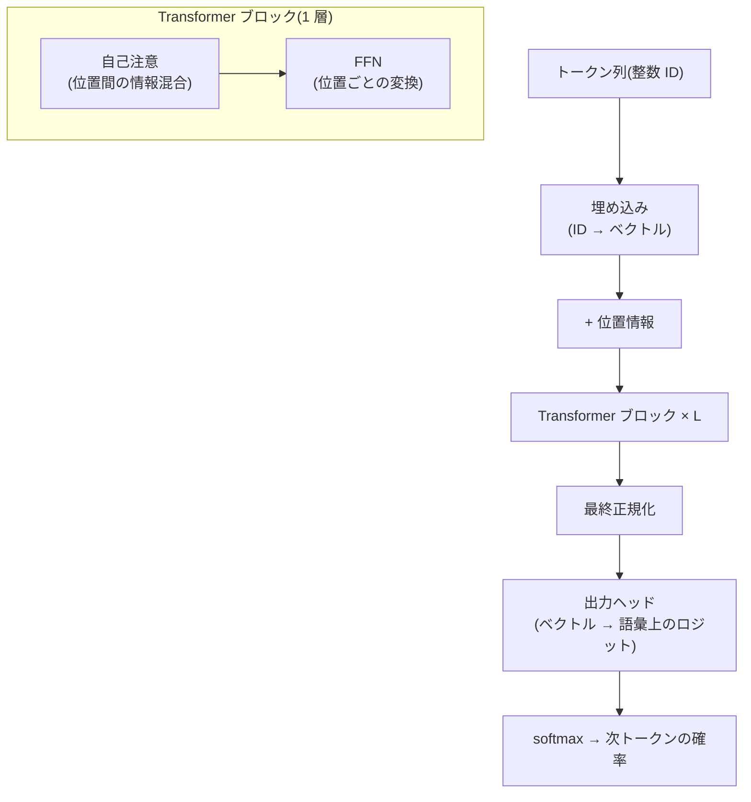

# Transformer アーキテクチャ詳解

## この記事の目的

現代の LLM の土台であるデコーダ専用 Transformer を、**主要な構成要素の数式レベル**で理解できるようになります。埋め込みと位置符号化・自己注意・多頭注意・FFN・残差ストリーム・正規化・パラメータの数え方までを、「結果の式 + 日本語の読み下し」で押さえ、モデルカードの数値(層数・隠れ次元・ヘッド数・パラメータ数)が何を意味するか、なぜ長文で計算量が増えるか、といった実務判断の「なぜ」に接続できる状態を目指します。

数式は読み飛ばしても本文が成立するように読み下しを添えます。**この記事は数学の教材ではありません** — 線形代数(行列積・ベクトル)の基礎は前提とし、導出は結論の解釈が変わる場合のみ最小限にとどめます。

## 対象読者

- [注意機構とコンテキストウィンドウの仕組み](../10-llm-foundations/attention-and-context.md)を読み、その「なぜ」をもう 1 段、数式で理解したいエンジニア
- モデルカードの構成(層数・次元・ヘッド数・パラメータ内訳)を読み解き、能力・コスト・メモリの見積りにつなげたい人

## 前提知識

- [注意機構とコンテキストウィンドウの仕組み](../10-llm-foundations/attention-and-context.md) — 本記事が数式で掘り下げる直感側の正本(必読)
- [LLM はどのようにテキストを生成するか](../10-llm-foundations/how-llms-generate-text.md) — 自己回帰生成の全体像
- 線形代数の基礎(ベクトル・行列積・内積)。本記事では教材化せず前提とします

## 本文

### 概要: デコーダ専用 Transformer の全体像

現代の LLM の主流は、Transformer(2017 年)のうち**デコーダ側だけを積み重ねた「デコーダ専用(decoder-only)」構成**です。入力トークン列を受け取り、各位置で「次のトークンの確率分布」を出力します。全体は次の流れです。

1 つの Transformer ブロックは、**自己注意(トークン間で情報を混ぜる)**と **FFN(各位置で独立に変換する)**の 2 つの副層(sub-layer)からなり、これを $L$ 層積みます。以下、各要素を順に見ます。

記号を先に決めておきます。系列長(トークン数)を $n$、モデルの隠れ次元(residual の幅)を $d_{\mathrm{model}}$(以下 $d$)、語彙サイズを $V$、層数を $L$ とします。

### 埋め込みと出力ヘッド

入力の各トークン(整数 ID)は、埋め込み行列 $E \in \mathbb{R}^{V \times d}$ の対応する行を引くことでベクトルになります。位置 $t$ のトークン ID を $\mathrm{id}_t$ とすると、

$$
\mathbf{x}_t = E_{[\mathrm{id}_t]} \in \mathbb{R}^{d}
$$

読み下し: 「トークン ID を使って埋め込み表の 1 行を取り出し、$d$ 次元のベクトルにする」。埋め込みは学習される「トークンの意味の初期ベクトル」です。

最終層の出力ベクトル $\mathbf{h}_t$ から、語彙全体のスコア(ロジット)を出す**出力ヘッド(unembedding)** $W_U \in \mathbb{R}^{d \times V}$ を掛けます。

$$
\mathbf{z}_t = \mathbf{h}_t W_U \in \mathbb{R}^{V}, \qquad p(\cdot \mid \text{文脈}) = \mathrm{softmax}(\mathbf{z}_t)
$$

読み下し: 「最終ベクトルを語彙数のスコアに射影し、softmax で確率分布にする」。多くのモデルは**重み共有(weight tying)**を採り、$W_U = E^\top$ として入力埋め込みと出力ヘッドを共有します(パラメータ削減と学習安定の効果)。

### 位置符号化: 順序をどう入れるか

自己注意それ自体は**集合演算で、トークンの順序を区別しません**(後述の式に位置の情報が入っていないことに注目)。そこで位置情報を明示的に与えます。方式は 3 系統あります。

- **絶対位置(元祖)**: 位置ごとに固定または学習したベクトルを埋め込みに加算する(Transformer 原論文の正弦波位置符号化)
- **相対位置**: 「$i$ と $j$ の距離」を注意スコアに反映する
- **回転位置埋め込み(RoPE)**: 2026 年時点の主流。クエリ・キーのベクトルを**位置に応じて回転**させることで、内積に相対位置が自然に現れる

RoPE は、ベクトルを 2 次元ずつのペアに分け、位置 $t$ に比例した角度だけ回転させます。回転後のクエリ $\tilde{\mathbf{q}}_m$(位置 $m$)とキー $\tilde{\mathbf{k}}_n$(位置 $n$)の内積は、**相対位置 $m-n$ だけに依存する成分**を持ちます。

$$
\langle \tilde{\mathbf{q}}_m, \tilde{\mathbf{k}}_n \rangle = g(\mathbf{q}, \mathbf{k},\, m-n)
$$

読み下し: 「回転させたクエリとキーの内積は、絶対位置ではなく 2 つの位置の差の関数になる」。この性質のおかげで、学習長を超える位置への外挿がしやすく(完全ではありません)、長コンテキスト技術の土台になります(詳細は[注意機構の変種と長コンテキスト技術](attention-variants-and-long-context.md))。

### 自己注意の数式

自己注意は Transformer の心臓部です。各位置の表現から、**クエリ(Q)・キー(K)・バリュー(V)**の 3 つを線形変換で作ります。入力を行方向に並べた $X \in \mathbb{R}^{n \times d}$ に対し、

$$
Q = X W^Q, \quad K = X W^K, \quad V = X W^V
$$

読み下し: 「各トークンのベクトルから、問い合わせ(Q)・見出し(K)・中身(V)の 3 役のベクトルを作る」。そして**縮小付き内積注意(scaled dot-product attention)**は次式です。

$$
\mathrm{Attention}(Q, K, V) = \mathrm{softmax}\!\left(\frac{QK^{\top}}{\sqrt{d_k}} + M\right)V
$$

読み下し: 「各クエリと各キーの内積で『どれだけ注目するか』のスコアを作り、$\sqrt{d_k}$ で割ってから softmax で重みにし、その重みでバリューを混ぜ合わせる」。要素を分解します。

- $QK^{\top} \in \mathbb{R}^{n \times n}$ は、全トークン対の類似度(注意スコア)。**この $n \times n$ が、計算量とメモリが系列長 $n$ の 2 乗で増える理由**です
- $\sqrt{d_k}$ での除算(スケーリング)は、次元 $d_k$ が大きいと内積の分散が大きくなり softmax が飽和して勾配が消えるのを防ぎます。**この 1 項が学習の安定に効きます**
- $M$ は**因果マスク(causal mask)**。デコーダ専用モデルでは、位置 $t$ が未来($>t$)を見られないよう、未来の位置のスコアを $-\infty$ にして softmax 後の重みを 0 にします。これが「左から右へ」の自己回帰性を保証します

softmax は行ごと(各クエリごと)に取り、重みの合計が 1 になります。

### 多頭注意

1 組の Q/K/V だけでは、1 種類の「注目の仕方」しか表せません。そこで**多頭注意(multi-head attention)**は、$d$ 次元を $h$ 個のヘッドに分け($d_k = d/h$)、各ヘッドが独立に注意を計算します。

$$
\mathrm{head}_i = \mathrm{Attention}(X W_i^Q,\; X W_i^K,\; X W_i^V)
$$

読み下し: 「ヘッド $i$ は、そのヘッド専用の射影で作った Q/K/V で、1 つ分の注意を計算する」。この $h$ 個のヘッドの結果を連結し、出力射影でまとめます。

$$
\mathrm{MultiHead}(X) = \mathrm{Concat}(\mathrm{head}_1, \dots, \mathrm{head}_h)\, W^O
$$

読み下し: 「小さな注意を $h$ 個並列に走らせ(各ヘッドが別の関係に注目)、結果を連結してから出力射影 $W^O$ でまとめる」。ヘッドごとに「直前の語」「主語との一致」「引用符の対応」など異なるパターンを担うことが、解釈可能性研究で観察されています。

なお、$W^O$ を掛けた後の出力は $d$ 次元に戻り、次の残差加算につながります。**ヘッド数を増やしても総次元 $d$ は一定**(各ヘッドが細くなる)である点に注意します。KV キャッシュを減らす MQA/GQA など「ヘッドの構造を変える変種」は別記事で扱います([注意機構の変種と長コンテキスト技術](attention-variants-and-long-context.md))。

### FFN と残差ストリーム

自己注意が「トークン間で情報を混ぜる」のに対し、**FFN(位置ごとフィードフォワード)**は各位置を独立に非線形変換します。基本形は 2 層 MLP です。

$$
\mathrm{FFN}(\mathbf{x}) = \sigma(\mathbf{x} W_1 + \mathbf{b}_1) W_2 + \mathbf{b}_2, \qquad W_1 \in \mathbb{R}^{d \times d_{ff}},\; W_2 \in \mathbb{R}^{d_{ff} \times d}
$$

読み下し: 「いったん広い中間次元 $d_{ff}$ に持ち上げ、非線形活性 $\sigma$ をかけ、元の $d$ 次元へ戻す」。中間次元は $d_{ff} \approx 4d$ が定番で、**FFN はパラメータの過半を占めます**(後述の数え方)。近年は**ゲート付き活性(SwiGLU など)**が主流です。

$$
\mathrm{FFN}_{\mathrm{SwiGLU}}(\mathbf{x}) = \big(\mathrm{Swish}(\mathbf{x} W_1) \odot (\mathbf{x} W_3)\big) W_2
$$

読み下し: 「活性化を通した枝(ゲート)と、通さない枝の要素積を取ってから戻す」。$\odot$ は要素ごとの積です。ゲートが情報の通過量を調整し、同じパラメータ数でも品質が上がることが報告されています(3 行列に増えるぶん、$d_{ff}$ を $\tfrac{2}{3}$ 倍して総数を揃えるのが慣例)。

**残差ストリーム(residual stream)という見方** が、内部を理解する鍵です。各副層は入力に**足し込む**形で接続されます(Pre-LN 構成)。

$$
\mathbf{h}^{(l+1)} = \mathbf{h}^{(l)} + \mathrm{Sublayer}\big(\mathrm{Norm}(\mathbf{h}^{(l)})\big)
$$

読み下し: 「各層は、正規化した入力を副層に通した結果を、元の表現に足し込むだけ」。この加算の連なりは、**層をまたいで貫く 1 本の『残差ストリーム』に、各層が情報を読み書きしていく**というモデルとして解釈できます。注意ヘッドや FFN は、この共有された通信路(次元 $d$)から読み取り、変換し、書き戻します。この視点は解釈可能性研究の基礎です(本セクションで別途扱う予定です)。残差接続は、勾配が深いネットワークを素通りできる経路も与え、深い学習を可能にします。

### 正規化と学習安定性

正規化層は、各ベクトルのスケールをそろえて学習を安定させます。元祖は **LayerNorm**(平均と分散で標準化してからスケール・シフト)ですが、近年は **RMSNorm** が主流です。

$$
\mathrm{RMSNorm}(\mathbf{x}) = \frac{\mathbf{x}}{\sqrt{\frac{1}{d}\sum_{i=1}^{d} x_i^2 + \epsilon}} \odot \mathbf{g}
$$

読み下し: 「ベクトルを、その二乗平均平方根(RMS)で割って大きさをそろえ、学習パラメータ $\mathbf{g}$ で各次元を再スケールする」。RMSNorm は平均を引かないぶん計算が軽く、品質はほぼ同等とされます。

**配置(Pre-LN vs Post-LN)**も重要です。正規化を副層の「前」に置く **Pre-LN** は、原論文の Post-LN(後ろ)より深い学習が安定し、現在の LLM の定番です。残差の加算が正規化を経由しない(前節の式で足し算の外に $\mathrm{Norm}$ がある)ため、残差ストリームが素通しで保たれます。

### パラメータの内訳

モデルカードの「パラメータ数」が何でできているかを、$d$・$L$・$V$ で概算できます。1 層あたりの主要パラメータは:

- **注意**: $W^Q, W^K, W^V, W^O$ の 4 つが各 $d \times d$ → $4d^2$
- **FFN**: $W_1, W_2$ が $d \times 4d$ と $4d \times d$ → $8d^2$(定番の $d_{ff}=4d$)

合わせて 1 層 $\approx 12 d^2$、$L$ 層で

$$
N_{\text{非埋め込み}} \approx 12\, L\, d^2
$$

読み下し: 「(埋め込みを除く)本体のパラメータ数は、おおよそ層数 × 隠れ次元の 2 乗の 12 倍」。これに埋め込み/出力ヘッドの $V d$(重み共有なら 1 つ、しないなら 2 つ)が加わります。

この概算から読み取れる実務的含意があります。

- パラメータは**深さ $L$ と幅 $d$ の両方**で決まり、$d$ は 2 乗で効きます。「同じパラメータ数でも、深く細いか浅く太いか」で挙動が変わります
- **FFN が本体の 2/3**($8d^2$ 対 $4d^2$)。MoE はこの FFN を疎化して総パラメータと計算量を切り離す発想です(→ [MoE の内部構造](mixture-of-experts-internals.md))
- 語彙 $V$ が大きいと埋め込み/出力ヘッドが無視できません(小型モデルほど比率が大きくなります)
- ゲート付き FFN・バイアスの有無・正規化のパラメータで定数は前後します。**厳密な数はモデルカードの構成値から計算する**のが正で、この式は当たりを付けるためのものです

### この理解が効く場面

- **モデルカードを読む**: 層数・隠れ次元・ヘッド数・語彙から、パラメータ内訳とメモリの当たりを付けられる([モデル選定ガイド](../03-implementation/model-selection.md))
- **長文でコストが増える理由を説明できる**: 注意の $QK^\top$ が $n^2$ である事実が、長コンテキストのコスト・レイテンシの根拠([コスト管理](../05-operations/cost-management.md)・[レイテンシ最適化](../05-operations/latency-optimization.md))。その緩和策が[注意機構の変種と長コンテキスト技術](attention-variants-and-long-context.md)
- **KV キャッシュのサイズを見積もる**: K と V を位置ごとに保持する必要が、推論メモリの主因([注意機構の変種と長コンテキスト技術](attention-variants-and-long-context.md)の KV キャッシュ式)
- **解釈可能性の議論に入る**: 残差ストリーム・多頭注意という見方が、回路・特徴の分析の前提になります

## 実務での注意点

### アンチパターン

- **「パラメータ数だけ」でモデルの能力・コストを判断する** → 同じ総数でも、深さ/幅の配分・MoE か稠密か・語彙サイズで挙動とメモリが変わる → 構成値(L・d・ヘッド数・$d_{ff}$・MoE の有無)まで見て判断する
- **注意の $n^2$ を意識せずに長文前提の設計をする** → 系列長を倍にすると注意の計算・メモリが 4 倍になり、コスト・レイテンシが跳ねる → 長文が要件なら変種・長コンテキスト技術の前提を理解して設計する([注意機構の変種と長コンテキスト技術](attention-variants-and-long-context.md))
- **位置符号化を「おまけ」と見なす** → 位置方式(特に RoPE のスケーリング)が長コンテキストの外挿限界を決める。学習長を超える利用で静かに品質が落ちる → 対応長と位置方式の前提を確認する
- **数式の暗記に走り、実務判断につなげない** → 本記事の価値は「なぜモデルカードの数値がその意味を持つか」。式は判断の裏付けであって目的ではない → 各式を「この理解が効く場面」に結びつけて読む
- **この概算式を厳密値として引用する** → $12Ld^2$ はゲート FFN・バイアス・正規化・埋め込みで定数がずれる → 厳密な数はモデルカードの構成から計算する

### チェックリスト

- [ ] デコーダ専用構成の全体の流れ(埋め込み → ブロック×L → 出力ヘッド)を説明できる
- [ ] 自己注意の式の各項($QK^\top$・$\sqrt{d_k}$ スケーリング・因果マスク)の役割を説明できる
- [ ] 注意の計算量・メモリが系列長 $n$ の 2 乗である理由を説明できる
- [ ] 多頭注意で「総次元 $d$ は一定、ヘッドが細くなる」ことを理解している
- [ ] 残差ストリームという見方(各副層が共有通信路に読み書きする)を説明できる
- [ ] Pre-LN と RMSNorm がなぜ使われるか(安定性・軽さ)を言える
- [ ] $N \approx 12Ld^2$ でパラメータの当たりを付けつつ、厳密値は構成から計算すると理解している

## 関連トピック

- [注意機構とコンテキストウィンドウの仕組み](../10-llm-foundations/attention-and-context.md) — 本記事の直感側の正本(数式なしの理解)
- [注意機構の変種と長コンテキスト技術](attention-variants-and-long-context.md) — MQA/GQA・スパース/線形注意・位置の外挿・SSM(本記事の注意を拡張)
- [MoE の内部構造](mixture-of-experts-internals.md) — FFN を疎化して総パラメータと計算量を切り離す(本記事の FFN の発展)
- [LLM の学習パイプライン](../10-llm-foundations/llm-training-pipeline.md) — この構造を何で学習させるか
- [モデル選定ガイド](../03-implementation/model-selection.md) — 構成値(層・次元・パラメータ)を選定判断に使う

## 参考資料

- [Attention Is All You Need](https://arxiv.org/abs/1706.03762) — Transformer の原論文(縮小付き内積注意・多頭注意)(Vaswani et al., 2017、アクセス日: 2026-07-09)
- [RoFormer: Enhanced Transformer with Rotary Position Embedding](https://arxiv.org/abs/2104.09864) — 回転位置埋め込み(RoPE)の原論文(Su et al., 2021、アクセス日: 2026-07-09)
- [Root Mean Square Layer Normalization](https://arxiv.org/abs/1910.07467) — RMSNorm の原論文(Zhang & Sennrich, 2019、アクセス日: 2026-07-09)
- [On Layer Normalization in the Transformer Architecture](https://arxiv.org/abs/2002.04745) — Pre-LN の学習安定性(Xiong et al., 2020、アクセス日: 2026-07-09)
- [GLU Variants Improve Transformer](https://arxiv.org/abs/2002.05202) — SwiGLU などゲート付き FFN(Shazeer, 2020、アクセス日: 2026-07-09)
- [Layer Normalization](https://arxiv.org/abs/1607.06450) — LayerNorm の原論文(Ba et al., 2016、アクセス日: 2026-07-09)

## TODO・未確認事項

なし
