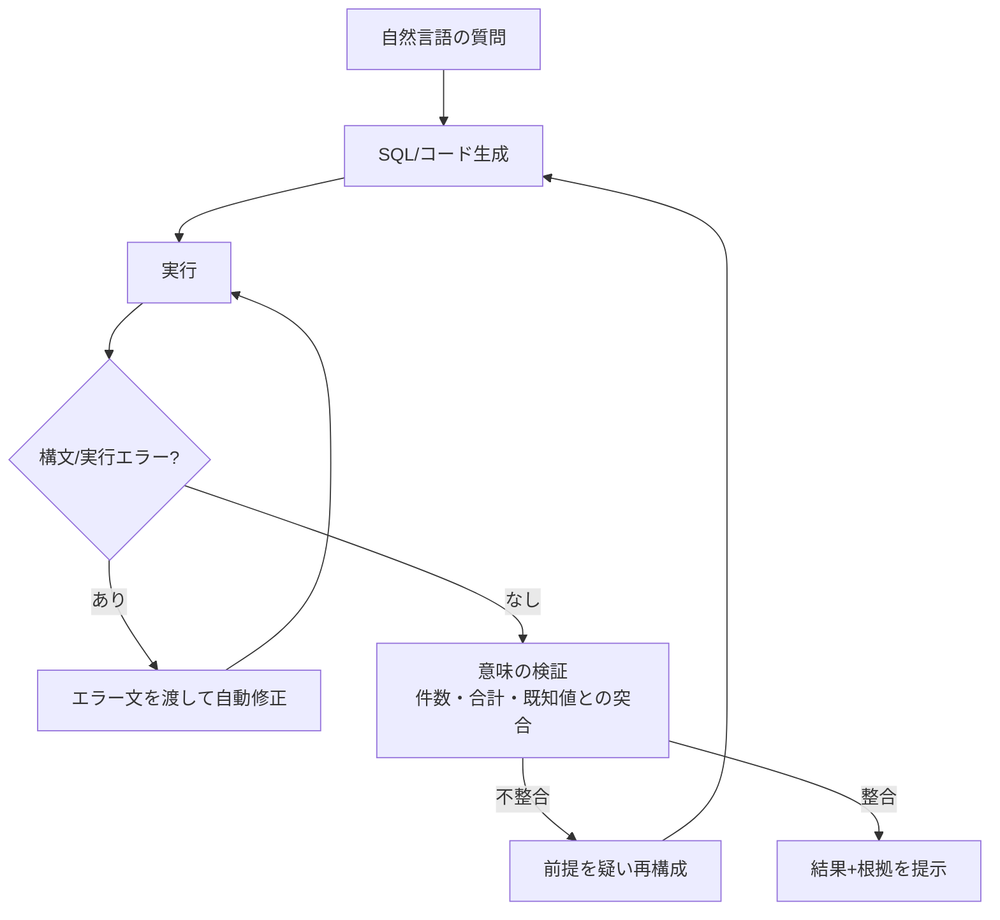

# データ分析エージェント

## この記事の目的

自然言語からデータ分析(SQL・ノートブック・グラフ)を行うエージェントを、**もっともらしく間違った分析**を防ぐ構造で設計できるようになります。Text-to-SQL の与え方・セマンティックレイヤーが精度を決める構造・実行と検証の非対称なループ・「嘘のグラフ」対策・行列レベルの権限・評価セットの作り方を、実務の判断として持ち帰れる状態を目指します。

## 対象読者

- 社内データに対する「聞けば分析してくれる」エージェント(BI アシスタント・分析コパイロット)を設計するエンジニア・データ基盤担当
- Text-to-SQL やノートブック実行を試したが、精度と安全性を本番水準に上げたい実装者

## 前提知識

- [ツール権限とサンドボックス](../06-security/tool-permissions-and-sandboxing.md) — コード・クエリ実行の隔離(ノートブック型の前提)
- [エージェントの認証・認可](../06-security/agent-identity-and-auth.md) — 誰の権限でデータに触るか(行列レベル制御の前提)
- [ループのフィードバックと検証](../03-implementation/loop-feedback-and-verification.md) — 実行結果を検証して直すループ
- [能力と限界](../10-llm-foundations/capabilities-and-limits.md) — LLM が数値・集計で間違える構造

## 本文

### 概要: 最大の敵は「エラー」ではなく「もっともらしい誤答」

データ分析エージェントは、自然言語の質問を SQL やコードに変換し、実行し、結果を表やグラフで返します。ここで設計者が最優先で潰すべきは、**構文エラー**ではありません。構文エラーは実行が失敗するので気づけます。本当に怖いのは、**実行が成功し、それらしいグラフが出るのに、集計の意味が間違っている**ケースです。誤ったフィルタ、取り違えた結合、単位の混同 — どれもエラーを出さずに「自信ありげな数字」を返します。

したがって設計の中心テーマは一貫して「**もっともらしい誤答をどう検出・抑止するか**」です。以下の各節は、すべてこの一点に収束します。データ分析は[ユースケース発見](../09-business/usecase-discovery.md)の軸で言えば**検証可能性が高く失敗コストも高い**ドメインで、だからこそ検証構造の作り込みが価値を生みます。

### Text-to-SQL の設計: モデルの賢さより「与える文脈」

Text-to-SQL の精度は、モデルの能力より**スキーマと文脈の与え方**でほぼ決まります。生のテーブル定義をそのまま渡すだけでは、現場の暗黙知(この列は論理削除フラグ、金額は税抜、日付は UTC)を踏み外します。

- **スキーマに意味を添える**: テーブル・列の物理名だけでなく、**業務上の意味・単位・注意点**を説明として渡します。`amount` が税抜か税込か、`status='9'` が何を指すかは、DDL には書かれていません
- **分析用ビューを整える**: 正規化された生テーブルを直接触らせるより、**分析用に整えたビュー**(結合済み・意味の明確な列名・論理削除除外済み)を用意し、そこだけを対象にすると誤りが激減します。エージェントの精度問題の多くは、データ基盤側の整備で解けます
- **少数例(few-shot)を効かせる**: 頻出の質問と正しい SQL のペアを例示すると、その組織の言い回し(「先月」の定義、「アクティブユーザー」の定義)に沿います
- **書き込みを構造的に禁じる**: 分析用途では、実行アカウントを**読み取り専用**にし、`SELECT` 以外を DB 権限レベルで拒否します。プロンプトでの禁止に頼らず、経路そのものを塞ぎます([エージェントの認証・認可](../06-security/agent-identity-and-auth.md))

### セマンティックレイヤーが精度を決める構造

「先月の売上」の**先月**と**売上**の定義が人によって違うと、正しい SQL は書けません。この定義を一元管理するのが**セマンティックレイヤー(semantic layer)**です。指標(メトリクス)・ディメンション・粒度の定義をコードで一元化し、エージェントはそれを参照します。

- **指標定義の一元化が効く理由**: 売上・粗利・解約率のような指標を、その場で LLM に組み立てさせると、集計の取り違え(重複カウント・粒度の混同)が起きます。セマンティックレイヤーで**検証済みの定義**を一箇所に持ち、エージェントは「どの指標をどの軸で見るか」の選択に集中させると、誤りの余地が構造的に減ります
- **セマンティックレイヤーがない組織の現実解**: 多くの現場にはまだ整った層がありません。その場合でも、**頻出指標の正しい SQL 断片を用意して部品として渡す**だけで、精度は大きく上がります。完全な基盤を待たず、指標定義の局所的な一元化から始めます
- **定義の変更に追従する**: 指標の定義は業務都合で変わります。定義をコード管理し、変更が例やスキーマ説明に反映される運用にします([データガバナンス](../05-operations/data-governance-for-ai.md))

### 実行と検証の非対称なループ

データ分析エージェントのループには、**構文の誤りと意味の誤りで回復コストが非対称**という特徴があります。この非対称を設計に織り込むと、労力を正しい場所に配分できます。

- **構文エラーは自動回復してよい**: 実行時のエラーメッセージをそのままモデルに返せば、多くは自力で直します([ループのフィードバックと検証](../03-implementation/loop-feedback-and-verification.md))。ここは自動化を厚くして問題ありません
- **意味の誤りは自動回復できない**: 集計の意味が違っても実行は成功するため、**別の検証**が要ります。次節の突き合わせがそれです。「エラーが出ないから正しい」という前提を置かないことが、このドメインの肝です
- **暴走を防ぐ**: 自動修正ループには回数上限を設け、直らないときは「答えを作らず、分析できなかったと返す」設計にします。もっともらしい答えを無理に出すより安全です

### 「もっともらしい嘘のグラフ」対策

実行が成功しても数字が正しいとは限りません。ここを守る具体策が、このエージェントの信頼性を決めます。

- **数字を突き合わせる**: 生成結果を、**独立した経路の既知値**と照合します。総件数・総合計・主要 KPI の月次値など、別途正しいと分かっている数字と一致するかを自動チェックします。ズレたら結果を出さずに差し戻します
- **集計を再現させる**: 重要な数値は、**別の書き方の SQL**でもう一度求め、一致を確認します(例: 明細合計とサマリテーブルの一致)。一致しなければ、どちらかの前提が間違っています
- **クエリと結果を必ず添える**: グラフや結論だけを見せず、**使った SQL・対象期間・フィルタ条件**を必ず併記します。利用者が「何を数えた数字か」を検証できることが、誤答を実害にしない最後の砦です
- **ゼロ件・NULL・外れ値を隠さない**: 「該当なし」を勝手に 0 と埋めたり、NULL を無視して平均を歪めたりしないよう、データ品質上の注意を結果に添えます

### ノートブック型(コード実行)の設計とサンドボックス

SQL では表現できない分析(統計処理・時系列・可視化)には、Python などを**実行**させるノートブック型が向きます。ただし任意コード実行は攻撃面が大きいため、隔離が前提です。

- **サンドボックスで隔離する**: コード実行は、ネットワーク遮断・ファイルアクセス制限・リソース上限を課した隔離環境で行います([ツール権限とサンドボックス](../06-security/tool-permissions-and-sandboxing.md))。生成コードは信頼できない入力として扱います
- **データの持ち込み経路を管理する**: 分析対象データをサンドボックスへ渡す経路と、結果を取り出す経路を明確にし、そこに権限チェックを置きます。サンドボックス内から社内ネットワークへ出られないようにします([データ持ち出し対策](../06-security/data-exfiltration.md))
- **再現性を残す**: 実行したコード・入力データのスナップショット・出力を保存し、後から**同じ結果を再現**できるようにします。分析結果への反論に答えるには、再現性が必要です

### 権限: 行・列レベルの制御(権限反映の分析版)

分析エージェントは、**利用者が本来見られるデータしか集計してはいけません**。全社集計を、権限のない一利用者が引き出せてしまうのは重大な情報漏えいです。

- **利用者の権限で実行する**: エージェントのサービスアカウントの広い権限ではなく、**問いを発した利用者の権限**でクエリを実行します。行レベル(見られる範囲の絞り込み)・列レベル(給与など機微列のマスク)の制御をデータ層で効かせます([エージェントの認証・認可](../06-security/agent-identity-and-auth.md))
- **集計での漏えいに注意する**: 個票が見られなくても、**集計結果から個人が特定**できることがあります(該当者が 1 人の集計など)。少数集計の抑止(k-匿名の下限)を検討します([プライバシー強化技術](../06-security/privacy-enhancing-technologies.md))
- **権限を結果表示にも反映する**: 生成した SQL やスキーマ情報自体が、権限外のテーブル構造を露出しないよう、提示内容も権限に合わせます

### 評価の設計

データ分析は**正解が定義しやすい**ドメインなので、評価セットを作りやすいのが利点です。ここを手厚くします([評価データセット](../04-evaluation/evaluation-datasets.md))。

- **正解つき質問セットを作る**: 代表的な質問と、その**正しい答え(数値)**をペアで用意します。生成 SQL の文字列一致ではなく、**実行結果(集計値)の一致**で採点するのが実務的です。SQL の書き方は複数あってよく、答えが合えば正解とします
- **意味の誤りを狙って混ぜる**: 論理削除・税抜税込・タイムゾーン・重複結合など、**現場で実際に間違えるパターン**を質問セットに意図的に含めます。ここを通過することが本番投入の条件です
- **拒否の正しさも測る**: 権限外のデータを求められたときに正しく拒否できるか、答えられない問いに「分からない」と言えるかも評価します。無理に答えない性質を、評価で担保します
- **回帰を検知する**: モデル更新やプロンプト変更で精度が落ちていないかを、質問セットで継続的に確認します([評価データセット](../04-evaluation/evaluation-datasets.md))

## 実務での注意点

### アンチパターン

- **生のスキーマだけ渡して精度を上げようとする** → 論理削除・単位・暗黙の意味を踏み外す → スキーマに意味を添え、分析用ビューとして整える
- **指標をその場で LLM に組み立てさせる** → 重複カウント・粒度の混同が起きる → セマンティックレイヤー(なければ検証済み SQL 断片)で指標定義を一元化する
- **「エラーが出ないから正しい」と扱う** → もっともらしい誤答が素通りする → 既知値との突合・別書き SQL での再現で意味を検証する
- **グラフや結論だけを見せる** → 利用者が何を数えた数字か検証できない → 使った SQL・期間・フィルタを必ず併記する
- **サービスアカウントの広い権限で実行する** → 権限外データが集計で漏れる → 利用者の権限で実行し、行列レベル制御と少数集計の抑止をデータ層で効かせる
- **任意コードを隔離せず実行する** → 攻撃面が大きく情報漏えい・破壊のリスク → サンドボックスで隔離し、生成コードを信頼しない
- **書き込みをプロンプトで禁じる** → 回避されうる → 実行アカウントを読み取り専用にし DB 権限で塞ぐ

### チェックリスト

- [ ] スキーマに業務上の意味・単位・注意点を添え、分析用ビューを整えているか
- [ ] 指標定義を一元化(セマンティックレイヤーまたは検証済み SQL 断片)しているか
- [ ] 構文エラーは自動回復し、意味の誤りは別途検証する非対称ループになっているか
- [ ] 重要数値を既知値との突合・別書き SQL での再現でチェックしているか
- [ ] 結果に、使った SQL・対象期間・フィルタ条件を併記しているか
- [ ] 利用者の権限でクエリを実行し、行・列レベル制御と少数集計の抑止を効かせているか
- [ ] コード実行をサンドボックスで隔離し、書き込みを DB 権限で禁じているか
- [ ] 実行結果(集計値)の一致で採点する正解つき質問セットを持ち、意味の誤りパターンを混ぜているか

## 関連トピック

- [ツール権限とサンドボックス](../06-security/tool-permissions-and-sandboxing.md) — コード・クエリ実行の隔離
- [エージェントの認証・認可](../06-security/agent-identity-and-auth.md) — 行・列レベルの権限反映
- [ループのフィードバックと検証](../03-implementation/loop-feedback-and-verification.md) — 実行結果を検証して直すループ
- [能力と限界](../10-llm-foundations/capabilities-and-limits.md) — LLM が数値・集計で間違える構造
- [プライバシー強化技術](../06-security/privacy-enhancing-technologies.md) — 集計からの再識別と少数集計の抑止
- [評価データセット](../04-evaluation/evaluation-datasets.md) — 正解つき質問セットと回帰検知
- [表計算・構造化データ操作エージェント](spreadsheet-agents.md) — 現場の Excel の世界(本記事は BI・SQL の世界)
- [予測・時系列タスクと LLM](time-series-and-forecasting.md) — 時系列固有の判断(数値予測は専用手法、LLM は解釈層)
- [ユースケース発見](../09-business/usecase-discovery.md) — データ分析タスクの向き不向き

## 参考資料

- 本リポジトリの執筆テンプレート `templates/doc-template.md` — 記事構造の共通形式(出典・確度・チェックリストを分ける型。アクセス日: 2026-07-09)

## TODO・未確認事項

なし
