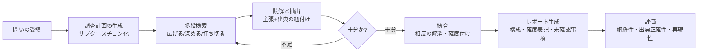

# ディープリサーチ型エージェントの設計

## この記事の目的

多段の調査(計画 → 検索 → 読解 → 統合 → レポート)を自律実行する**ディープリサーチ(deep research)型エージェント**を、出典の信頼性を保ったまま設計できるようになります。調査タスクの分解・多段検索の打ち切り判断・全主張への出典紐付け・相反する情報源の扱い・レポート形式・評価の設計を、実装の勘所とともに持ち帰れる状態を目指します。

## 対象読者

- 社内ナレッジや Web を横断して調査レポートを生成するエージェントを設計するアプリケーションエンジニア・テックリード
- RAG は動かせるが、「単発の検索応答」から「多段の自律調査」へ段階を上げたい実装者

## 前提知識

- [RAG 実装パターン](../03-implementation/rag-implementation-patterns.md) — 検索基盤の実装(本記事の各検索ステップの中身)
- [ループエンジニアリング](../02-architecture/loop-engineering.md) — 自律ループの停止条件・進捗判定の設計
- [ループのフィードバックと検証](../03-implementation/loop-feedback-and-verification.md) — 中間結果の検証で軌道を正す設計
- [信頼度と較正](../04-evaluation/confidence-and-calibration.md) — 確度の表現と過信の回避

## 本文

### 概要: 「速い RAG」ではなく「調べ切る」設計

ディープリサーチ型エージェントは、1 回の検索で答える RAG とは目的が違います。**曖昧な問い**を受け取り、自分で調査計画を立て、検索と読解を何度も繰り返し、複数の情報源を突き合わせて、**出典付きのレポート**を生成します。人間のリサーチャーの仕事を模す、と言えます。

この形式が向くのは、**検証可能性が中〜高く、失敗コストが高い**調査タスクです([ユースケース発見](../09-business/usecase-discovery.md)の軸)。競合調査・技術選定の下調べ・規制の一次情報の洗い出しなどが典型です。逆に、**即答が要る問い**や、**単一ドキュメントで完結する問い**にはオーバースペックで、単発 RAG やそのまま検索を返すほうが速くて安全です。

設計の全体像は次のパイプラインです。各段は独立した設計判断を持ちます。

このライブラリ自身の `research/` ディレクトリ(執筆前の公式情報調査メモ)は、まさにこの型の**人手による実例**です。「事実 / 出典 URL / 確認日 / 確度」を全項目に付ける形式は、そのままエージェントの出力設計の参考になります。

### 調査タスクの分解(調査計画の生成)

最初のステップは、曖昧な問いを**調査可能なサブクエスチョン**に割ることです。ここを飛ばして「いきなり検索」すると、検索クエリが問い全体をなぞるだけになり、浅い結果しか返りません。

- **調査計画を明示的に生成する**: 「この問いに答えるには何を確かめる必要があるか」をエージェントにまず列挙させます。計画をテキスト(または[構造化出力](../03-implementation/structured-output.md))として残すと、後段の進捗判定・打ち切り判断・レポート構成の骨格に再利用できます
- **サブクエスチョンは検証可能な粒度まで割る**: 「A は B より優れているか」ではなく「A の公式が示す X の値」「B の公式が示す X の値」まで割ると、各サブクエスチョンに**出典を 1 対 1 で紐付け**られます。抽象的な問いのまま検索すると、意見記事を根拠にしてしまいがちです
- **計画は固定しない**: 調査の途中で「そもそも問いの前提が違った」と分かることがあります。計画をリードオンリーの契約にせず、中間結果に応じて**サブクエスチョンを追加・削除できる**設計にします(次節のループと接続)

### 多段検索の制御(広げる・深める・打ち切る)

ディープリサーチの中核は、検索を**いつ広げ・いつ深め・いつ打ち切るか**の判断です。ここが甘いと、無限に検索し続けてコストが膨らむか、逆に 1〜2 回で満足して浅いレポートを出すかの両極に振れます。[ループエンジニアリング](../02-architecture/loop-engineering.md)の停止条件設計を、調査ドメインに具体化したものと考えてください。

- **広げる(breadth)**: サブクエスチョンを網羅できていないとき。まだ触れていない観点・情報源の種類(公式・学術・報道)を増やします
- **深める(depth)**: ある主張の根拠が弱い・一次情報に届いていないとき。二次情報から一次情報へ、要約から原文へ辿ります
- **打ち切る(stop)**: 判断が最も難しい部分です。次の複数の停止条件を**併用**します
  - **飽和**: 新しい検索が既知の事実しか返さなくなった(新規情報の増分がしきい値を下回る)
  - **計画の充足**: すべてのサブクエスチョンに一定確度以上の出典が付いた
  - **予算**: 検索回数・トークン・時間の上限([長時間実行エージェント](../05-operations/long-running-agents.md)の予算管理)。上限に達したら「未確認事項」として明示して打ち切る

> **無限ループと過少調査は同じ根から生じます。** 「進捗しているか」を測れないと、停止できない(進捗ゼロでも回り続ける)か、早すぎる打ち切り(進捗しているのに止める)のどちらかになります。**各ステップで「計画のどのサブクエスチョンが埋まったか」を更新し、進捗を可観測にする**ことが、両方の解決策です。中間状態のトレースは [可観測性とトレーシング](../05-operations/observability-and-tracing.md) を参照してください。

### 出典管理: 全主張に出典を紐付ける

ディープリサーチ型で最も価値を分けるのが、**出典管理の厳密さ**です。レポートの体裁は同じでも、「全主張に検証済みの出典が付く」ものと「もっともらしい文章に後付けで URL を貼った」ものは、実務での信頼性が根本的に違います。

- **主張と出典を生成時に紐付ける**: レポートを書き終えてから出典を探させると、**文章に合う出典を探す**という逆向きの動きになり、出典の捏造や牽強付会が起きます。読解・抽出の段階で「事実 → その出典」をペアで蓄積し、レポートはそのペアからのみ構成します
- **出典なし主張を排除する**: 蓄積した出典ペアに紐付かない主張は、レポートに出さないか、明確に「一般論・推測」と区別します。エージェントが背景知識(訓練データ)から埋めた文は、出典がないため後で検証できません
- **引用を検証する**: 「その URL に、その主張が実際に書いてあるか」を別ステップで確かめます([ループのフィードバックと検証](../03-implementation/loop-feedback-and-verification.md))。生成モデルは実在する URL に対して**書かれていない内容を要約として付ける**ことがあります。可能なら引用箇所(該当文)まで保持し、レポートから原文へ辿れるようにします
- **一次情報を優先する**: 同じ事実でも、公式ドキュメント・原論文・一次統計を、まとめ記事より上位に置きます。出典の**発行主体**をメタデータとして持つと、後述の確度付けと相反解消に使えます

### 相反する情報源の扱い(確度の表現)

深く調べるほど、**情報源どうしが食い違う**場面に必ず出会います。ここでエージェントが「片方を勝手に採用して断定する」と、もっともらしいが偏ったレポートになります。

- **食い違いを潰さず、明示する**: 「A は X と述べ、B は Y と述べる」と**両論を残す**のが既定です。無理に一つの結論へ丸めません
- **確度を表現する**: 一次情報で複数が一致する事実は高確度、単一の二次情報のみは低確度、と**確度のラベル**を主張ごとに付けます。[信頼度と較正](../04-evaluation/confidence-and-calibration.md)の考え方をレポート出力に持ち込み、過信を避けます
- **発行主体と日付で重み付けする**: 相反したとき、発行主体(公式かどうか)と情報の鮮度(いつの時点か)で優先順位の手がかりを示します。ただし**最終判断は読者に委ねる**書き方にし、エージェントが独断で「Y は誤り」と断じないようにします

### 社内資料と Web の統合

実務のディープリサーチは、**社内資料(信頼できるが限定的)と Web(広いが玉石混交)**を統合します。両者は信頼性の前提が違うため、同じ検索経路に混ぜると事故が起きます。

- **経路と権限を分ける**: 社内資料は[権限](../06-security/agent-identity-and-auth.md)を反映した検索経路で引き、Web は別経路で引きます。社内の機密が Web 検索クエリに漏れる・外部の内容が社内資料と区別なく混ざる、といった経路の取り違えを防ぎます
- **信頼の階層を持たせる**: 社内の一次資料 > 社内の二次資料 > Web の公式 > Web の一般、のような階層を確度付けに反映します
- **秘匿の扱い**: 社内資料を根拠にレポートを書くとき、そのレポートの配布先が資料の閲覧権限を満たすかを設計に含めます([データ持ち出し対策](../06-security/data-exfiltration.md))

### レポート形式の設計

出力レポートは、**読者が検証・再調査できる**形式にします。結論だけの美しいレポートより、根拠へ辿れる無骨なレポートのほうが実務価値が高い、というのがこのドメインの原則です。

- **構成を計画から導く**: 調査計画のサブクエスチョンをそのまま節構成の骨格にすると、網羅性が担保され、抜けが見えます
- **確度と出典を本文に埋める**: 各主張に確度ラベルと出典リンクを添えます。末尾一括の参考文献より、**主張の隣に出典**があるほうが検証しやすいです
- **未確認事項を明示する**: 打ち切り時に埋まらなかったサブクエスチョンを「未確認事項」として残します。**「調べたが分からなかった」と「調べていない」を区別**するのが、信頼できるレポートの条件です
- **構造化出力を併用する**: レポートの骨格(主張・出典・確度のリスト)を[構造化出力](../03-implementation/structured-output.md)で持つと、後述の自動評価や、他システムへの引き渡しが容易になります

### 評価の設計

ディープリサーチ型の評価は、単発 RAG より難しくなります。「正解の 1 文」ではなく「レポート全体の質」を測るためです。次の 3 軸に分けて設計します([評価データセット](../04-evaluation/evaluation-datasets.md)・[LLM-as-a-Judge](../04-evaluation/llm-as-a-judge.md))。

- **網羅性**: 用意した問いに対し、押さえるべき論点を落としていないか。基準となる論点リスト(ゴールドの観点)を人手で作り、レポートがそれを何割カバーしたかで測ります
- **出典正確性**: 各主張の出典が実在し、かつ主張を実際に支持しているか。ここは自動チェック(URL 到達性 + 引用箇所の含意判定)と人手抜き取りを併用します。**捏造出典ゼロ**を最優先の合格条件にします
- **再現性**: 同じ問いで、結論の骨格が安定するか。多段の自律実行はばらつきが大きいため、**複数回実行して結論の分散**を見ます。分散が大きいレポートは、確度の表現を厚くする設計判断につながります

## 実務での注意点

### アンチパターン

- **調査計画を立てず、いきなり検索する** → 検索が問いをなぞるだけで浅い結果しか出ない → まずサブクエスチョンへ分解し、計画をレポート構成に再利用する
- **レポートを書いてから出典を後付けする** → 文章に合う出典を探す逆向きの動きで、捏造・牽強付会が起きる → 読解段階で「事実 → 出典」をペアで蓄積し、そのペアからのみ書く
- **引用先を検証しない** → 実在 URL に書かれていない内容を要約として付けてしまう → 引用箇所の含意を別ステップで確認する
- **相反する情報源を片方に丸める** → もっともらしいが偏ったレポートになる → 両論を残し、確度と発行主体で手がかりを示し、判断は読者に委ねる
- **停止条件が飽和判定だけ、または予算だけ** → 過少調査か暴走のどちらかに振れる → 飽和・計画充足・予算を併用し、進捗を可観測にする
- **「調べたが不明」と「未調査」を区別しない** → 読者が抜けに気づけない → 未確認事項を明示的に残す

### チェックリスト

- [ ] 曖昧な問いを、出典を 1 対 1 で紐付けられる粒度のサブクエスチョンへ分解しているか
- [ ] 停止条件を複数(飽和・計画充足・予算)併用し、進捗を可観測にしているか
- [ ] すべての主張が、検証済みの出典ペアに紐付いているか(出典なし主張を排除しているか)
- [ ] 引用先に主張が実際に書かれているかを検証するステップがあるか
- [ ] 相反する情報源を両論併記し、確度を主張ごとに表現しているか
- [ ] 社内資料と Web の検索経路・権限・信頼階層を分けているか
- [ ] レポートに未確認事項を明示し、「不明」と「未調査」を区別しているか
- [ ] 網羅性・出典正確性・再現性の 3 軸で評価し、捏造出典ゼロを合格条件にしているか

## 関連トピック

- [RAG 実装パターン](../03-implementation/rag-implementation-patterns.md) — 各検索ステップの実装(本記事は多段の制御と統合を扱う)
- [ループエンジニアリング](../02-architecture/loop-engineering.md) — 停止条件・進捗判定(調査の打ち切り判断の基盤)
- [ループのフィードバックと検証](../03-implementation/loop-feedback-and-verification.md) — 引用検証・中間結果の検証
- [信頼度と較正](../04-evaluation/confidence-and-calibration.md) — 確度の表現と過信の回避
- [構造化出力](../03-implementation/structured-output.md) — 主張・出典・確度の構造化
- [評価データセット](../04-evaluation/evaluation-datasets.md) — 網羅性・出典正確性の評価セット作り
- [検索体験の再設計](search-experience-redesign.md) — 人間向けの検索・回答体験(本記事は自律調査のレポート生成)
- [ユースケース発見](../09-business/usecase-discovery.md) — ディープリサーチ型が向く/向かない業務の見極め

## 参考資料

- 本リポジトリの執筆テンプレート `templates/doc-template.md` — 出典・確度・未確認事項を分ける構造の実例(アクセス日: 2026-07-09)
- 本リポジトリの `research/` ディレクトリ — 「事実 / 出典 URL / 確認日 / 確度」形式の調査メモ(人手によるディープリサーチの実例。アクセス日: 2026-07-09)

## TODO・未確認事項

なし
