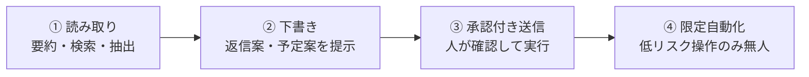

# パーソナルアシスタントの設計

## この記事の目的

メール・カレンダー・タスクを横断する個人向けアシスタントを、**権限とプライバシーの段階設計**で安全に作れるようになります。横断アクセスの最小化・自律度の段階的な引き上げ・記憶とパーソナライズ・プロアクティブ性の節度・受信コンテンツ経由の間接インジェクション防御を、実装の判断として持ち帰れる状態を目指します。

## 対象読者

- メール・予定・タスクなど個人の業務データを横断するアシスタントを設計するアプリケーションエンジニア・プロダクト責任者
- 「便利さ」と「暴走・漏えいのリスク」のバランスを、権限と自律度の設計で取りたい実装者

## 前提知識

- [Human-in-the-Loop 設計](../02-architecture/human-in-the-loop.md) — 承認・関与点の設計(自律度の段階の基盤)
- [データ漏えい対策](../06-security/data-exfiltration.md) — 機微データが外部に出る経路(間接インジェクションの被害面)
- [長期記憶の実装](../03-implementation/long-term-memory-implementation.md) — 好み・文脈の保存(パーソナライズの基盤)
- [プロンプトインジェクション](../06-security/prompt-injection.md) — 受信コンテンツ経由の間接型攻撃

## 本文

### 概要: 「便利さ」は「権限の広さ」と「自律度」の掛け算で危険になる

パーソナルアシスタントは、メール・カレンダー・連絡先・ファイルなど、**持ち主の生活のほぼ全域**にアクセスします。この横断性が便利さの源泉であり、同時にリスクの源泉です。広い権限を持つエージェントが、外部から届いたコンテンツ(メール本文・予定の説明・共有ファイル)を読み、そのまま行動できると、**間接プロンプトインジェクション**で乗っ取られたときの被害が甚大になります。

したがって設計の中心テーマは「**権限の広さ**」と「**自律度**」を独立に絞り込むことです。便利さのために権限を広げるなら自律度は低く保ち、自律度を上げるなら権限を絞る、という掛け算で危険度を管理します。この記事の各節は、この 2 軸をどう設計するかに帰着します。

### 横断アクセスの設計(ツール群と権限の最小化)

アシスタントに「全部できる 1 個の万能アカウント」を与えるのは最悪の出発点です。ツールと権限を、**用途ごとに分けて最小化**します。

- **読み取りと書き込みを分ける**: 「メールを読む」と「メールを送る」は別のツール・別の権限にします。多くの有用な機能(要約・検索・下書き)は読み取りだけで実現でき、送信・削除のような不可逆操作にだけ強い制御をかけられます
- **スコープを絞る**: カレンダーなら「予定の閲覧」と「予定の作成」、メールなら「特定ラベルのみ」のように、アクセス範囲を業務に必要な最小限に絞ります([エージェントの認証・認可](../06-security/agent-identity-and-auth.md))
- **持ち主の権限で動く**: アシスタントは持ち主本人の権限の範囲でのみ動き、それを超える操作(他人の予定の閲覧など)はできないようにします
- **致命的な組み合わせを避ける**: 「非公開データへのアクセス」「信頼できない外部コンテンツの読み取り」「外部への送信能力」の 3 つが 1 つのエージェントに揃うと、データ持ち出しが構造的に可能になります([Agent の脅威モデル概観](../06-security/threat-model-overview.md)の致命的三重奏)。パーソナルアシスタントはこの 3 つが揃いやすいため、送信能力に承認ゲートを噛ませて三重奏を崩します

### 自律度の段階(読み取り → 下書き → 承認付き送信 → 限定自動化)

自律度は、いきなり最大にせず、**信頼を積み上げながら段階的に**上げます。各段階は独立した設計判断です([Human-in-the-Loop 設計](../02-architecture/human-in-the-loop.md))。

- **① 読み取り**: 要約・検索・リマインドなど、副作用のない機能から始めます。ここは失敗コストが低く、有用性を検証しやすい段階です
- **② 下書き**: 返信案・予定案を**提示するだけ**で、送信・確定はしません。人が書き換えて使うので、誤りが実害になりません
- **③ 承認付き送信**: 送信・予定確定などの操作を、**人の承認を挟んで**実行します。承認の記録が、後から「誰が許可したか」を説明する裏付けになります
- **④ 限定自動化**: 「既読にする」「スパムを振り分ける」のような**低リスク・可逆**の操作に限って、承認なしの自動化を許します。金銭・対外送信・削除のような高リスク操作は、便利でも自動化しません
- **段階を飛ばさない**: 「いきなり自動返信」は、間接インジェクションで乗っ取られたときに人の目を通らず被害が出ます。自律度を上げる判断は、そのリスクを引き受けられる操作かどうかで決めます

### 記憶とパーソナライズ(好み・文体の学習)

パーソナルアシスタントの価値は、**持ち主に馴染む**ことです。好み・文体・よく使う相手を覚え、パーソナライズします([長期記憶の実装](../03-implementation/long-term-memory-implementation.md))。ただし記憶は便利さと同時にリスクにもなります。

- **覚えてよいものを決める**: 文体の癖・定型の返し方・優先度の付け方などは覚える価値があります。一方、機微な個人情報(健康・金銭の詳細)を安易に長期記憶へ書くと、漏えい時の被害が大きくなります。**何を覚え・何を覚えないか**を設計します
- **記憶を外部入力として扱う**: 記憶に書かれた内容も、間接インジェクションで汚染されうる入力です([新興攻撃パターンの体系](../06-security/advanced-attack-patterns.md)のメモリポイズニング)。「記憶にこう書いてあるから」を無条件に信頼せず、重要な行動の前には現在の指示と突き合わせます
- **忘れる手段を用意する**: 持ち主が「これは覚えないで」「今の記憶を消して」と言える経路を用意します。記憶の透明性(何を覚えているか見える)と制御(消せる)は、パーソナルデータを扱う以上の必須要件です

### プロアクティブ性の節度

「先回りして提案する」プロアクティブ性は、うまくやれば価値が高く、外すとうるさいだけになります。節度の設計が要ります。

- **邪魔しない既定**: 通知・先回りの提案は、**控えめを既定**にします。頻繁な割り込みは、便利さより煩わしさが勝ちます
- **確度の低い先回りは黙る**: 「たぶんこうしたいはず」の確度が低いときは、提案せずに黙るほうが信頼されます([信頼度と較正](../04-evaluation/confidence-and-calibration.md)の棄権の考え方)。外れた先回りは、当たった先回りより強く印象に残ります
- **プロアクティブ操作こそ承認を厚く**: 人が頼んでいない操作(自発的な予定調整など)は、頼まれた操作より慎重にします。プロアクティブ性と自律度を同時に上げない、が原則です

### 間接プロンプトインジェクション(受信コンテンツ経由)への防御

パーソナルアシスタント最大の脅威は、**受信メール・予定の説明・共有ファイルに仕込まれた指示**でエージェントが乗っ取られることです。持ち主が書いた指示と、外部から届いたコンテンツを、エージェントは区別しにくいという構造的な弱さがあります。教材として [メールアシスタントの情報漏えいインシデント](../07-case-studies/case-study-email-assistant-incident.md) を必ず参照してください。

- **外部コンテンツを「データ」として扱う**: 受信メールなどの本文は、**命令ではなくデータ**として処理します。本文中の「これを○○に転送して」といった文字列を、エージェントへの指示として実行しないよう、境界を設計します([プロンプトインジェクション](../06-security/prompt-injection.md))
- **送信・持ち出しに人を挟む**: 完全な防御は困難なため、**被害を止める**設計を併用します。外部への送信・転送・共有は承認を必須にし、乗っ取られても人の目で止まるようにします([データ漏えい対策](../06-security/data-exfiltration.md))
- **持ち主の指示を優先する構造**: システムプロンプトや持ち主の直接指示を、外部コンテンツより上位に置く構造にします。ただしこれだけで防ぎ切れないため、上の承認ゲートと組み合わせます

### 個人データの扱い

パーソナルアシスタントは、定義上、**個人データの塊**を扱います。プライバシーの設計は機能の付け足しではなく前提です。

- **データの経路を明確にする**: 個人データがどのモデル・どの外部サービスを通るかを把握し、持ち主に説明できるようにします。学習に使われるか、どこに保存されるかを明示します([AI のためのデータガバナンス](../05-operations/data-governance-for-ai.md))
- **最小化する**: タスクに不要な個人データはモデルに渡しません。要約に不要な連絡先や本文の一部は削ってから渡す、といった最小化を設計に組み込みます
- **持ち主が主導権を持つ**: 何にアクセスさせ、何を覚えさせ、何を自動化させるかを、持ち主が見て・変えられるようにします。パーソナルアシスタントの信頼は、機能の賢さより制御の透明性から生まれます

## 実務での注意点

### アンチパターン

- **万能の 1 アカウントに全権限を与える** → 乗っ取り時の被害が全域に及ぶ → ツール・権限を用途ごとに分け、読み取りと書き込みを分離する
- **いきなり自動返信・自動送信を実装する** → 間接インジェクションで人の目を通らず被害が出る → 読み取り → 下書き → 承認付き送信 → 限定自動化と段階を踏む
- **外部コンテンツ中の指示を実行してしまう** → 受信メール経由で乗っ取られる → 外部本文を命令でなくデータとして扱い、送信・持ち出しに承認を挟む
- **機微な個人情報を無制限に長期記憶へ書く** → 漏えい時の被害が拡大し、記憶汚染も効く → 覚える対象を絞り、記憶を外部入力として検証し、忘れる手段を用意する
- **確度の低い先回りを積極的に通知する** → うるさく、外れると信頼を失う → 控えめを既定にし、確度が低ければ黙る
- **個人データの経路を持ち主に説明できない** → プライバシー不信で使われない → データの流れ・保存・学習利用を明示し、持ち主が制御できるようにする

### チェックリスト

- [ ] ツール・権限を用途ごとに分け、読み取りと書き込みを分離したか
- [ ] 送信・削除・持ち出しなど不可逆・対外操作に承認ゲートを噛ませ、致命的三重奏を崩したか
- [ ] 自律度を読み取り → 下書き → 承認付き送信 → 限定自動化の段階で設計したか
- [ ] 長期記憶に覚える対象を絞り、記憶を外部入力として検証し、忘れる手段を用意したか
- [ ] 受信コンテンツ中の指示を実行しない境界(データとして扱う)を設けたか
- [ ] プロアクティブな提案を控えめ既定にし、確度が低ければ棄権する設計にしたか
- [ ] 個人データの経路・保存・学習利用を持ち主に説明でき、制御できるようにしたか

## 関連トピック

- [Human-in-the-Loop 設計](../02-architecture/human-in-the-loop.md) — 自律度の段階と承認ゲートの設計
- [データ漏えい対策](../06-security/data-exfiltration.md) — 送信・持ち出し経路の遮断(乗っ取り時の被害停止)
- [プロンプトインジェクション](../06-security/prompt-injection.md) — 受信コンテンツ経由の間接型攻撃
- [メールアシスタントの情報漏えいインシデント](../07-case-studies/case-study-email-assistant-incident.md) — 本記事の脅威が現実化した教材
- [長期記憶の実装](../03-implementation/long-term-memory-implementation.md) — 好み・文脈のパーソナライズ
- [新興攻撃パターンの体系](../06-security/advanced-attack-patterns.md) — メモリポイズニング(記憶汚染)
- [信頼度と較正](../04-evaluation/confidence-and-calibration.md) — 確度の低い先回りを棄権する判断
- [ユースケース発見](../09-business/usecase-discovery.md) — アシスタント機能の向き不向きの見極め

## 参考資料

- [メールアシスタントの情報漏えいインシデント](../07-case-studies/case-study-email-assistant-incident.md) — 間接インジェクションと過剰権限が重なった失敗の分析(アクセス日: 2026-07-09)

## TODO・未確認事項

なし
