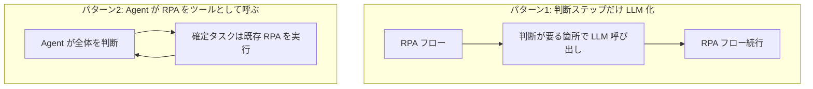

# RPA と Agent の使い分け・移行戦略

## この記事の目的

既存の RPA(ロボティック・プロセス・オートメーション)資産を持つ組織が、AI Agent との**使い分け・共存・段階的移行**を判断できるようになります。両者の特性の違い・それぞれが壊れる場所・共存パターン・移行の優先順位付け・運用統制の引き継ぎを、製品選定に踏み込む前の判断軸として持ち帰れる状態を目指します。

## 対象読者

- すでに RPA を運用しており、AI Agent の導入・置き換えを検討している業務部門・情報システム部門・RPA 開発者
- 「RPA を全部 Agent にすべきか」を問われて、切り分けの軸がほしい PM・テックリード

## 前提知識

- [Workflow 型 vs Agent 型の使い分け](../02-architecture/workflow-vs-agent.md) — 決定的な手順と適応的な判断の使い分け(本記事の商流版)
- [ブラウザ・コンピュータ操作の実装](../03-implementation/computer-use-implementation.md) — 画面操作を Agent に行わせる場合の実装と限界
- [ユースケース発見と要件定義](../09-business/usecase-discovery.md) — どの業務を自動化対象に選ぶかの判断

## 本文

### 概要: 「RPA を全部 Agent に」は問いの立て方が間違っている

RPA は、人間の画面操作(クリック・入力・コピー)を**決定的なスクリプト**として記録・再生する自動化です。手順が固定した定型業務では、安く・速く・確実に動きます。一方 AI Agent は、状況を見て**適応的に判断**します。手順が固定できない・例外が多い業務に強い代わりに、確実性は下がります。

この 2 つは対立技術ではなく、**得意な場所が違う道具**です。「RPA を全部 Agent に置き換える」は、多くの場合コストを上げて信頼性を下げます。正しい問いは「**どの業務のどの部分**を、どちらに任せるか」です。以下では、その切り分けの軸を整理します。この判断は[Workflow 型 vs Agent 型の使い分け](../02-architecture/workflow-vs-agent.md)の考え方を、既存の RPA 資産がある現場に当てはめたものです。

### 特性比較

| 観点 | RPA(決定的スクリプト) | AI Agent(適応的判断) |
| --- | --- | --- |
| 手順 | 事前に固定。毎回同じ動き | 状況に応じて実行時に決める |
| 主なインターフェース | 画面操作(GUI)が中心。API があれば API も | API・ツール呼び出しが中心。画面操作も可 |
| 得意な業務 | 手順が固定した定型・大量処理 | 例外が多い・判断や読解を含む業務 |
| 確実性 | 高い(同じ入力に同じ結果) | 確率的(検証で担保する必要) |
| 変化への強さ | 弱い(画面が変わると壊れる) | 相対的に強い(意図で吸収しうる) |
| 主な保守コスト | 画面変更への追従。壊れやすい | プロンプト・評価・モデル更新への追従 |
| コスト構造 | 開発時に固定的。実行は安い | 実行ごとにトークン課金。判断が増えると上がる |

- **保守コストの構造が違う**: RPA の保守コストは「対象画面が変わるたびに直す」形で発生します。Agent の保守コストは「意図どおり判断できているかを評価し続ける」形で発生します。どちらもゼロにはならず、**負担の性質が違う**ことを前提に総保有コストを見ます
- **確実性を捨てられない業務に注意**: 会計・決済・在庫更新のように、**毎回同じ結果でなければ困る**処理は、確率的な Agent に丸ごと任せるべきではありません。判断は Agent、確定的な実行は決定的な仕組み、と分けます

### RPA が壊れる場所と Agent が揺れる場所(相補性)

両者の弱点は、ちょうど裏返しの関係にあります。これが共存を設計できる根拠です。

- **RPA が壊れる場所**: 対象システムの**画面レイアウト変更**、想定外のダイアログ、入力データの表記ゆれ。RPA は「見た目の座標や文言」に依存するため、少しの変化で止まります。例外処理を書き足すほどスクリプトが複雑化し、保守が破綻していきます
- **Agent が揺れる場所**: 同じ入力でも**出力がぶれる**、判断を誤ってももっともらしく続行する、コストが読みにくい。Agent は「意図で吸収できる」代わりに、**確実性の保証**が構造的に弱いです
- **相補性**: 表記ゆれや例外の**判断**は Agent が吸収し、確定した処理の**確実な実行**は決定的な仕組み(RPA・API)が担う、という分担が自然に導かれます。片方の弱点を、もう片方の強みで埋めます

### 共存パターン

全面置き換えではなく、次のような**共存**が実務的です。既存 RPA 資産を活かしながら、判断が要る部分だけを Agent 化します。

- **パターン 1: RPA の中の判断ステップだけ LLM 化**: 既存の RPA フローはそのまま使い、その中の「人が目視で判断していた 1 ステップ」(書類の分類・記載内容の妥当性チェックなど)だけを LLM 呼び出しに置き換えます。導入リスクが小さく、効果を測りやすい始め方です
- **パターン 2: Agent が RPA をツールとして呼ぶ**: Agent が業務全体を判断・オーケストレーションし、**確定した定型処理は既存の RPA を「ツール」として呼び出す**構成です。RPA 資産を捨てずに、判断の柔軟性を上から足せます([Workflow 型 vs Agent 型の使い分け](../02-architecture/workflow-vs-agent.md)のオーケストレーション)
- **どちらも「決定的な部分は決定的なまま」**: 共通するのは、確実性が要る処理を Agent の確率的判断に溶かさないことです。Agent は判断・接着に使い、実行の確実性は決定的な部品に残します

### 移行の優先順位付け

限られた予算で移行するなら、**保守負債が大きく・判断で楽になる**業務から着手します。

- **画面操作依存で壊れやすい RPA を優先**: 対象システムの画面変更で頻繁に止まる RPA は、保守コストが高く、API や Agent の柔軟な操作([ブラウザ・コンピュータ操作の実装](../03-implementation/computer-use-implementation.md))で楽になる余地が大きい候補です。ただし computer use 自体もまだ発展途上のため、まずは API 化を優先し、画面操作は最後の手段にします
- **例外処理が肥大した RPA を優先**: 分岐と例外対応でスクリプトが複雑化した RPA は、判断を Agent に委ねると保守が軽くなります
- **確実性が最優先の業務は後回し(または対象外)**: 会計確定・決済のような処理は、Agent 化の効果より確実性の低下リスクが上回りがちです。急いで移行しません
- **効果測定をセットにする**: どの移行も、[ユースケース発見](../09-business/usecase-discovery.md)の成功基準を先に決め、移行前後で保守コスト・処理時間・エラー率を比較します

### RPA ベンダーの Agent 統合動向(類型)

> **最終確認日: 2026-07-09。** 各 RPA/自動化ベンダーのエージェント機能・提供形態は変化が非常に速く、製品名・機能名・ライセンス階層は本文に固定しません。最新の各社公式発表と、リポジトリの `research/domain-agents/rpa.md`(調査メモ)を確認してください。ここでは**製品横断で言える類型**のみを扱います。

主要な RPA・自動化プラットフォームは、AI Agent 機能を次のような**類型**で取り込んでいます(2026-07 時点。特定製品の優劣は論じません)。

- **オーケストレーション層としてのエージェント**: エージェントが業務全体を計画・判断し、決定的な自動化タスク(既存 RPA ロボット)を実行部品として呼び分ける、という位置づけを多くのベンダーが打ち出しています(上述のパターン 2 に対応)
- **既存フローへの LLM ステップの埋め込み**: フロー内の特定ステップ(文書理解・分類・要約・回答生成)を LLM に委ねる機能(上述のパターン 1 に対応)
- **提供形態はクラウド/オンプレで分かれる**: エージェント機能はクラウド前提のものが多い一方、閉域網・オンプレ要件向けの提供も存在します。**自社のデータ経路要件(外部送信の可否)で選別**が必要です([企業システム環境の制約と対応](../08-coding-agents/se-enterprise-constraints.md)の閉域網の議論と同じ観点)
- **統制・ガバナンス機能の同梱**: 人の承認・監査ログ・権限管理を、既存の RPA 運用統制の延長として、オーケストレーション層に集約してエージェントにも広げる打ち出しが見られます(次節)
- **モデル中立(BYO-LLM)への傾斜**: オーケストレーション基盤を特定の LLM に固定せず、複数プロバイダや自社ホストモデルを選べる設計が広がっています。基盤選定では「**LLM の選択自由度**」と「**ガバナンスの主体**(誰が統制を効かせるか)」を分けて評価します
- **他社エージェントも同一統制下に束ねる**: 自社エージェントだけでなく、他ベンダー製・カスタムのエージェントも同じ監査・可観測性の下でオーケストレーションする方向が見られます。ベンダーロックインを避けつつ統制を効かせる「エージェント相互運用のガバナンス」が判断軸になります

いずれも**発表と実態・提供範囲が乖離しやすい**領域です。デモではなく、自社の要件(データ経路・確実性・統制)を満たすかを PoC で確かめてから採否を決めます。

### 統制の引き継ぎ(運用統制・監査)

RPA には長年かけて作られた**運用統制**(誰が・いつ・何を実行したかの記録、承認フロー、変更管理)があります。Agent 化でこれを失うと、統制の後退になります。

- **監査証跡を引き継ぐ**: RPA の実行ログに相当するものを、Agent でも残します。何を入力に・どう判断し・どのツールを・どう実行したかのトレース([可観測性とトレーシング](../05-operations/observability-and-tracing.md))を、既存の監査要件に合う粒度で確保します
- **承認フローを維持する**: RPA で人の承認を挟んでいた重要操作は、Agent でも[Human-in-the-Loop](../02-architecture/human-in-the-loop.md)として承認点を残します。自律度を上げる判断は、統制の要件とセットで行います
- **変更管理を移植する**: RPA の「変更時のレビューとテスト」に相当する運用を、プロンプト・ツール・モデルの変更に対しても用意します([回帰テストと CI 組み込み](../04-evaluation/regression-testing.md))。決定的だった RPA と違い、Agent はモデル更新でも挙動が変わるため、変更管理の対象が増えます
- **権限を絞る**: RPA ロボットに広すぎる権限を与えていた場合、Agent 化はそれを見直す好機です。実行アカウントの権限を業務に必要な最小限に絞ります([エージェントの認証・認可](../06-security/agent-identity-and-auth.md))

## 実務での注意点

### アンチパターン

- **RPA を全面的に Agent へ置き換える** → コストが上がり確実性が下がる → 業務の「判断部分」だけを Agent に、「確定処理」は決定的な部品に残す
- **確実性が要る処理を確率的な Agent に丸投げする** → 会計・決済でぶれが致命傷になる → 判断は Agent、確定実行は決定的な仕組み、と分ける
- **画面操作の RPA を、そのまま画面操作の Agent に移すだけ** → 壊れやすさは変わらず、確実性だけ下がる → まず API 化を検討し、画面操作は最後の手段にする
- **既存 RPA 資産を捨てて作り直す** → 移行コストと再統制の負担が大きい → Agent が RPA をツールとして呼ぶ共存構成で資産を活かす
- **RPA の運用統制を引き継がない** → 監査・承認・変更管理が後退する → 監査証跡・承認フロー・変更管理を Agent の統制として移植する
- **ベンダーのデモを実態と見なして採否を決める** → 提供範囲・データ経路要件で後から詰まる → 自社要件で PoC してから決める

### チェックリスト

- [ ] 対象業務を「判断が要る部分」と「確定処理の部分」に切り分けたか
- [ ] 確実性が最優先の処理を、確率的な Agent に丸投げしていないか
- [ ] 既存 RPA 資産を活かす共存構成(判断ステップの LLM 化 / Agent が RPA を呼ぶ)を検討したか
- [ ] 移行の優先順位を、保守負債の大きさと判断で楽になる度合いで決めたか
- [ ] 画面操作の移行で、API 化を先に検討したか(画面操作は最後の手段か)
- [ ] RPA の監査証跡・承認フロー・変更管理を Agent の統制として引き継いだか
- [ ] ベンダーのエージェント機能を、自社のデータ経路・確実性・統制要件で PoC 検証したか

## 関連トピック

- [Workflow 型 vs Agent 型の使い分け](../02-architecture/workflow-vs-agent.md) — 決定的な手順と適応的な判断の使い分け(本記事の基盤)
- [ブラウザ・コンピュータ操作の実装](../03-implementation/computer-use-implementation.md) — 画面操作を Agent に行わせる場合の実装と限界
- [ユースケース発見と要件定義](../09-business/usecase-discovery.md) — 移行対象業務の選定と成功基準
- [Human-in-the-Loop 設計](../02-architecture/human-in-the-loop.md) — RPA の承認フローを Agent に引き継ぐ設計
- [可観測性とトレーシング](../05-operations/observability-and-tracing.md) — RPA の実行ログに相当する監査証跡
- [エージェントの認証・認可](../06-security/agent-identity-and-auth.md) — ロボット権限の最小化
- [企業システム環境の制約と対応](../08-coding-agents/se-enterprise-constraints.md) — 閉域網・データ経路要件(ベンダー選定の観点)

## 参考資料

- `research/domain-agents/rpa.md` — RPA ベンダーの AI Agent 統合動向の調査メモ(公式一次情報・製品名を含む。アクセス日: 2026-07-09)

## TODO・未確認事項

> **TODO(要確認):** 主要 RPA/自動化ベンダーのエージェント機能・提供形態(クラウド/オンプレ・ライセンス階層・統制機能)の最新を各社公式で確認する。製品名・機能名は本文に固定せず `research/domain-agents/rpa.md` と本節に閉じ込める(最終確認: 2026-07)
