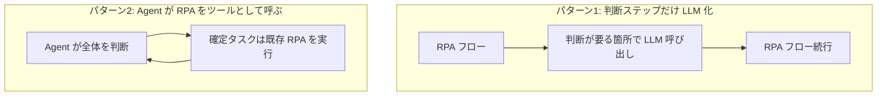

# RPA と Agent の使い分け・移行戦略

## この記事の目的

既存の RPA(ロボティック・プロセス・オートメーション)資産を持つ組織が、AI Agent との**使い分け・共存・段階的移行**を判断できるようになります。両者の特性の違い・それぞれが壊れる場所・共存パターン・移行の優先順位付け・運用統制の引き継ぎを、製品選定に踏み込む前の判断軸として持ち帰れる状態を目指します。

## 対象読者

- すでに RPA を運用しており、AI Agent の導入・置き換えを検討している業務部門・情報システム部門・RPA 開発者
- 「RPA を全部 Agent にすべきか」を問われて、切り分けの軸がほしい PM・テックリード

## 前提知識

- [Workflow 型 vs Agent 型の使い分け](../02-architecture/workflow-vs-agent.md) — 決定的な手順と適応的な判断の使い分け(本記事の商流版)
- [ブラウザ・コンピュータ操作の実装](../03-implementation/computer-use-implementation.md) — 画面操作を Agent に行わせる場合の実装と限界
- [ユースケース発見と要件定義](../09-business/usecase-discovery.md) — どの業務を自動化対象に選ぶかの判断

## 本文

### 概要: 「RPA を全部 Agent に」は問いの立て方が間違っている

RPA は、画面操作や API 呼び出しなどを**事前に定義したフロー**で実行する自動化です。記録・再生は作成方法の 1 つで、条件分岐やセレクターを使う実装もあります。一方 AI Agent は、モデルが状況に応じて**実行する手順を選ぶ**構成です。どちらも対象システムの状態や入力に影響されるため、フローが固定されていても実行成功や同一結果を保証しません。

この 2 つは対立技術ではなく、**得意な場所が違う道具**です。全面置き換えの効果は業務と実装で変わるため、費用・成功率・保守負担を比較します。正しい問いは「**どの業務のどの部分**を、どちらに任せるか」です。以下では、その切り分けの軸を整理します。この判断は[Workflow 型 vs Agent 型の使い分け](../02-architecture/workflow-vs-agent.md)の考え方を、既存の RPA 資産がある現場に当てはめたものです。

### 特性比較

| 観点 | RPA(事前定義フロー) | AI Agent(適応的判断) |
| --- | --- | --- |
| 手順 | 手順・分岐を事前に定義 | 状況に応じて実行時に決める |
| 主なインターフェース | 画面操作(GUI)が中心。API があれば API も | API・ツール呼び出しが中心。画面操作も可 |
| 得意な業務 | 手順が固定した定型・大量処理 | 例外が多い・判断や読解を含む業務 |
| 確実性 | 定義済みの分岐を実行するが外部状態の変化で失敗する | モデルの判断も変動要因になる。両者とも結果検証が必要 |
| 変化への強さ | 座標・セレクター・API など依存先による | 変化を吸収できる場合も誤認する場合もあり、実測が必要 |
| 主な保守コスト | 画面変更への追従。壊れやすい | プロンプト・評価・モデル更新への追従 |
| コスト構造 | 開発・ライセンス・実行基盤・保守費用 | それらに加え推論費用。API 従量課金か自社運用かでも変わる |

- **保守コストの構造が違う**: RPA の保守コストは「対象画面が変わるたびに直す」形で発生します。Agent の保守コストは「意図どおり判断できているかを評価し続ける」形で発生します。どちらもゼロにはならず、**負担の性質が違う**ことを前提に総保有コストを見ます
- **確実性を捨てられない業務に注意**: 会計・決済・在庫更新のように、**毎回同じ結果でなければ困る**処理は、確率的な Agent に丸ごと任せるべきではありません。判断は Agent、確定的な実行は決定的な仕組み、と分けます

### RPA が壊れる場所と Agent が揺れる場所(相補性)

両者の弱点には重なりもあります。対象業務で失敗する箇所を分けて観測し、組み合わせる価値を評価します。

- **RPA が壊れる場所**: 対象システムの**画面レイアウト変更**、想定外のダイアログ、入力データの表記ゆれ。座標・文言に依存する実装では変化で止まる場合があります。セレクターや API を使う実装でも依存先の互換性確認は必要です。例外処理の追加による保守負担も測ります
- **Agent が揺れる場所**: 同じ入力でも**出力がぶれる**、判断を誤ってももっともらしく続行する、コストが読みにくい。Agent は「意図で吸収できる」代わりに、**確実性の保証**が構造的に弱いです
- **相補性**: 表記ゆれや例外の**判断**は Agent が吸収し、確定した処理の**確実な実行**は決定的な仕組み(RPA・API)が担う、という分担が自然に導かれます。片方の弱点を、もう片方の強みで埋めます

### 共存パターン

全面置き換えではなく、次のような**共存**が実務的です。既存 RPA 資産を活かしながら、判断が要る部分だけを Agent 化します。

```mermaid
flowchart TB
    subgraph A[パターン1: 判断ステップだけ LLM 化]
      A1[RPA フロー] --> A2[判断が要る箇所で LLM 呼び出し] --> A3[RPA フロー続行]
    end
    subgraph B[パターン2: Agent が RPA をツールとして呼ぶ]
      B1[Agent が全体を判断] --> B2[確定タスクは既存 RPA を実行] --> B1
    end
```

- **パターン 1: RPA の中の判断ステップだけ LLM 化**: 既存の RPA フローはそのまま使い、その中の「人が目視で判断していた 1 ステップ」(書類の分類・記載内容の妥当性チェックなど)だけを LLM 呼び出しに置き換えます。導入リスクが小さく、効果を測りやすい始め方です
- **パターン 2: Agent が RPA をツールとして呼ぶ**: Agent が業務全体を判断・オーケストレーションし、**確定した定型処理は既存の RPA を「ツール」として呼び出す**構成です。RPA 資産を捨てずに、判断の柔軟性を上から足せます([Workflow 型 vs Agent 型の使い分け](../02-architecture/workflow-vs-agent.md)のオーケストレーション)
- **どちらも「決定的な部分は決定的なまま」**: 共通するのは、確実性が要る処理を Agent の確率的判断に溶かさないことです。Agent は判断・接着に使い、実行境界に権限・入力検査・重複防止・結果照合を残します。RPA/API も失敗しうるため、外部処理の結果不明を成功とみなしません

### 移行の優先順位付け

限られた予算で移行するなら、**保守負債が大きく・判断で楽になる**業務から着手します。

- **画面操作依存で壊れやすい RPA を優先**: 対象システムの画面変更で頻繁に止まる RPA は、保守コストが高く、API や Agent の柔軟な操作([ブラウザ・コンピュータ操作の実装](../03-implementation/computer-use-implementation.md))で楽になる余地が大きい候補です。ただし computer use 自体もまだ発展途上のため、まずは API 化を優先し、画面操作は最後の手段にします
- **例外処理が肥大した RPA を優先**: 分岐と例外対応でスクリプトが複雑化した RPA は、判断を Agent に委ねる案と、フローの整理や API 化を比較します
- **確実性が最優先の業務は後回し(または対象外)**: 会計確定・決済のような処理は、Agent 化の効果より確実性の低下リスクが上回りがちです。急いで移行しません
- **効果測定をセットにする**: どの移行も、[ユースケース発見](../09-business/usecase-discovery.md)の成功基準を先に決め、移行前後で保守コスト・処理時間・エラー率を比較します

### RPA と Agent を統合する製品の確認例

[UiPath Maestro の公式概要](https://docs.uipath.com/maestro/automation-cloud/latest/user-guide/overview)は、ロボット・エージェント・人を含む業務プロセスのオーケストレーションを説明しています(確認日: 2026-09-10)。これは統合製品の一例であり、すべての RPA ベンダーが同じ提供範囲・統制機能を持つという意味ではありません。

製品選定では、次を個別の公式仕様・契約・試験で確認します。

- 既存ロボットや API を呼べるか、失敗・結果不明・再試行をどう扱うか
- 人の承認、実行権限、監査ログがどの単位で適用されるか
- クラウド・閉域網・自社運用のどこで推論し、データがどこへ送られるか
- 利用可能なモデル、他社エージェントとの連携範囲、プラン・地域による差は何か
- 開発・実行・推論・監査保存を含めた費用を自社の処理量で見積もれるか

本記事の共存パターンは設計案です。製品のデモを見た後も、自社のデータ経路・結果の整合性・統制要件を満たすかを PoC で評価します。

### 統制の引き継ぎ(運用統制・監査)

RPA には長年かけて作られた**運用統制**(誰が・いつ・何を実行したかの記録、承認フロー、変更管理)があります。Agent 化でこれを失うと、統制の後退になります。

- **監査証跡を引き継ぐ**: RPA の実行ログに相当するものを、Agent でも残します。何を入力に・どう判断し・どのツールを・どう実行したかのトレース([可観測性とトレーシング](../05-operations/observability-and-tracing.md))を、既存の監査要件に合う粒度で確保します
- **承認フローを維持する**: RPA で人の承認を挟んでいた重要操作は、Agent でも[Human-in-the-Loop](../02-architecture/human-in-the-loop.md)として承認点を残します。自律度を上げる判断は、統制の要件とセットで行います
- **変更管理を移植する**: RPA の「変更時のレビューとテスト」に相当する運用を、プロンプト・ツール・モデルの変更に対しても用意します([回帰テストと CI 組み込み](../04-evaluation/regression-testing.md))。決定的だった RPA と違い、Agent はモデル更新でも挙動が変わるため、変更管理の対象が増えます
- **権限を絞る**: RPA ロボットに広すぎる権限を与えていた場合、Agent 化はそれを見直す好機です。実行アカウントの権限を業務に必要な最小限に絞ります([エージェントの認証・認可](../06-security/agent-identity-and-auth.md))

## 実務での注意点

### アンチパターン

- **評価せず RPA を全面的に Agent へ置き換える** → 費用と失敗の増加を見逃す → 業務の「判断部分」だけを Agent に、「確定処理」は決定的な部品に残す
- **確実性が要る処理を確率的な Agent に丸投げする** → 会計・決済でぶれが致命傷になる → 判断は Agent、確定実行は決定的な仕組み、と分ける
- **画面操作の RPA を、そのまま画面操作の Agent に移すだけ** → 画面依存の問題が残り、モデルの判断誤りも加わる場合がある → まず API 化を検討し、画面操作は最後の手段にする
- **既存 RPA 資産を捨てて作り直す** → 移行コストと再統制の負担が大きい → Agent が RPA をツールとして呼ぶ共存構成で資産を活かす
- **RPA の運用統制を引き継がない** → 監査・承認・変更管理が後退する → 監査証跡・承認フロー・変更管理を Agent の統制として移植する
- **ベンダーのデモを実態と見なして採否を決める** → 提供範囲・データ経路要件で後から詰まる → 自社要件で PoC してから決める

### チェックリスト

- [ ] 対象業務を「判断が要る部分」と「確定処理の部分」に切り分けたか
- [ ] 確実性が最優先の処理を、確率的な Agent に丸投げしていないか
- [ ] 既存 RPA 資産を活かす共存構成(判断ステップの LLM 化 / Agent が RPA を呼ぶ)を検討したか
- [ ] 移行の優先順位を、保守負債の大きさと判断で楽になる度合いで決めたか
- [ ] 画面操作の移行で、API 化を先に検討したか(画面操作は最後の手段か)
- [ ] RPA の監査証跡・承認フロー・変更管理を Agent の統制として引き継いだか
- [ ] ベンダーのエージェント機能を、自社のデータ経路・確実性・統制要件で PoC 検証したか

## 関連トピック

- [Workflow 型 vs Agent 型の使い分け](../02-architecture/workflow-vs-agent.md) — 決定的な手順と適応的な判断の使い分け(本記事の基盤)
- [ブラウザ・コンピュータ操作の実装](../03-implementation/computer-use-implementation.md) — 画面操作を Agent に行わせる場合の実装と限界
- [ユースケース発見と要件定義](../09-business/usecase-discovery.md) — 移行対象業務の選定と成功基準
- [Human-in-the-Loop 設計](../02-architecture/human-in-the-loop.md) — RPA の承認フローを Agent に引き継ぐ設計
- [可観測性とトレーシング](../05-operations/observability-and-tracing.md) — RPA の実行ログに相当する監査証跡
- [エージェントの認証・認可](../06-security/agent-identity-and-auth.md) — ロボット権限の最小化
- [企業システム環境の制約と対応](../08-coding-agents/se-enterprise-constraints.md) — 閉域網・データ経路要件(ベンダー選定の観点)

## 参考資料

- [UiPath Maestro, Overview](https://docs.uipath.com/maestro/automation-cloud/latest/user-guide/overview) — Agent、ロボット、人を統合するオーケストレーションの公式実装例。製品横断の普及率や精度の根拠にはしません(アクセス日: 2026-09-10)

## TODO・未確認事項

> **TODO(要確認):** 主要 RPA/自動化ベンダーのエージェント機能・提供形態(クラウド/オンプレ・ライセンス階層・統制機能)の最新を各社公式で確認する。製品名・機能名は本文に固定せず `research/domain-agents/rpa.md` と本節に閉じ込める(最終確認: 2026-07)
