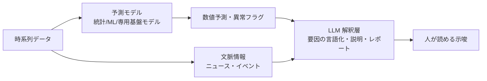

# 予測・時系列タスクと LLM

## この記事の目的

需要予測・異常検知などの時系列タスクに対する **LLM の適用範囲と限界**を判断し、従来手法との分担を設計できるようになります。LLM が効く場所と効かない場所・予測モデルと LLM を組み合わせるハイブリッド構成・「もっともらしい後付け説明」の危険・予測精度と説明品質を分けた評価を、実務の判断として持ち帰れる状態を目指します。

## 対象読者

- 需要予測・異常検知・売上予測などの時系列タスクに LLM を使えないか検討しているエンジニア・データ担当
- 「予測も LLM でできるのでは」という期待と現実の線引きがほしい実装者

## 前提知識

- [データ分析エージェント](data-analysis-agents.md) — データ分析全般(本記事は時系列固有の判断)
- [能力と限界](../10-llm-foundations/capabilities-and-limits.md) — LLM が数値・計算で外す構造
- [信頼度と較正](../04-evaluation/confidence-and-calibration.md) — 予測の不確かさの扱い

## 本文

### 概要: 数値予測そのものは、LLM の仕事ではない

需要予測や異常検知に LLM を使えないか、という相談はよくあります。結論から言うと、**数値予測そのもの(次の値をいくつと当てる)は、専用の予測手法が既定**であり、LLM に置き換えるものではありません。LLM は言語のモデルであり、時系列の数値を外挿する道具として設計されていません([能力と限界](../10-llm-foundations/capabilities-and-limits.md))。

では LLM は時系列で無力かというと、そうではありません。**予測の周辺**——要因の言語化・異常の説明・レポート生成・特徴量のアイデア出し——には効きます。設計の要点は、「数値予測は専用手法、その周辺の言語的な作業は LLM」と**役割を分ける**ことです。この線引きを誤り、数値予測を LLM に丸投げすると、もっともらしいが根拠の薄い予測が出ます。

### LLM が効く場所と効かない場所

時系列タスクの中で、LLM の向き不向きは明確に分かれます。

| 作業 | 向き | 理由 |
| --- | --- | --- |
| 次の値の数値予測 | 効かない(専用手法が既定) | LLM は数値の外挿に向かない |
| 異常の検出そのもの | 効きにくい | 統計・専用モデルが得意 |
| 要因の言語化・仮説出し | 効く | 「なぜ増えたか」の候補列挙は言語の仕事 |
| 異常・変化の説明文生成 | 効く | 検出済みの事象を人向けに説明する |
| レポート・示唆の生成 | 効く | 数値結果を文章にまとめる |
| 特徴量のアイデア出し | 効く | ドメイン知識からの発想の補助 |

- **効かない場所を LLM に任せない**: 数値予測・異常検知の中核は、統計モデル・機械学習・専用の時系列基盤モデルに任せます。ここを LLM に置き換えると精度が下がります
- **効く場所で価値を出す**: 予測モデルが出した結果を「人が理解し、行動できる」形にする——要因の説明・レポート化・示唆出し——が LLM の主戦場です
- **外部情報の統合**: 予測モデルが扱いにくい非構造情報(ニュース・イベント・注記)を、LLM が予測の文脈として取り込む使い方もあります(ただし予測値そのものは専用手法が出す)

### ハイブリッド構成(予測モデル + LLM の解釈層)

実務で有効なのは、**予測は専用モデル、解釈と説明は LLM**という 2 層のハイブリッド構成です。

- **予測層は専用手法**: 数値予測・異常検知は、その分野の確立した手法に任せます。この層の精度は、時系列の専門技術で担保します
- **解釈層は LLM**: 予測層の出力(数値・フラグ)を受け取り、要因を言語化し、説明とレポートを生成します。人が意思決定に使える形に翻訳する層です
- **層を混ぜない**: 解釈層の LLM に予測値を「調整」させると、根拠なく数字を動かす危険があります。**予測値は予測層が確定し、LLM は説明に徹する**、と層の責任を分けます

### 「もっともらしい後付け説明」の危険

このドメインで最も注意すべきは、LLM の**説明能力が、かえって害になる**場面です。

- **相関と因果の混同を増幅する**: LLM は「なぜこの数字になったか」をなめらかに説明します。しかしその説明は、**相関を因果のように語る**ことが容易です。「売上が伸びたのは○○のおかげ」という後付けの物語は、もっともらしいだけで根拠がないことがあります
- **説明を根拠と取り違えない**: 流暢な説明は、正しさの保証ではありません。LLM の説明は**仮説**として扱い、データで検証してから意思決定に使います。説明の説得力と、その説明の正しさは別物です
- **不確かさを消さない**: 予測には必ず不確かさがあります。LLM の説明が、その不確かさを「断定的な物語」で覆い隠さないようにします([信頼度と較正](../04-evaluation/confidence-and-calibration.md))。予測区間・前提・外れる条件を、説明に残します

### 評価(予測精度と説明品質の分離)

ハイブリッド構成の評価は、**予測層と解釈層を分けて**行います。混ぜると、どちらが良い/悪いのか分からなくなります。

- **予測精度は数値で測る**: 予測層は、その分野の標準的な精度指標(誤差の大きさなど)で評価します。ここは LLM の評価とは別世界の、確立した方法があります
- **説明品質は別に測る**: 解釈層の説明は、正確さ(データと整合するか)・有用さ(意思決定に役立つか)・誤誘導のなさ(相関を因果と偽らないか)で評価します。[LLM-as-a-Judge](../04-evaluation/llm-as-a-judge.md)と人手を併用します
- **2 つを取り違えない**: 「説明が上手い」ことと「予測が当たる」ことは無関係です。説明の流暢さで予測精度を過大評価しないよう、両者を独立に評価します

## 実務での注意点

### アンチパターン

- **数値予測そのものを LLM に丸投げする** → もっともらしいが根拠の薄い予測になる → 数値予測は専用手法、LLM は周辺の言語作業に絞る
- **解釈層の LLM に予測値を調整させる** → 根拠なく数字が動く → 予測値は予測層が確定し、LLM は説明に徹する
- **LLM の後付け説明を根拠として意思決定する** → 相関を因果と誤認する → 説明は仮説として扱い、データで検証してから使う
- **流暢な説明で予測の不確かさを覆い隠す** → 過信して外したときの被害が大きい → 予測区間・前提・外れる条件を説明に残す
- **予測精度と説明品質を混ぜて評価する** → どちらが問題か分からない → 予測層と解釈層を分けて評価する

### チェックリスト

- [ ] 数値予測・異常検知の中核を、専用手法に任せているか(LLM に置き換えていないか)
- [ ] LLM を、要因の言語化・説明・レポート・特徴量のアイデア出しに絞っているか
- [ ] 予測層と解釈層を分け、LLM に予測値を調整させない構成にしたか
- [ ] LLM の後付け説明を仮説として扱い、データで検証する運用にしているか
- [ ] 説明が予測の不確かさ(区間・前提)を覆い隠していないか
- [ ] 予測精度と説明品質を分けて評価しているか

## 関連トピック

- [データ分析エージェント](data-analysis-agents.md) — データ分析全般(本記事は時系列固有の判断)
- [能力と限界](../10-llm-foundations/capabilities-and-limits.md) — LLM が数値・計算で外す構造
- [信頼度と較正](../04-evaluation/confidence-and-calibration.md) — 予測の不確かさを消さない
- [LLM-as-a-Judge](../04-evaluation/llm-as-a-judge.md) — 説明品質の評価
- [ユースケース発見](../09-business/usecase-discovery.md) — 予測タスクへの LLM 適用の向き不向き

## 参考資料

- 本リポジトリの執筆テンプレート `templates/doc-template.md` — 記事構造の共通形式(アクセス日: 2026-07-09)

## TODO・未確認事項

なし
