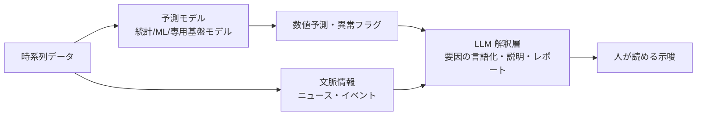

# 予測・時系列タスクと LLM

## この記事の目的

需要予測・異常検知などの時系列タスクに対する **LLM の適用範囲と限界**を判断し、従来手法との分担を設計できるようになります。LLM が効く場所と効かない場所・予測モデルと LLM を組み合わせるハイブリッド構成・「もっともらしい後付け説明」の危険・予測精度と説明品質を分けた評価を、実務の判断として持ち帰れる状態を目指します。

## 対象読者

- 需要予測・異常検知・売上予測などの時系列タスクに LLM を使えないか検討しているエンジニア・データ担当
- 「予測も LLM でできるのでは」という期待と現実の線引きがほしい実装者

## 前提知識

- [データ分析エージェント](data-analysis-agents.md) — データ分析全般(本記事は時系列固有の判断)
- [能力と限界](../10-llm-foundations/capabilities-and-limits.md) — LLM が数値・計算で外す構造
- [信頼度と較正](../04-evaluation/confidence-and-calibration.md) — 予測の不確かさの扱い

## 本文

### 概要: 数値予測の手法は時系列の評価で選ぶ

需要予測や異常検知では、**専用手法と単純なベースラインを最初の比較対象**にします。汎用チャットへ数値列を渡すだけの構成、数値の表現・入力方法を設計した LLM ベースの予測、時系列専用の基盤モデルは区別します。LLM ベースの手法が検証条件によって専用手法と同等以上になる研究もあり、「LLM に置き換えると必ず精度が下がる」とは言えません。一方、論文の結果を自社系列へそのまま一般化もできません。

導入しやすい構成は、**検証済みの予測層と、その周辺の言語的な作業を担う LLM を分ける**ことです。要因の仮説出し・説明・レポート生成でも、文章の流暢さは数値や因果の正しさを保証しません。以下ではこの役割分担を既定の設計例とし、予測層の手法は実測で選びます。

### LLM が効く場所と効かない場所

時系列タスクの中で、採用判断に必要な評価を分けます。

| 作業 | 向き | 理由 |
| --- | --- | --- |
| 次の値の数値予測 | 比較評価で判断 | 単純・統計・専用モデルを基準に、LLM ベースの手法も同じ期間・予測地平で測る |
| 異常の検出そのもの | 比較評価で判断 | 誤検知・見逃し・検出遅延を、統計・専用モデルと比較する |
| 要因の言語化・仮説出し | 効く | 「なぜ増えたか」の候補列挙は言語の仕事 |
| 異常・変化の説明文生成 | 効く | 検出済みの事象を人向けに説明する |
| レポート・示唆の生成 | 効く | 数値結果を文章にまとめる |
| 特徴量のアイデア出し | 効く | ドメイン知識からの発想の補助 |

- **予測層を未検証の LLM に置き換えない**: 統計モデル・機械学習・専用の時系列基盤モデルを比較の出発点とし、LLM ベースの手法は精度・費用・遅延が採用基準を満たした場合に選びます
- **効く場所で価値を出す**: 予測モデルが出した結果を「人が理解し、行動できる」形にする——要因の説明・レポート化・示唆出し——が LLM の主戦場です
- **外部情報の統合**: 予測モデルが扱いにくい非構造情報(ニュース・イベント・注記)を、LLM が予測の文脈として取り込む使い方もあります(ただし予測値そのものは専用手法が出す)

### ハイブリッド構成(予測モデル + LLM の解釈層)

実務で有効なのは、**予測は専用モデル、解釈と説明は LLM**という 2 層のハイブリッド構成です。

```mermaid
flowchart LR
    D[時系列データ] --> M[予測モデル<br/>統計/ML/専用基盤モデル]
    D --> C[文脈情報<br/>ニュース・イベント]
    M --> N[数値予測・異常フラグ]
    N --> L[LLM 解釈層<br/>要因の言語化・説明・レポート]
    C --> L
    L --> O[人が読める示唆]
```

- **予測層は評価済みの手法**: 図では専用手法を示していますが、採用の根拠は時系列での評価です。LLM ベースの手法を選ぶ場合も、この層として同じ検証と版管理を行います
- **解釈層は LLM**: 予測層の出力(数値・フラグ)を受け取り、要因を言語化し、説明とレポートを生成します。人が意思決定に使える形に翻訳する層です
- **層を混ぜない**: 解釈層の LLM に予測値を「調整」させると、根拠なく数字を動かす危険があります。**予測値は予測層が確定し、LLM は説明に徹する**、と層の責任を分けます

### 「もっともらしい後付け説明」の危険

このドメインで最も注意すべきは、LLM の**説明能力が、かえって害になる**場面です。

- **相関と因果の混同を増幅する**: LLM は「なぜこの数字になったか」をなめらかに説明します。しかしその説明は、**相関を因果のように語る**ことが容易です。「売上が伸びたのは○○のおかげ」という後付けの物語は、もっともらしいだけで根拠がないことがあります
- **説明を根拠と取り違えない**: 流暢な説明は、正しさの保証ではありません。LLM の説明は**仮説**として扱い、データで検証してから意思決定に使います。説明の説得力と、その説明の正しさは別物です
- **不確かさを消さない**: 予測には必ず不確かさがあります。LLM の説明が、その不確かさを「断定的な物語」で覆い隠さないようにします([信頼度と較正](../04-evaluation/confidence-and-calibration.md))。予測区間・前提・外れる条件を、説明に残します

### 評価(予測精度と説明品質の分離)

ハイブリッド構成の評価は、**予測層と解釈層を分けて**行います。混ぜると、どちらが良い/悪いのか分からなくなります。

- **予測精度は数値で測る**: 学習・調整・採用判定の期間を時間順に分け、予測起点をずらす検証で、同じ予測地平の単純予測・専用手法と比較します。前処理・特徴量・ニュースも各予測時点までの情報だけで作り、未来の情報混入を防ぎます。誤差に加え予測区間の被覆率、費用、遅延も測ります
- **説明品質は別に測る**: 解釈層の説明は、正確さ(データと整合するか)・有用さ(意思決定に役立つか)・誤誘導のなさ(相関を因果と偽らないか)で評価します。[LLM-as-a-Judge](../04-evaluation/llm-as-a-judge.md)と人手を併用します
- **2 つを取り違えない**: 「説明が上手い」ことと「予測が当たる」ことは無関係です。説明の流暢さで予測精度を過大評価しないよう、両者を独立に評価します

## 実務での注意点

### アンチパターン

- **数値予測を未検証の LLM に丸投げする** → もっともらしい数字を予測能力と取り違える → 時間順の未見データで専用ベースラインと比較し、予測層として採用可否を決める
- **解釈層の LLM に予測値を調整させる** → 根拠なく数字が動く → 予測値は予測層が確定し、LLM は説明に徹する
- **LLM の後付け説明を根拠として意思決定する** → 相関を因果と誤認する → 説明は仮説として扱い、データで検証してから使う
- **流暢な説明で予測の不確かさを覆い隠す** → 過信して外したときの被害が大きい → 予測区間・前提・外れる条件を説明に残す
- **予測精度と説明品質を混ぜて評価する** → どちらが問題か分からない → 予測層と解釈層を分けて評価する

### チェックリスト

- [ ] 予測手法を時間順の未見データで評価し、単純・専用ベースラインと比較したか
- [ ] 前処理と補足情報を含め、予測時点より未来の情報が混入していないか
- [ ] LLM を予測に使う場合と解釈に使う場合の責任・評価を分けたか
- [ ] 予測層と解釈層を分け、LLM に予測値を調整させない構成にしたか
- [ ] LLM の後付け説明を仮説として扱い、データで検証する運用にしているか
- [ ] 説明が予測の不確かさ(区間・前提)を覆い隠していないか
- [ ] 予測精度と説明品質を分けて評価しているか

## 関連トピック

- [データ分析エージェント](data-analysis-agents.md) — データ分析全般(本記事は時系列固有の判断)
- [能力と限界](../10-llm-foundations/capabilities-and-limits.md) — LLM が数値・計算で外す構造
- [信頼度と較正](../04-evaluation/confidence-and-calibration.md) — 予測の不確かさを消さない
- [LLM-as-a-Judge](../04-evaluation/llm-as-a-judge.md) — 説明品質の評価
- [ユースケース発見](../09-business/usecase-discovery.md) — 予測タスクへの LLM 適用の向き不向き

## 参考資料

- [Large Language Models Are Zero-Shot Time Series Forecasters](https://arxiv.org/abs/2310.07820) — 数値系列をテキストとして予測する手法と、条件付きの比較結果。自社タスクでの性能保証ではありません(アクセス日: 2026-09-10)
- [Forecasting: Principles and Practice — Time series cross-validation](https://otexts.com/fpp3/tscv.html) — 予測起点をずらし、過去の情報だけで検証する方法(アクセス日: 2026-09-10)

## TODO・未確認事項

なし
