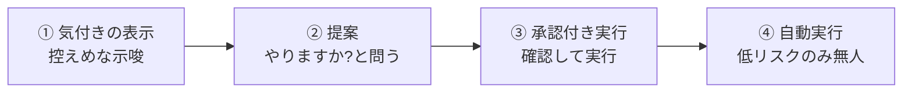

# プロアクティブエージェントの UX

## この記事の目的

エージェント側から動く体験(通知・提案・先回り)を、**うるささと便利さの均衡点**で設計できるようになります。プロアクティブ性の段階・介入の閾値・ユーザー制御・通知疲れによる信頼の損耗・反応からの学習を、設計判断として持ち帰れる状態を目指します。

## 対象読者

- 通知・提案・先回りといった、エージェント発の体験を設計するデザイナー・PM・エンジニア
- 「便利にしたつもりがうるさがられる」を、閾値と制御の設計で解きたい実装者

## 前提知識

- [AI プロダクトの UX パターン](ai-ux-patterns.md) — 自動化レベルの提示・信頼の較正
- [信頼度と較正](../04-evaluation/confidence-and-calibration.md) — 確信度に応じた介入の判断

## 本文

### 概要: プロアクティブ性は諸刃の剣

利用者が頼む前にエージェントが動く——先回りして提案する、気付いたことを知らせる——のがプロアクティブ性です。うまくやれば「気が利く」体験になり、外すと「うるさい・お節介」になります。この差は紙一重で、**均衡点の設計**がすべてです。

プロアクティブ性の失敗は、単にその通知が無視されるだけでは済みません。**外し続けると、正しい通知まで無視されるようになり、信頼が損なわれます**。だからこそ、控えめを既定にし、確信と重要度が揃ったときだけ動く設計が要ります。パーソナルアシスタントでの具体は [パーソナルアシスタントの設計](../13-domain-agents/personal-assistant-design.md) のプロアクティブ性の節度も参照してください。

### プロアクティブ性の段階

プロアクティブ性は「する/しない」の二択ではなく、関与の強さに**段階**があります。段階を上げるほど、慎重さが要ります。

- **① 気付きの表示**: 「こういうことに気付きました」と、押しつけずに示すだけ。最も控えめで、外してもダメージが小さい段階です
- **② 提案**: 「○○しますか?」と問い、利用者が選びます。行動は利用者が決めるので、安全です
- **③ 承認付き実行**: エージェントが用意した行動を、利用者の承認で実行します([Human-in-the-Loop 設計](../02-architecture/human-in-the-loop.md))
- **④ 自動実行**: 承認なしで動きます。**低リスク・可逆な操作に限る**のが鉄則で、対外送信・課金・削除のような操作は、便利でも自動化しません

### 介入の閾値設計(確信度 × 重要度 × 頻度)

「いつ動くか」を、勘でなく**閾値**で設計します。3 つの軸を掛け合わせます。

- **確信度**: エージェントが「これは役立つ」と確信できているか。確信が低いなら黙るほうが信頼されます([信頼度と較正](../04-evaluation/confidence-and-calibration.md))
- **重要度**: 外したときの損失と、当たったときの価値。重要度が高いことは多少確信が低くても知らせ、些細なことは確信が高くても控えます
- **頻度**: どれだけ頻繁に介入するか。個々が有用でも、頻度が高すぎると全体がうるさくなります。介入の総量に上限を設けます
- **掛け算で決める**: 「確信度 × 重要度」が高く、かつ頻度が過剰でないときだけ介入する、という設計にします。単一の軸で決めると外します

### ユーザー制御(頻度設定・ミュート・なぜ出たか)

プロアクティブ性の主導権は、最終的に**利用者**にあるべきです。制御手段を用意します。

- **頻度を調整できる**: 通知の頻度・種類を利用者が設定できるようにします。人によって心地よい頻度は違います
- **ミュート・オフにできる**: 「今は静かにして」「この種類は要らない」と、簡単に止められるようにします。止められないプロアクティブ性は、うるささを我慢させるだけです
- **「なぜ出たか」を説明する**: 提案の理由(「○○だったのでお知らせしました」)を示すと、納得感が生まれ、外れていても不信になりにくいです

### 通知疲れと信頼の損耗

プロアクティブ性の最大の敵は、**通知疲れ**です。この構造を理解して設計します。

- **外れが積もると全体が無視される**: 役に立たない通知が続くと、利用者は通知そのものを見なくなります。すると、たまに出る**本当に重要な通知まで無視**されます。これは個々の通知の問題ではなく、信頼の損耗です
- **少なく・的確に**: 「たくさん出して当たりを引く」より「少なく出して外さない」ほうが、長期的な信頼を保ちます。プロアクティブ性は**質を量より優先**します
- **沈黙も設計の一部**: 「何も言わない」ことも積極的な設計判断です。確信・重要度が閾値に届かないなら、黙ります

### 反応からの学習(閾値の調整)

利用者の反応は、閾値を調整する材料です。固定せず、学習で均衡点に近づけます。

- **反応を観測する**: 提案が受け入れられたか・無視されたか・ミュートされたかを観測し、[フィードバックループ](../05-operations/feedback-loops.md)として閾値の調整に使います
- **無視・却下を重く見る**: 受け入れより、無視・却下・ミュートのシグナルを重視します。うるさがられている兆候を早く捉え、頻度を下げます
- **個人差に適応する**: 心地よい頻度・種類は人で違います。全体最適だけでなく、個人の反応に合わせて調整します

### リアルタイム観測型との接続

画面や環境を継続的に観測して先回りするエージェント([リアルタイムマルチモーダル Agent](../12-multimodal/realtime-multimodal-agents.md))は、プロアクティブ性が特に強く出ます。観測している以上、介入の閾値・プライバシー・ユーザー制御は本記事の原則をより厳格に適用します(常時見られている不安を与えない設計)。

## 実務での注意点

### アンチパターン

- **確信も重要度も低いのに通知する** → うるさがられ、信頼を損なう → 確信度 × 重要度が高く頻度が過剰でないときだけ介入する
- **たくさん通知して当たりを狙う** → 通知疲れで本当に重要な通知まで無視される → 少なく・的確に、質を量より優先する
- **低リスクでない操作を自動実行する** → 対外送信・課金・削除で事故になる → 自動実行は低リスク・可逆な操作に限る
- **止める手段がない** → うるささを我慢させ、離脱を招く → 頻度設定・ミュート・オフを簡単に用意する
- **なぜ出たかを説明しない** → 外れたとき不信になる → 提案の理由を示す
- **反応を無視して閾値を固定する** → 個人差・変化に適応できない → 無視・却下のシグナルを重く見て閾値を調整する

### チェックリスト

- [ ] プロアクティブ性の段階(気付き → 提案 → 承認付き実行 → 自動実行)を意識して設計したか
- [ ] 介入を確信度 × 重要度 × 頻度の掛け算で判断しているか
- [ ] 自動実行を低リスク・可逆な操作に限っているか
- [ ] 頻度設定・ミュート・オフを簡単に用意したか
- [ ] 提案の「なぜ出たか」を説明しているか
- [ ] 少なく・的確を優先し、通知疲れによる信頼の損耗を避けているか
- [ ] 無視・却下の反応を閾値の調整に還流しているか

## 関連トピック

- [AI プロダクトの UX パターン](ai-ux-patterns.md) — 自動化レベルの提示・信頼の較正
- [Human-in-the-Loop 設計](../02-architecture/human-in-the-loop.md) — 承認付き実行の設計
- [信頼度と較正](../04-evaluation/confidence-and-calibration.md) — 確信度に応じた介入の判断
- [フィードバックループの運用](../05-operations/feedback-loops.md) — 反応からの閾値調整
- [パーソナルアシスタントの設計](../13-domain-agents/personal-assistant-design.md) — プロアクティブ性の節度(ドメイン応用)
- [リアルタイムマルチモーダル Agent](../12-multimodal/realtime-multimodal-agents.md) — 継続観測型でのプロアクティブ性
- [チャットを超える UI](beyond-chat-ui.md) — 文脈からの自動起動

## 参考資料

- 本リポジトリの執筆テンプレート `templates/doc-template.md` — 記事構造の共通形式(アクセス日: 2026-07-09)

## TODO・未確認事項

なし
