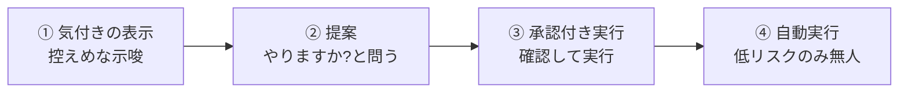

# プロアクティブエージェントの UX

## この記事の目的

エージェント側から動く体験(通知・提案・先回り)を、**うるささと便利さの均衡点**で設計できるようになります。プロアクティブ性の段階・介入の閾値・ユーザー制御・通知疲れによる信頼の損耗・反応からの学習を、設計判断として持ち帰れる状態を目指します。

## 対象読者

- 通知・提案・先回りといった、エージェント発の体験を設計するデザイナー・PM・エンジニア
- 「便利にしたつもりがうるさがられる」を、閾値と制御の設計で解きたい実装者

## 前提知識

- [AI プロダクトの UX パターン](ai-ux-patterns.md) — 自動化レベルの提示・信頼の較正
- [信頼度と較正](../04-evaluation/confidence-and-calibration.md) — 確信度に応じた介入の判断

## 本文

### 概要: プロアクティブ性は諸刃の剣

利用者が頼む前にエージェントが動く——先回りして提案する、気付いたことを知らせる——のがプロアクティブ性です。うまくやれば「気が利く」体験になり、外すと「うるさい・お節介」になります。この差は紙一重で、**均衡点の設計**がすべてです。

プロアクティブ性の失敗は、単にその通知が無視されるだけでは済みません。**役に立たない通知が続くと、重要な通知の見逃しや信頼低下につながる可能性があります**。頻度・採否・ミュート・重要通知の到達を測って確かめます。だからこそ、控えめを既定にし、確信と重要度が揃ったときだけ動く設計が要ります。パーソナルアシスタントでの具体は [パーソナルアシスタントの設計](../13-domain-agents/personal-assistant-design.md) のプロアクティブ性の節度も参照してください。

### プロアクティブ性の段階

プロアクティブ性は「する/しない」の二択ではなく、関与の強さに**段階**があります。段階を上げるほど、慎重さが要ります。

```mermaid
flowchart LR
    A[① 気付きの表示<br/>控えめな示唆] --> B[② 提案<br/>やりますか?と問う]
    B --> C[③ 承認付き実行<br/>確認して実行]
    C --> D[④ 自動実行<br/>低リスクのみ無人]
```

- **① 気付きの表示**: 「こういうことに気付きました」と、押しつけずに示すだけ。最も控えめで、外してもダメージが小さい段階です
- **② 提案**: 「○○しますか?」と問い、利用者が選びます。利用者が選べる余地を残します。ただし提案自体の情報漏えいや誤誘導もあり、採否を選べるだけでは安全性を保証しません
- **③ 承認付き実行**: エージェントが用意した行動を、利用者の承認で実行します([Human-in-the-Loop 設計](../02-architecture/human-in-the-loop.md))
- **④ 自動実行**: 承認なしで動きます。**低リスク・可逆な操作に限る**のが鉄則で、対外送信・課金・削除のような操作は、便利でも自動化しません

### 介入の閾値設計(確信度・利益と損失・頻度)

「いつ動くか」を、勘でなく**閾値**で設計します。次の 3 軸を使う独自の設計案です。単純な掛け算を検証済みの意思決定式として使うものではありません。

- **確信度**: 対象タスクの評価で、提案が役立つ見込みを測れているか。モデルの自己申告の確信度だけでは判断せず、未検証なら確率と表示しません([信頼度と較正](../04-evaluation/confidence-and-calibration.md))
- **重要度**: 外したときの損失と、当たったときの価値。見逃す損失が大きい場合は不確実性を添えた通知を検討しますが、誤警報や通知による情報開示の損失も比較します
- **頻度**: どれだけ頻繁に介入するか。個々が有用でも、頻度が高すぎると全体がうるさくなります。介入の総量に上限を設けます
- **対象別に条件を決める**: 提案が役立つ見込み、見逃しと誤警報の損失、許可された頻度を合わせて通知条件を決めます。通知の停止設定や実行権限は、スコアの高さにかかわらず守ります

### ユーザー制御(頻度設定・ミュート・なぜ出たか)

プロアクティブ性の主導権は、最終的に**利用者**にあるべきです。制御手段を用意します。

- **頻度を調整できる**: 通知の頻度・種類を利用者が設定できるようにします。人によって心地よい頻度は違います
- **ミュート・オフにできる**: 「今は静かにして」「この種類は要らない」と、簡単に止められるようにします。止められないプロアクティブ性は、うるささを我慢させるだけです
- **「なぜ出たか」を説明する**: 提案の理由(「○○だったのでお知らせしました」)を示すと、納得感が生まれ、外れていても不信になりにくいです

### 通知疲れと信頼の損耗

プロアクティブ性の最大の敵は、**通知疲れ**です。この構造を理解して設計します。

- **外れが積もると全体が無視される**: 役に立たない通知が続くと、利用者は通知そのものを見なくなります。すると、たまに出る**本当に重要な通知まで無視**されます。これは個々の通知の問題ではなく、信頼の損耗です
- **少なく・的確に**: 「たくさん出して当たりを引く」より「少なく出して外さない」ほうが、長期的な信頼を保ちます。プロアクティブ性は**質を量より優先**します
- **沈黙も設計の一部**: 「何も言わない」ことも積極的な設計判断です。確信・重要度が閾値に届かないなら、黙ります

### 反応からの学習(閾値の調整)

利用者の反応は、閾値を調整する材料です。固定せず、学習で均衡点に近づけます。

- **反応を観測する**: 提案が受け入れられたか・無視されたか・ミュートされたかを観測し、[フィードバックループ](../05-operations/feedback-loops.md)として閾値の調整に使います
- **反応の意味を確かめる**: 却下・ミュートは重要な手がかりですが、無反応には未読・多忙・別経路での完了も含まれます。無反応だけを否定評価とせず、明示的な設定・少量の確認・対象タスクの成果と合わせて調整します
- **個人差に適応する**: 心地よい頻度・種類は人で違います。全体最適だけでなく、個人の反応に合わせて調整します

### リアルタイム観測型との接続

画面や環境を継続的に観測して先回りするエージェント([リアルタイムマルチモーダル Agent](../12-multimodal/realtime-multimodal-agents.md))は、プロアクティブ性が特に強く出ます。観測している以上、介入の閾値・プライバシー・ユーザー制御は本記事の原則をより厳格に適用します(常時見られている不安を与えない設計)。

## 実務での注意点

### アンチパターン

- **確信も重要度も低いのに通知する** → うるさがられ、信頼を損なう → 見逃し・誤警報の損失と評価済みの有用性を比較し、頻度上限を守る
- **たくさん通知して当たりを狙う** → 通知疲れで本当に重要な通知まで無視される → 少なく・的確に、質を量より優先する
- **低リスクでない操作を自動実行する** → 対外送信・課金・削除で事故になる → 自動実行は低リスク・可逆な操作に限る
- **止める手段がない** → うるささを我慢させ、離脱を招く → 頻度設定・ミュート・オフを簡単に用意する
- **なぜ出たかを説明しない** → 外れたとき不信になる → 提案の理由を示す
- **反応を無視して閾値を固定する** → 個人差・変化に適応できない → 無反応の理由を決めつけず、明示的な設定と成果を合わせて閾値を調整する

### チェックリスト

- [ ] プロアクティブ性の段階(気付き → 提案 → 承認付き実行 → 自動実行)を意識して設計したか
- [ ] 介入条件を対象タスクの評価、見逃し・誤警報の損失、頻度上限で決めたか
- [ ] 自動実行を低リスク・可逆な操作に限っているか
- [ ] 頻度設定・ミュート・オフを簡単に用意したか
- [ ] 提案の「なぜ出たか」を説明しているか
- [ ] 少なく・的確を優先し、通知疲れによる信頼の損耗を避けているか
- [ ] 無視・却下の反応を閾値の調整に還流しているか

## 関連トピック

- [AI プロダクトの UX パターン](ai-ux-patterns.md) — 自動化レベルの提示・信頼の較正
- [Human-in-the-Loop 設計](../02-architecture/human-in-the-loop.md) — 承認付き実行の設計
- [信頼度と較正](../04-evaluation/confidence-and-calibration.md) — 確信度に応じた介入の判断
- [フィードバックループの運用](../05-operations/feedback-loops.md) — 反応からの閾値調整
- [パーソナルアシスタントの設計](../13-domain-agents/personal-assistant-design.md) — プロアクティブ性の節度(ドメイン応用)
- [リアルタイムマルチモーダル Agent](../12-multimodal/realtime-multimodal-agents.md) — 継続観測型でのプロアクティブ性
- [チャットを超える UI](beyond-chat-ui.md) — 文脈からの自動起動

## 参考資料

- [Amershi ほか, Guidelines for Human-AI Interaction (CHI 2019)](https://www.microsoft.com/en-us/research/wp-content/uploads/2019/01/Guidelines-for-Human-AI-Interaction-camera-ready.pdf) — G3・G4 の文脈に応じた介入、G8 の却下、G17 の全体設定。本文の閾値は独自の設計案です(アクセス日: 2026-09-10)

## TODO・未確認事項

なし
