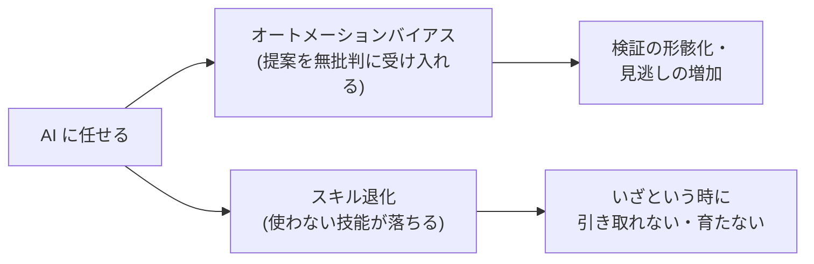

# オートメーションバイアスとスキル退化

## この記事の目的

AI 協働で起きる 2 つの人間側の構造 — **オートメーションバイアス**(自動化の提案を無批判に受け入れる)と**スキル退化**(deskilling、任せ続けて技能が落ちる)— を理解し、個人・チームの対策を設計できるようになります。これらは AI 特有の問題ではなく、航空・医療などで数十年蓄積された自動化研究の知見が、そのまま AI 協働に当てはまります。仕組み(承認フロー・レビュー体制)の手前にある**認知の構造**を扱います。

## 対象読者

- AI に業務を任せる中で「チェックが甘くなる」「若手が育たない」といった不安を持つエンジニア・リード
- レビューや承認が形骸化する認知的な理由を理解し、対策を設計したいマネージャー

## 前提知識

- [LLM の能力と限界の由来](../10-llm-foundations/capabilities-and-limits.md) — なぜ AI の出力に検証が要るか
- [Human-in-the-Loop 設計](../02-architecture/human-in-the-loop.md) — 承認の仕組み(本記事はその認知的背景)

## 本文

### 概要: 過信と技能低下という 2 つの構造

AI に任せることには、人間側に 2 つの落とし穴があります。

- **オートメーションバイアス**: 自動化された判断を、人間が過度に信頼し、自分で検証・反証しなくなる傾向。「AI がそう言うなら」で確認を省く
- **スキル退化(deskilling)**: 自動化に任せ続けることで、使われなくなった技能が衰える・そもそも習得されなくなる現象

どちらも古くから研究されており、自動化研究の古典が「皮肉なことに、自動化が進むほど人間の役割(監視・異常時の引き取り)は重要かつ難しくなる」と指摘してきました(Bainbridge の「自動化の皮肉」)。AI 協働はこの構造の新しい現れです。

### オートメーションバイアスの構造

オートメーションバイアスは、航空(自動操縦)・医療(診断支援)などで蓄積された知見です。人間は自動化を「認知の近道」として使い、次のような形で誤ります。

- **見逃し(omission)**: 自動化が警告しなかったから問題ないと判断し、実際の異常を見逃す
- **誤った提案への追従(commission)**: 自動化の提案に従い、自分の知識や他の情報と食い違っても提案を優先する

重要なのは、**訓練を受けた専門家でも起きる**ことです。むしろ「自動化は信頼できる」という経験が積み重なるほど、確認が甘くなります(complacency、油断)。近年は、AI リテラシー訓練を受けた専門家でも、誤った LLM の助言によって判断精度が下がりうることが報告され始めています。「詳しい人なら大丈夫」という前提は成り立ちません。

### 流暢さと権威性が検証を抑制する

LLM は、この構造をさらに強めます。[LLM の学習パイプライン](../10-llm-foundations/llm-training-pipeline.md)が示すように、出力は**流暢で自信ありげ**です。人間は流暢さ・断定的な口調を「正しさ・権威」と結びつけやすく、**流暢な誤りほど検証されずに通ります**([LLM の能力と限界の由来](../10-llm-foundations/capabilities-and-limits.md)の「流暢さ ≠ 正確さ」の人間側)。

つまり LLM の「もっともらしさ」は、オートメーションバイアスの引き金として非常に効いてしまいます。だから対策は「気をつける」という意志ではなく、後述の**構造**で作ります。

### スキル退化の型

スキル退化には、区別すべき型があります。

- **既存技能の萎縮**: 使わなくなった技能(手計算・デバッグ・文章構成)が、時間とともに衰える
- **学習機会の消失(育成問題)**: そもそも技能を習得する機会が失われる。**AI が肩代わりする部分は、若手が「苦労して身につける」機会でもあった**。基礎を AI に任せ続けると、判断や検証の土台になる経験が育たない
- **依存の固定化**: 技能が落ちると AI なしでは仕事が進まなくなり、さらに任せる — という循環

特に育成問題は、個人でなく組織の時間軸で効きます。「今は AI で速くなった」の裏で、**数年後に AI の出力を検証・修正できる人が育っていない**リスクが積み上がります。

### 対策の設計

対策は、意志(「ちゃんと確認しよう」)ではなく**構造と習慣**で作ります。

- **検証をデフォルトにするワークフロー**: 「確認するか」を毎回判断させず、検証を既定の手順に組み込む([AI 出力の検証習慣](verifying-ai-outputs.md))。承認フローも「押すだけ」にならない設計にする([Human-in-the-Loop 設計](../02-architecture/human-in-the-loop.md))
- **意図的な手動練習**: 技能を保つために、あえて AI なしで行う機会を残す(「AI なし」で解く演習、コードを自分で書く時間)。使わない技能は落ちる、を前提に運用する
- **自動化レベルの意識的な選択**: すべてを最大限自動化せず、「どこまで任せ、どこは人が判断するか」を意識的に選ぶ(自動化研究の「自動化のレベル」の考え方)。重要な判断は自動化レベルを下げて人を関与させる
- **育成を守る**: 若手が基礎を経験する機会を意図的に確保する。AI を「答えを出す道具」でなく「学びを補助する道具」として使わせる設計(教育文脈は[教育・学習支援エージェント](../13-domain-agents/education-agents.md)と接続)
- **チームで検証済みを可視化する**: 「AI 出力を誰も検証していない」状態を検知できるようにする([チーム導入とレビュー体制](../08-coding-agents/coding-agent-team-adoption.md))

### この理解が効く場面

- **レビュー・承認の設計**: なぜレビューが形骸化するか(認知的な理由)を踏まえ、「押すだけ」にならない設計にする([Human-in-the-Loop 設計](../02-architecture/human-in-the-loop.md))
- **育成の設計**: AI 導入と若手育成を両立させる(基礎経験の確保)
- **個人の技能維持**: 意図的な手動練習で、いざという時に引き取れる力を保つ([AI 時代のエンジニアキャリア戦略](ai-career-strategy.md))
- **研修の題材**: 「任せすぎの罠」として研修に組み込む([AI リテラシー研修の設計](ai-literacy-training-design.md))

## 実務での注意点

### アンチパターン

- **「気をつける」という意志で過信を防ごうとする** → オートメーションバイアスは意志で消えない構造的傾向 → 検証をデフォルトにするワークフローで構造的に防ぐ
- **「専門家がレビューするから安全」と考える** → 訓練された専門家でもオートメーションバイアスは起きる → レビューが形骸化しない設計(押すだけにしない・検証の可視化)にする
- **効率化のため基礎作業をすべて AI に任せる** → 若手が基礎を身につける機会が消え、数年後に検証できる人が育たない → 育成のための手動経験を意図的に残す
- **すべてを最大限自動化する** → 重要な判断まで人が関与しなくなり、異常時に引き取れない → 判断の重要度に応じて自動化レベルを選ぶ
- **技能維持を個人の心がけ任せにする** → 使わない技能は落ち、依存が固定化する → 意図的な手動練習を仕組みとして残す

### チェックリスト

- [ ] AI の提案を無批判に受け入れる傾向(オートメーションバイアス)を、意志でなく構造で防いでいる
- [ ] 検証がワークフローのデフォルトに組み込まれている(毎回の判断にしていない)
- [ ] 承認・レビューが「押すだけ」の形骸化に陥らない設計になっている
- [ ] 重要な判断は自動化レベルを下げ、人を意識的に関与させている
- [ ] 若手が基礎を経験する機会を、AI 導入後も意図的に確保している
- [ ] 個人・チームで意図的な手動練習の機会を残している
- [ ] 「AI 出力を誰も検証していない」状態を検知できる

## 関連トピック

- [AI 出力の検証習慣](verifying-ai-outputs.md) — 検証をデフォルトにする個人の技法(本記事の対策側)
- [Human-in-the-Loop 設計](../02-architecture/human-in-the-loop.md) — 承認の仕組み(本記事はその形骸化を防ぐ認知的背景)
- [チーム導入とレビュー体制](../08-coding-agents/coding-agent-team-adoption.md) — レビュー体制(検証の可視化)
- [LLM の能力と限界の由来](../10-llm-foundations/capabilities-and-limits.md) — 流暢さ ≠ 正確さ(検証が要る理由)
- [AI 時代のエンジニアキャリア戦略](ai-career-strategy.md) — 技能維持と価値の重心(個人の備え)
- [AI リテラシー研修の設計](ai-literacy-training-design.md) — 「任せすぎの罠」を組織に教える
- [教育・学習支援エージェントの設計](../13-domain-agents/education-agents.md) — AI を学びの補助にする設計(育成問題と接続)

## 参考資料

- [Ironies of Automation](https://doi.org/10.1016/0005-1098%2883%2990046-8) — 自動化が人間の監視役割を難しくするという古典(Bainbridge, 1983, Automatica、アクセス日: 2026-07-09)
- [Humans and Automation: Use, Misuse, Disuse, Abuse](https://doi.org/10.1518/001872097778543886) — 自動化への信頼と誤用の枠組み(Parasuraman & Riley, 1997, Human Factors、アクセス日: 2026-07-09)
- [Complacency and Bias in Human Use of Automation: An Attentional Integration](https://doi.org/10.1177/0018720810376055) — 油断とオートメーションバイアスの統合的レビュー(Parasuraman & Manzey, 2010, Human Factors、アクセス日: 2026-07-09)
- [Does automation bias decision-making?](https://doi.org/10.1006/ijhc.1999.0252) — オートメーションバイアスの実証(Skitka, Mosier & Burdick, 1999, Int. J. Human-Computer Studies、アクセス日: 2026-07-09)
- [A model for types and levels of human interaction with automation](https://doi.org/10.1109/3468.844354) — 「自動化のレベル」の枠組み(Parasuraman, Sheridan & Wickens, 2000, IEEE Trans. SMC-A、アクセス日: 2026-07-09)

## TODO・未確認事項

> **TODO(要確認):** LLM 協働文脈でのオートメーションバイアス・スキル退化の実証研究は増えつつある(例: 専門家でも誤った LLM 助言で判断精度が下がりうる、との報告)。古典(1983〜2010)の枠組みは安定だが、AI 固有の最新知見は各研究の一次情報で確認する(最終確認: 2026-07)
