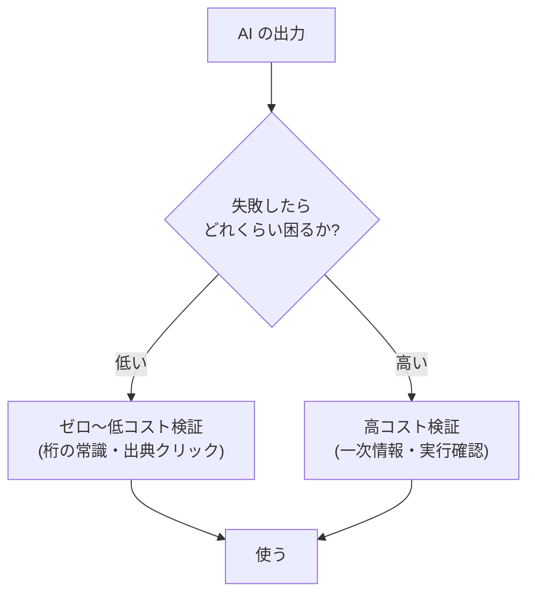

# AI 出力の検証習慣

## この記事の目的

日々の AI 利用で「もっともらしさに騙されない」ための検証を、**負担が続けられる形**で身につけられるようになります。検証コストの階層、タスク別の検証パターン、そして「どこまで検証すべきか」を失敗コストと確信度で判断する考え方を持ち帰り、個人とチームに検証を習慣として根づかせることを目指します。

## 対象読者

- 業務で AI(チャット・コーディング支援・要約など)を日常的に使う、すべての職種の人
- チームに「AI 出力を鵜呑みにしない」文化を根づかせたいリード・マネージャー

## 前提知識

- [LLM の能力と限界の由来](../10-llm-foundations/capabilities-and-limits.md) — なぜ検証が要るのか(限界の由来)
- 特別な前提はありません。本記事はこのセクションの入口の 1 つです

## 本文

### 概要: もっともらしさは正しさではない

LLM は、**間違っていても自信ありげに・流暢に**答えます([LLM の学習パイプライン](../10-llm-foundations/llm-training-pipeline.md)の「目的関数はもっともらしさ」)。だから「読んで納得できる = 正しい」とは限りません。とはいえ、すべてを一次情報まで遡って検証すると仕事になりません。要は、**続けられる検証習慣**を持つことです。鍵は「検証コストを階層で持ち、失敗コストに応じて使い分ける」ことにあります。

### 検証コストの階層

検証には手間の異なる段階があります。**軽いものから習慣化**し、重いものは必要なときだけ払います。

- **ゼロコスト検証**: 出典リンクをクリックして存在を確かめる、数値の桁が常識に合うか見る、単位・日付の整合を見る。ほぼ手間ゼロで多くの誤りを弾けます
- **低コスト検証**: 別経路で突き合わせる(検索で 1 つ裏取り)、AI に「逆質問」する(「その主張の反例は?」)、少し表現を変えて同じ答えが返るか見る
- **高コスト検証**: 一次情報(公式ドキュメント・原典)に当たる、コードを実際に実行する、専門家に確認する。時間がかかるので、失敗コストの高い場面に絞ります

「常に高コスト検証」でも「一切検証しない」でもなく、**この階層を失敗コストで使い分ける**のが続けるコツです。

### タスク別の検証パターン

出力の種類ごとに、効く検証は違います。

| 出力の種類 | 効く検証 | 特に危ういところ |
| --- | --- | --- |
| 事実・固有名詞 | 出典を要求してリンクをたどる。存在しない出典(捏造)に注意 | もっともらしい嘘・古い情報 |
| 数値・計算 | 桁の常識・単位・合計の再計算。元データとの突き合わせ | 自信ありげな計算間違い |
| コード | 実行する・テストを書く・境界値を試す。動く ≠ 正しい | 動くが要件と違う・隠れた不具合 |
| 要約 | 原文に無い主張(混入)・重要な省略がないか原文と照合 | もっともらしい捏造・偏った省略 |
| 翻訳 | 固有名詞・数値・否定・条件の取り違えを重点確認 | 流暢だが意味がずれる |

共通するのは、**「流暢さ」ではなく「検証可能な要素(出典・数値・実行結果)」で判断する**ことです。

### 「検証すべき度合い」の判断

どこまで検証するかは、**失敗コスト × 確信度**で決めます([LLM の能力と限界の由来](../10-llm-foundations/capabilities-and-limits.md)の個人版)。

- **失敗コストが高い**(外部に出す・お金や安全に関わる・後で直しにくい)ほど、検証を厚くする
- **自分の確信度が低い**(自分では正誤を判断できない領域)ほど、検証を厚くする — ただし「自分が詳しくない領域ほど、AI の誤りにも気づけない」という危うさに注意します
- 逆に、**下書き・ブレスト・自分で正誤を即判断できるもの**は、軽い検証で流してよい

「全部疑う」と疲れて続かず、「全部信じる」と事故ります。この 2 軸で強弱をつけるのが現実解です。

### 検証を促す使い方

AI の使い方自体を、検証しやすい方向に設計できます。

- **出典を要求する**: 「根拠となる出典を挙げて」と最初から頼む。出典があれば検証がゼロコストに近づきます(ただし出典自体が捏造されることもあるので、リンクは実際にたどります)
- **確信度を聞く / 曖昧さを明示させる**: 「確信の低いところはどこか」を答えさせると、検証を絞る手がかりになります
- **反対意見・反例を出させる**: 「この主張への反論は?」で、一面的な出力を相対化できます
- **段階的に検証可能な形で出させる**: 長い結論より、根拠つき・手順つきで出させると、途中で検証しやすくなります

### チームでの検証文化

個人の習慣は、チームで**共有すると崩れやすい**ので設計が要ります。

- **検証済みかを明示する**: 「AI に聞いた(未検証)」と「確認済み」を区別して共有する。未検証の出力が「事実」として伝播するのが最も危険です
- **鵜呑み共有を防ぐ**: AI の出力をそのまま転送・貼り付けする前に、発信者が最低限の検証をする規範を持つ
- **失敗を責めずに学ぶ**: 「AI を信じて間違えた」を個人の責任にすると隠されます。仕組み(検証のデフォルト化)で減らす([オートメーションバイアスとスキル退化](automation-bias-and-deskilling.md))

## 実務での注意点

### アンチパターン

- **流暢さ・自信ありげな口調を正しさの証拠と受け取る** → もっともらしい誤りをそのまま使う → 出典・数値・実行結果という検証可能な要素で判断する
- **出典が付いていることで安心する** → 出典自体が捏造・無関係なことがある → リンクを実際にたどり、主張と対応するか確かめる
- **自分が詳しくない領域ほど検証を省く** → 誤りに気づけない領域こそ事故る → 確信度が低いほど検証を厚くし、必要なら詳しい人に確認する
- **毎回すべてを高コスト検証しようとする** → 疲れて続かず、やがて一切検証しなくなる → コスト階層を失敗コストで使い分ける
- **未検証の AI 出力を「事実」として共有する** → 組織内に誤りが伝播する → 「未検証」を明示し、共有前に最低限の検証をする

### チェックリスト

- [ ] 出力の失敗コスト(外部提出・金銭・安全・修正しにくさ)を意識して検証の強弱を決めている
- [ ] 事実には出典を要求し、リンクを実際にたどっている
- [ ] 数値は桁・単位・再計算で確かめている
- [ ] コードは実行・テストで確かめている(「動く ≠ 正しい」)
- [ ] 要約・翻訳は原文と照合して混入・取り違えを見ている
- [ ] 自分が詳しくない領域ほど検証を厚くしている
- [ ] チームで「未検証」と「確認済み」を区別して共有している

## 関連トピック

- [オートメーションバイアスとスキル退化](automation-bias-and-deskilling.md) — なぜ人は検証を省くのか(本記事の認知的背景)
- [LLM の能力と限界の由来](../10-llm-foundations/capabilities-and-limits.md) — 検証が要る理由(限界の由来)
- [LLM の学習パイプライン](../10-llm-foundations/llm-training-pipeline.md) — 「もっともらしさ」が生まれる工程
- [ループ内フィードバックと検証器の設計](../03-implementation/loop-feedback-and-verification.md) — システム側の自動検証(本記事は人間側の習慣)
- [LLM-as-a-Judge](../04-evaluation/llm-as-a-judge.md) — AI に検証させる場合のバイアスと限界
- [AI リテラシー研修の設計](ai-literacy-training-design.md) — 検証習慣を組織に教える設計

## 参考資料

- なし(本記事は特定の一次資料の解説ではなく、本ライブラリの LLM の限界・評価・検証の知見を、個人が続けられる検証習慣として整理したものです)

## TODO・未確認事項

なし
