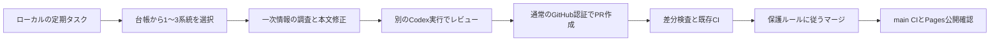

# 記事の定期最新化: Codex と GitHub Actions

最終更新: 2026-09-10

記事の調査・編集・独立レビューは、ChatGPT でログインしたローカルの Codex が担当します。GitHub Actions は本文差分の検査、既存 CI、Pages 公開を担当します。API キーを追加せず、普段の Codex と同じ契約枠を使う構成です。[認証方式](https://learn.chatgpt.com/docs/auth)(アクセス日: 2026-09-10)

## 定期タスクの登録内容

デスクトップアプリの Scheduled に次の 2 件を登録します。対象プロジェクトは `C:\dev\ai-agent-library`、実行場所は **Worktree**、ログイン方法は ChatGPT、タイムゾーンは **Asia/Tokyo** です。モデルは構築時にローカルで設定済みの `gpt-6-astra` を使います。

| 名前 | 周期 | 保存するプロンプト |
| --- | --- | --- |
| AI Agent Library — 週次重点更新 | 毎週月曜 07:23 JST | [freshness-weekly-focus.txt](automation/freshness-weekly-focus.txt) の全文 |
| AI Agent Library — 全系統巡回 | 毎週木曜 07:23 JST | [freshness-rotation.txt](automation/freshness-rotation.txt) の全文 |

ローカルのファイルを使う定期タスクは、実行時に PC の電源とアプリの起動が必要です。Git worktree を使うと普段の作業ディレクトリと分離できます。公式資料では CLI に Scheduled の管理画面はなく、アプリまたは Web から作成・管理する方式です。この構成のローカルプロジェクトはデスクトップアプリに登録します。[Scheduled tasks](https://learn.chatgpt.com/docs/automations)(アクセス日: 2026-09-10)

運用手順の正本は [freshness-maintenance スキル](.agents/skills/freshness-maintenance/SKILL.md)です。プロンプトは作業の入口だけを保持するため、手順の改善で登録済みプロンプトを毎回書き換える必要はありません。

この端末ではアプリの通常の設定読込を使って登録し、アプリが保存した次回日時まで確認しました。再登録・状態確認・停止は PowerShell 7 の `scripts/register-freshness-tasks.ps1 -Mode Install|Status|Pause` で行えます。Install は既存の同名設定を上書きしません。アプリの版変更で読込形式が変わった場合は Scheduled 画面で管理してください。停止後の DB 表示は次の一覧読込まで古い場合がありますが、scheduler は設定ファイルの ACTIVE のものだけを実行対象にします。

## 処理の流れ



月曜はモデル・coding と期限・残件、木曜は古い観測を順に確認します。対象と調査起点は [ROADMAP](ROADMAP.md) の機械可読表が正本です。学習記事の所属漏れはスクリプトが検出します。未観測の記事を、系統に含まれるという理由だけで確認済みにしません。

変更なしの回は空 PR を作りません。確認不能や必要な実装変更は、理由と再試行条件を残します。利用枠に達したら記録を保存して次回に引き継ぎ、API への切替や追加クレジット購入は行いません。使用量は通常の Codex 利用と共有されます。[契約枠と利用上限](https://learn.chatgpt.com/docs/pricing)(アクセス日: 2026-09-10)

## GitHub 側の構成

- ローカルで認証済みの `gh` / Git を使って push・PR 作成・マージ予約を行います。個人の Codex 認証ファイルを GitHub へ送信しません。
- `automation/freshness-<run_id>` ブランチの更新は `freshness-policy` チェックを通します。検証するコードと workflow は信頼する base 側のものを使い、候補 PR のコードを実行しません。
- 必須チェックは `lint`、`actionlint`、`docs`、`examples`、`build`、`freshness-policy` です。main を保護し、自動更新で `--admin` を使いません。
- `gh pr merge --auto --squash` で必須チェック後のマージを予約します。PR の head が変われば証拠・レビュー・CI を取り直します。
- main へのマージ後は既存の CI が Pages を公開します。予約、マージ、公開成功は別々に追跡します。

PR 操作をローカルの認証で行うため、Actions の `GITHUB_TOKEN` による後続起動制限を避けられます。この構成では OpenAI API キー、GitHub App 秘密鍵、追加の PAT を Actions secrets に保存しません。[GitHub の起動制限](https://docs.github.com/en/actions/concepts/security/github_token)(アクセス日: 2026-09-10)

## 差分とレビューの検証

[freshness-policy.mjs](scripts/freshness-policy.mjs) は、自動更新の変更範囲を選択系統の記事・調査メモ・関連索引に限定します。新規記事、削除、実行属性、シンボリックリンク、実装・依存・workflow・スキル・生成物の変更は通常の最新化 PR へ混ぜません。ROADMAP は観測欄だけを更新できます。

各 PR は `research/freshness-runs/<run_id>.json` を 1 件含めます。[結果スキーマ](scripts/schemas/freshness-result.schema.json)に従い、一次資料 URL・確認時刻・確認した主張・変更先・独立レビュー結果を記録します。

新規実行は schema 2 を使います。レビューする digest は、base・変更パス・Git blob・ファイル属性に加え、正規化した根拠・観測・変更分類から計算します。JSON のキー順と空白、レビュー結果自身と実行の開始・完了時刻は対象外です。本文だけでなく根拠 URL・取得時刻・主張・変更分類が変わった場合も、stage と digest 計算をやり直して再レビューします。最初の digest 計算前に根拠を含む manifest を stage する必要があります。

旧 schema 1 の過去記録は [旧スキーマ](scripts/schemas/freshness-result-v1.schema.json)と `validateArchivedResultShape` / `legacyContentDigest` で閲覧・検証できます。これらを新規 PR の受理には使いません。2026-09-10 の切替開始時点に旧形式の未完了 run / PR はありませんでした。将来同様の切替をする場合は、継続中の実行を完了させるか、保存後に新形式へ移行してレビューを取り直してから、新形式を必須化します。

このチェックが保証するのは、証拠記録の形式、差分との対応、日付・権限範囲です。**根拠の内容が正しいことや、実際に独立した判断が行われたことを機械的に証明するものではありません。** その部分は、別の doc-reviewer 実行が一次資料と本文を読み直し、実行 ID と判定を記録する運用で確認します。

法的・ライセンスの適用判断やセキュリティ推奨の実質変更は `requires-human` として保留します。通常更新の PR と分離して、他の巡回を止めません。

## ローカルで確認するコマンド

```powershell
# 対象の一覧と規約を検証する(書き込みなし)
node scripts/freshness-registry.mjs

# この回の対象を表示する(ロックや実行記録を作らない)
node scripts/freshness-run.mjs prepare --mode rotation --dry-run

# 中断・観測・公開の状態を表示する
node scripts/freshness-run.mjs status

# 関連する回帰テスト
node --test tests/unit/freshness-*.test.mjs

# 全文書の検証
npm run check
```

実際の開始は `prepare --mode weekly_focus` または `prepare --mode rotation` です。出力の `checkpoint` ファイルへ確認範囲・残件・PR URL を追記し、次のコマンドで保存します。

```powershell
node scripts/freshness-run.mjs checkpoint --run '<checkpoint の絶対パス>' --attempt-id '<開始時の attempt_id>'
node scripts/freshness-run.mjs finish --run '<checkpoint の絶対パス>' --attempt-id '<開始時の attempt_id>' --outcome observed
```

`finish` の outcome は `observed` / `merged` / `held` / `failed` です。merged には `pr_url` とレビュー・CI対象の `head_sha` を記録し、変更した公開ページを `publication_urls` に指定します。各項目はURL文字列または `{url, includes}`(本文の必須文字列)です。CLIがGitHubから必須チェックのApp/workflow/event・merge SHA・main CI・Pages deployment・公開URLを再取得し、`github_verification` に保存します。予約や保存済みの成功フラグだけでは完了しません。

`completed_systems` は、その系統の宣言した確認範囲に残件がない場合だけ指定します。レビュー・CI・公開確認を次回へ引き継ぐ場合は `finish held` ではなく `suspend --run '<checkpoint の絶対パス>' --attempt-id '<開始時の attempt_id>' --wait-until '<次回照合 UTC>' --wait-reason '<理由>'` を使います。差分・残件を保存し、未完了状態を維持して lock を解放します。利用制限では `--usage-limit`、要判断では `--needs-decision` を付けます。API認証への切替や追加購入は行いません。

## 保存場所と復旧

観測状態・未完了 checkpoint・排他 lock は Git の common directory 配下の `freshness/` に保存します。通常の配置では `C:\dev\ai-agent-library\.git\freshness\` です。worktree 間で同じ状態を共有し、アプリの一時 worktree が削除されても記録が残ります。状態ファイルはコミットされず、秘密情報を記録しません。

`checkpoint` / `suspend` は `docs/` と `research/` の Markdown・JSON、および `ROADMAP.md`、`GLOSSARY.md`、`README.md` の変更を、一時的な Git index を使ってローカルの WIP コミットへ保存します。保存先は `refs/freshness/checkpoints/<run_id>` です。実際の index・ブランチ・作業ファイルは変更せず、この ref をリモートへ push しません。これら以外の未コミットファイルと、最後の checkpoint 後の編集は保存対象外です。

復元時は checkpoint の `snapshot_commit` と `snapshot_head`、既存ブランチ・PR head を比較します。ブランチが snapshot の親のままであれば、きれいな worktree でそのブランチへ `git merge --ff-only --no-overwrite-ignore <snapshot_commit>` を実行できます。無視対象ファイルとの衝突も上書きせず止めます。ブランチがなければ snapshot から作成します。ブランチが既に先へ進んだ場合や他の worktree で使用中の場合は、履歴を確認して差分を統合します。最新 main が変わっていれば統合後に checkpoint・evidence の `base_sha` を更新し、根拠・digest・レビュー・CI を取り直します。

| 情報 | 保存先 | 意味 |
| --- | --- | --- |
| 系統と対象 | ROADMAP の registry 表 | 人とスクリプトが読む正本 |
| 最終試行・最終確認・再試行日 | `freshness/state.json` | 本文の更新日と分離した巡回状態 |
| 作業途中の確認範囲・残件 | `freshness/runs/<run_id>.json` | 利用制限・中断からの再開 |
| 記事・調査資料の保存済み差分 | `refs/freshness/checkpoints/<run_id>` | 一時 worktree 消失時にも復元できる WIP コミット |
| 排他状態 | `freshness/lock/owner.json` | 同じ clone の複数 worktree による重複作業を防止 |
| マージする変更の根拠 | `research/freshness-runs/<run_id>.json` | PR とともに残る証拠 |

未完了 checkpoint のうち実行可能なものを次の prepare が同じ run ID で復元します。外部待ちの期限前と要判断の run は待ち行列に残し、別の期限到来した系統を選べます。週次・巡回では周期未到来と同日重複を抑え、明示した `manual --ids` は依頼による対象確認として区別します。lock は 6 時間有効で、通常作業の `harness-run` と共用し、期限切れの回収自体も排他します。lock 操作の途中でプロセスが失われて `lock-mutex` が残った場合は自動で破壊せず停止します。実行中のタスクがないことを確認し、該当する空ディレクトリだけを取り除いて再試行します。

状態と checkpoint は保存世代と journal で対応付けます。`status` と `--dry-run` は復旧の必要性を表示するだけです。更新操作は排他を取得して未完了の保存世代を復旧し、途中まで保存された観測を失敗や成功で上書きしません。旧状態 schema 1 は互換読み込みを維持し、操作時に必要な世代・queue・予算だけを付加します。

ローカル状態が失われた場合は保守的に再観測します。Git 上の過去の監査日は、それだけでは今日の確認済みを意味しません。ファイル・base が変わった場合は以前のレビューを引き継ぎません。

公開失敗は checkpoint の publication に記録し、状態表示で検出した次の回は通常マージより復旧を優先します。利用制限や認証切れの場合も、完了していない範囲を明記して終了します。

## 導入の確認項目

- 定期タスク 2 件に、正しいプロジェクト・Worktree・曜日・日本時間・プロンプトを登録する。
- 一時的な試験用スケジュールでアプリの実起動を確認し、記事更新の試行で checkpoint、一次情報、独立レビュー、PR の CI、マージ後の公開を確認する。
- PC とアプリの起動状態、Codex 契約枠、GitHub 認証を確認する。
- 初期数回は PR の内容と未確認の扱いを見て、対象数や周期を調整する。

構築時の実測結果と登録状態は [導入記録](project/records/2026-09-10/freshness-automation-setup.md)で追跡します。
